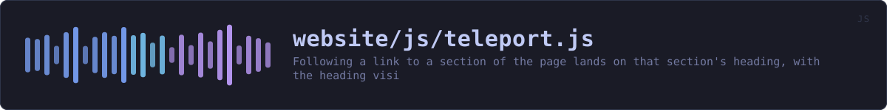
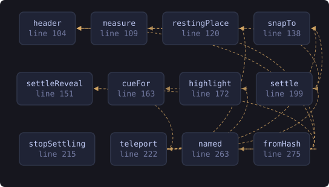

<!-- SPDX-License-Identifier: GPL-3.0-or-later -->
<!-- GENERATED by tools/docs/sources.py from the header comment in the
     source. Do not edit this file: edit the comment at the top of the
     source file and run the generator again. CI verifies it with
         python tools/docs/sources.py --check
-->

  

# `website/js/teleport.js`

[the source](https://github.com/tilas01/veilvoice/blob/main/website/js/teleport.js) &middot; 346 lines

## What it does

Following a link to a section of the page lands on that section's heading, with the heading visible.

# The defect this replaces

The header is `position: sticky`, so the top of the viewport is covered by it. `scroll-margin-top` is the property for that, and this site set it to a flat `90px`. The header is not 90px tall. Measured in a browser it is 133px at desktop widths, 171px where the navigation wraps to three rows, 115px on a phone, 143px at 320px, and 81px on the reference pages. Every one of those is a landing that is wrong, and at the common desktop width it is 43px wrong in the direction that hides the heading behind the header.

It was also set on `section`, `h2` and `h3` only, so an `h4` or a list item with an id -- which is most of the releases page and every roadmap entry -- had no offset at all and landed a full header height underneath it.

The edition of this site that runs no scripts has never had this problem, because it has no sticky header. That is the standard being matched here.

# How the offset is decided

By measuring the header, not by writing a number down. `--anchor-offset` is set from the header's own height and kept current by a ResizeObserver, so a header that grows a row, a font that loads late and a phone that is turned sideways all correct themselves. The stylesheet carries a starting value for the moment before this runs, and that value is never the one that matters.

# Why the scroll is repeated

A fragment jump happens once, at the moment the browser reads the hash, and the page is not finished at that moment. An image without intrinsic size finishes loading, a web font replaces the fallback, a reveal transition takes its transform off, and the heading that was in the right place is now somewhere else. So the position is checked over the second that follows and corrected if it drifts, and the checking stops the instant the reader scrolls: catching up with a moving page is the job, fighting the reader is not.

Reveal transitions are settled up front rather than corrected afterwards. `.reveal` holds an element 18px below where it belongs, and an element scrolled to is an element that has been reached, so the target and anything holding it are shown before the browser scrolls, while the click is still being handled.

# The landing that arrived only once

The highlight is drawn when a landing is *cued*, and until F-205 the only thing that cued one was `hashchange`. That covers arriving at a page with a fragment already in the address bar, and it covers the first click on a link into the page, because that click writes a hash where there was none or a different one.

It does not cover a click on a link naming the fragment that is already there. No new hash is written, so no `hashchange` arrives, so nothing runs. The link still works and the browser still scrolls, and the reader gets no cue at all. On a page with a contents list that is most of the clicks after the first one: pick an entry, read, come back, pick the same entry again, and the second time nothing is marked.

So the click handler below cues that one case itself, on the frame after the browser has done its own scrolling. It is the only case it takes: every other click writes a hash, and cueing it here as well would draw the highlight twice.

# What is deliberately left alone

The navigation itself. Clicks are not prevented and no history entry is written here, because the full-size screenshot viewers are opened by `:target`, which follows a real fragment navigation and not a `pushState`. The back button, the middle button and copying a link therefore behave exactly as they do with this file absent, which is also what happens if it fails to load: the stylesheet still clears the header, just less exactly.

## In plain words

Clicking a link that points further down the same page takes you to exactly that spot, with the heading you asked for on screen rather than hidden under the bar at the top, and a brief highlight so you can see where you landed.

## What calls what

Read out of the source: an edge means the callee's name appears,
called, inside the caller's body. It is a syntactic reading, not a
resolved one, so a call made through a variable will not appear.

  

| Function | Line |
|---|---:|
| `header` | 104 |
| `measure` | 109 |
| `restingPlace` | 120 |
| `snapTo` | 138 |
| `settleReveal` | 151 |
| `cueFor` | 163 |
| `highlight` | 172 |
| `settle` | 199 |
| `stopSettling` | 215 |
| `teleport` | 222 |
| `named` | 263 |
| `fromHash` | 275 |
