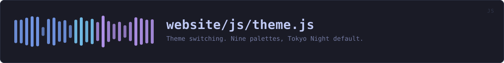
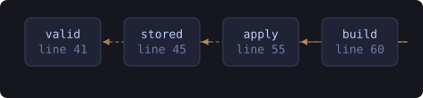

<!-- SPDX-License-Identifier: GPL-3.0-or-later -->
<!-- GENERATED by tools/docs/sources.py from the header comment in the
     source. Do not edit this file: edit the comment at the top of the
     source file and run the generator again. CI verifies it with
         python tools/docs/sources.py --check
-->

  

# `website/js/theme.js`

[the source](https://github.com/tilas01/veilvoice/blob/main/website/js/theme.js) &middot; 104 lines

## What it does

Theme switching. Nine palettes, Tokyo Night default.

The choice is kept in localStorage, which never leaves the browser. No cookie, so nothing is attached to a request and there is nothing to consent to -- a preference the server never sees is not tracking.

## In plain words

This is the colour-scheme menu in the corner of the page. Pick a theme and every page on this site changes to it, and stays that way next time you come back.

Your choice is kept in your own browser. It is not a cookie, so it is never sent anywhere: this site has no server that could receive it and nothing that could match it to you.

## What calls what

Read out of the source: an edge means the callee's name appears,
called, inside the caller's body. It is a syntactic reading, not a
resolved one, so a call made through a variable will not appear.

  

| Function | Line |
|---|---:|
| `valid` | 41 |
| `stored` | 45 |
| `apply` | 55 |
| `build` | 60 |
