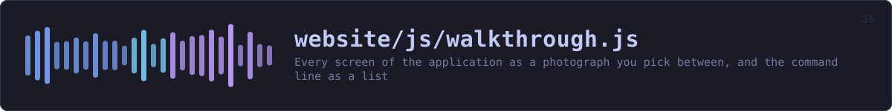
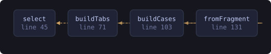

<!-- SPDX-License-Identifier: GPL-3.0-or-later -->
<!-- GENERATED by tools/docs/sources.py from the header comment in the
     source. Do not edit this file: edit the comment at the top of the
     source file and run the generator again. CI verifies it with
         python tools/docs/sources.py --check
-->

  

# `website/js/walkthrough.js`

[the source](https://github.com/tilas01/veilvoice/blob/main/website/js/walkthrough.js) &middot; 162 lines

## What it does

Every screen of the application as a photograph you pick between, and the command line as a list of jobs rather than a list of flags.

# What this is, and what it deliberately is not

Nothing here pretends to run. The pictures are captures of the real window, taken by the build on every commit, and the only thing the reader drives is which one they are looking at. That is a smaller claim than an interactive model of the program, and it is one the page can actually keep.

There used to be such a model, drawn in CSS and opened from a button. It is gone: a drawing of an interface is exactly the thing a reader cannot check, and offering it beside photographs of the same interface asked somebody to decide which of the two to believe. `js/sessions.js` replaced it with the recorded terminal sessions, which are the real programs' real output.

# Where the content comes from

All of it is in `window.VEILVOICE_DEMO`, which `tools/site/demo.py` writes from the source: the tab list out of `app.rs`, the pictures out of `assets/screenshots`, and every worked command checked against the program's own `--help`. Nothing is typed here, so nothing here can drift.

## In plain words

Lets you click through screenshots of the real app, and read what each command line job actually does, without downloading anything.

## What calls what

Read out of the source: an edge means the callee's name appears,
called, inside the caller's body. It is a syntactic reading, not a
resolved one, so a call made through a variable will not appear.

  

| Function | Line |
|---|---:|
| `select` | 45 |
| `buildTabs` | 71 |
| `buildCases` | 103 |
| `fromFragment` | 131 |
