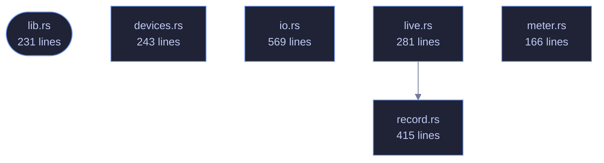

<!-- GENERATED by tools/docs/generate.py from the doc comments in the source. Do not edit: edit the .rs file and run the generator. -->

# veilvoice-audio

> Real-time capture and playback (cpal), lock-free ring buffers, virtual-cable routing and file import for VeilVoice.

[[Reference]] &middot; [the same page in the repository](https://github.com/tilas01/veilvoice/blob/main/crates/veilvoice-audio/README.md)

## Contents

  - [The live feature](#the-live-feature)
  - [Routing, and why a virtual cable matters](#routing-and-why-a-virtual-cable-matters)
- [In plain words](#in-plain-words)
  - [How the crate fits together](#how-the-crate-fits-together)
  - [The files](#the-files)

Everything between the sound hardware and
[[`veilvoice_core`|Crate-veilvoice-core]]: device enumeration, file
import and export, and the real-time capture → de-identify → playback path.

- `io`, to decode any common audio file to mono `f32`, write 16-bit WAV, or
encode one in memory so it can be encrypted without ever landing on disk
in the clear.
- `devices`, to enumerate inputs and outputs and spot a virtual audio cable.
- `live`, to run the engine live between two devices.

## The `live` feature

`devices` and `live` sit behind the default-on `live` feature. They are the
only part of this crate that needs `cpal`, and `cpal` has no backend for the
BSDs. Everything else, meaning decoding, encoding and running the engine over
a buffer, is pure Rust and builds anywhere, so turning the feature off keeps
file processing working on platforms that cannot do live capture rather than
failing to build at all.

## Routing, and why a virtual cable matters

Scrambling a microphone is only useful if other applications can hear the
result. Selecting a virtual audio cable as the output makes the veiled voice
appear as an ordinary microphone to any call, stream or recorder on the
machine, with no per-application setup. `devices::find_virtual_cable`
detects an installed one so the UI can offer it directly.

# In plain words

This is the plumbing between your microphone, your speakers and the part that
changes the voice.

It finds the sound devices you have, opens the recording you point at whatever
kind of file it is, and writes the result back out. For live use it does the
whole loop while you talk -- in from the microphone, through the engine, out to
whatever else is listening -- fast enough that a conversation still works.

It also reports how loud things are, which is what the level bars in the
program are drawing.

## How the crate fits together

  

The same graph as Mermaid source

## The files

| File | Lines | What it is |
|---|---:|---|
| [[`devices.rs`|File-veilvoice-audio-devices]] | 243 | Enumerating audio devices, and guessing which of them are virtual cables. |
| [[`io.rs`|File-veilvoice-audio-io]] | 569 | Reading and writing audio files. |
| [[`lib.rs`|File-veilvoice-audio-lib]] | 231 | Everything between the sound hardware and veilvoice_core: device enumeration, file import and export, and the real-time capture → de-identify → playback path. |
| [[`live.rs`|File-veilvoice-audio-live]] | 281 | Live microphone scrambling. |
| [[`meter.rs`|File-veilvoice-audio-meter]] | 166 | The scale a level meter is drawn on. |
| [[`record.rs`|File-veilvoice-audio-record]] | 415 | Recording the veiled voice without it ever reaching unprotected memory. |
