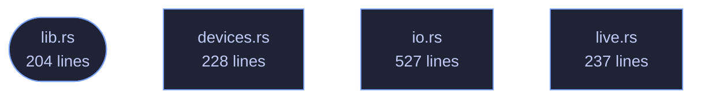

# veilvoice-audio

> Real-time capture and playback (cpal), lock-free ring buffers, virtual-cable routing and file import for VeilVoice.

[[Reference]] &middot; [the same page in the repository](https://github.com/tilas01/veilvoice/blob/main/crates/veilvoice-audio/README.md)

## Contents

- [The live feature](#the-live-feature)
- [Routing, and why a virtual cable matters](#routing-and-why-a-virtual-cable-matters)
- [How the crate fits together](#how-the-crate-fits-together)
- [The files](#the-files)

Everything between the sound hardware and
[[`veilvoice_core`|Crate-veilvoice-core]]: device enumeration, file
import and export, and the real-time capture → de-identify → playback path.

- `io` — decode any common audio file to mono `f32`, write 16-bit WAV, or
encode one in memory so it can be encrypted without ever landing on disk
in the clear.
- `devices` — enumerate inputs and outputs, and spot a virtual audio cable.
- `live` — run the engine live between two devices.

## The `live` feature

`devices` and `live` sit behind the default-on `live` feature. They are the
only part of this crate that needs `cpal`, and `cpal` has no backend for the
BSDs. Everything else — decoding, encoding, and running the engine over a
buffer — is pure Rust and builds anywhere, so turning the feature off keeps
file processing working on platforms that cannot do live capture rather than
failing to build at all.

## Routing, and why a virtual cable matters

Scrambling a microphone is only useful if other applications can hear the
result. Selecting a virtual audio cable as the output makes the veiled voice
appear as an ordinary microphone to any call, stream or recorder on the
machine, with no per-application setup. `devices::find_virtual_cable`
detects an installed one so the UI can offer it directly.

## How the crate fits together

## The files

| File | Lines | What it is |
|---|---:|---|
| [[`devices.rs`|File-veilvoice-audio-devices]] | 228 | Enumerating audio devices, and guessing which of them are virtual cables. |
| [[`io.rs`|File-veilvoice-audio-io]] | 527 | Reading and writing audio files. |
| [[`lib.rs`|File-veilvoice-audio-lib]] | 204 | Everything between the sound hardware and veilvoice_core: device enumeration, file import and export, and the real-time capture → de-identify → playback path. |
| [[`live.rs`|File-veilvoice-audio-live]] | 237 | Live microphone scrambling. |
