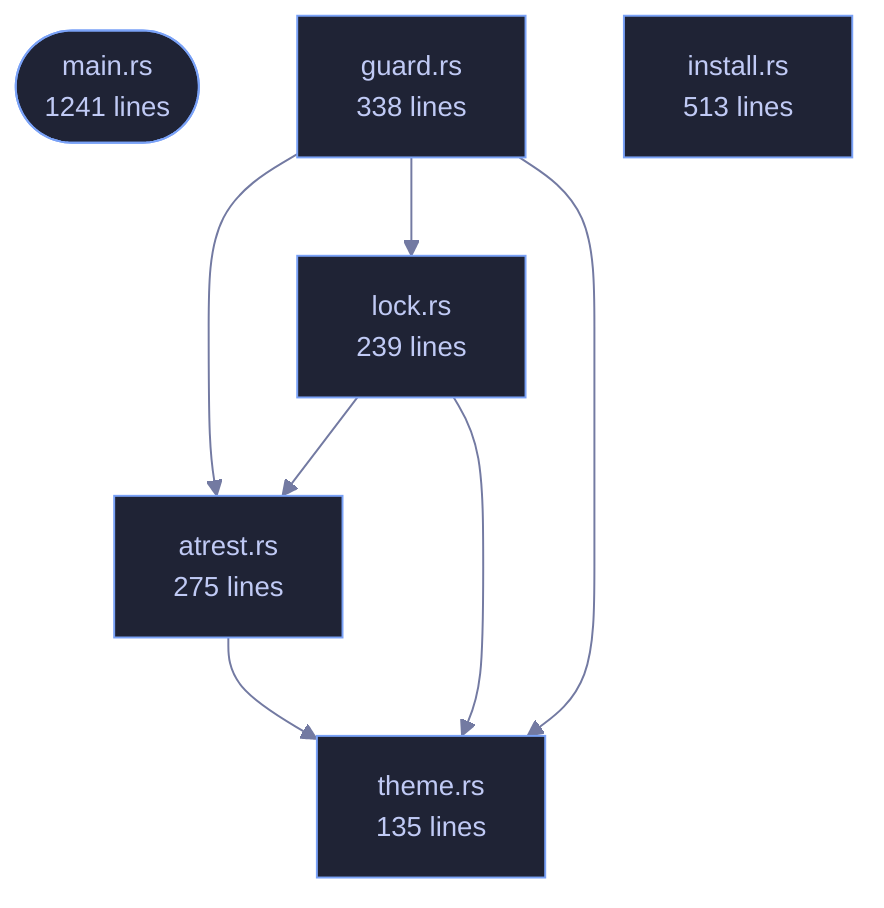

<!-- GENERATED by tools/docs/generate.py from the doc comments in the source. Do not edit: edit the .rs file and run the generator. -->

# veilvoice-cli

> Command-line interface for VeilVoice: anonymise files, scramble a microphone live, strip metadata, encrypt recordings.

[[Reference]] &middot; [the same page in the repository](https://github.com/tilas01/veilvoice/blob/main/crates/veilvoice-cli/README.md)

## Contents

- [What is here](#what-is-here)
- [Two behaviours that surprise people, on purpose](#two-behaviours-that-surprise-people-on-purpose)
- [Passphrase prompts cannot be piped](#passphrase-prompts-cannot-be-piped)
- [A clap ordering rule worth knowing](#a-clap-ordering-rule-worth-knowing)
  - [How the crate fits together](#how-the-crate-fits-together)
  - [The files](#the-files)

`veilvoice` — the command-line interface.

Everything VeilVoice does, available without a desktop: it runs over SSH, in
a container, and on machines that have no GUI toolkit at all. The same
engine backs both this and the graphical app.

# What is here

Fourteen subcommands, and they divide into four groups:

* **Audio** -- `anonymise` a file, `live` scramble a microphone, list
`devices`.
* **Privacy of the files themselves** -- `clean` metadata, `encrypt`,
`decrypt`, `keygen`, `shred`.
* **Watching the machine** -- `watch` the microphone and camera, `guard`
VeilVoice's own files against tampering.
* **The app lock** -- `lock set|status|change|remove`.

# Two behaviours that surprise people, on purpose

**`anonymise` writes `<out>.veil`, not a bare WAV.** Recordings are
encrypted at rest by default. `--encrypt=false` opts out and requires
`--yes`, because an unsealed recording is the thing somebody later wishes
they had not produced. The wiki explains where the WAV went.

**The front-ends refuse rather than downgrade.** Asked to encrypt with
nothing to encrypt with, this exits with an error instead of writing plain
audio and mentioning it. Quiet degradation to a weaker posture is the defect
class this project has found in itself most often.

# Passphrase prompts cannot be piped

`rpassword` needs a real console; piping a passphrase in blocks on
`CONIN$` rather than reading it. That is a property of terminal input, not a
bug here, and it means anything that prompts cannot be smoke-tested from a
non-interactive shell. The layer *beneath* each prompt is therefore tested
instead -- see `crate::atrest` and `crate::lock`, where the logic lives
precisely so it can be reached without a terminal.

# A clap ordering rule worth knowing

An argument declared beside `#[command(subcommand)]` must precede the
subcommand on the command line unless it is marked `global = true`. So
`veilvoice lock --path X status` parses and `veilvoice lock status --path X`
does not, except that `--path` is now global specifically so both do.

## How the crate fits together

## The files

| File | Lines | What it is |
|---|---:|---|
| [[`atrest.rs`|File-veilvoice-cli-atrest]] | 275 | Encryption at rest for the recordings VeilVoice writes, and the passphrase prompts that feed it. |
| [[`guard.rs`|File-veilvoice-cli-guard]] | 338 | veilvoice guard -- record what VeilVoice's files should be, and check them. |
| [[`install.rs`|File-veilvoice-cli-install]] | 513 | veilvoice install -- put this program somewhere the system can find it. |
| [[`lock.rs`|File-veilvoice-cli-lock]] | 239 | veilvoice lock — manage the application lock from the command line. |
| [[`main.rs`|File-veilvoice-cli-main]] | 1241 | veilvoice — the command-line interface. |
| [[`theme.rs`|File-veilvoice-cli-theme]] | 135 | Tokyo Night colouring for the terminal. |
