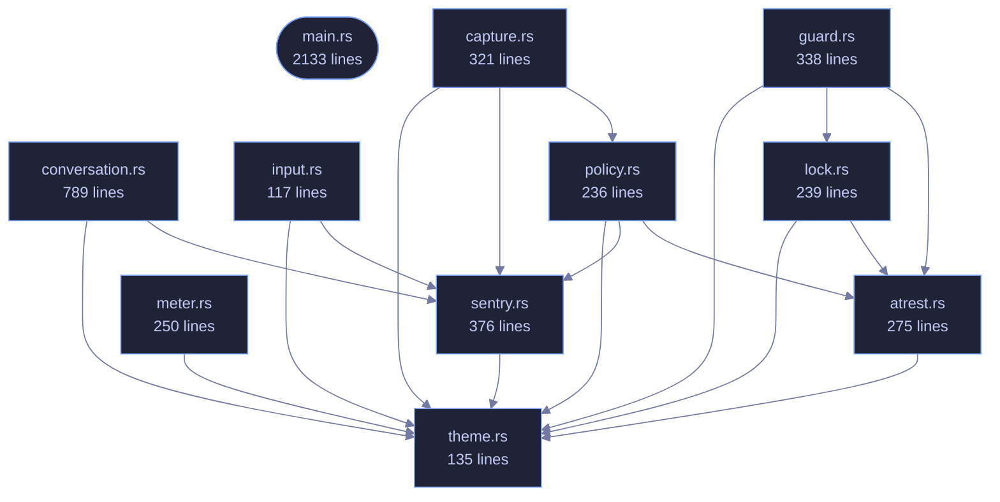

<!-- GENERATED by tools/docs/generate.py from the doc comments in the source. Do not edit: edit the .rs file and run the generator. -->

# veilvoice-cli

> Command-line interface for VeilVoice: anonymise files, scramble a microphone live, strip metadata, encrypt recordings.

[[Reference]] &middot; [the same page in the repository](https://github.com/tilas01/veilvoice/blob/main/crates/veilvoice-cli/README.md)

## Contents

- [What is here](#what-is-here)
- [Two behaviours that surprise people, on purpose](#two-behaviours-that-surprise-people-on-purpose)
- [Passphrase prompts cannot be piped](#passphrase-prompts-cannot-be-piped)
- [A clap ordering rule worth knowing](#a-clap-ordering-rule-worth-knowing)
- [In plain words](#in-plain-words)
  - [How the crate fits together](#how-the-crate-fits-together)
  - [The files](#the-files)

`veilvoice` — the command-line interface.

Everything VeilVoice does, available without a desktop: it runs over SSH, in
a container, and on machines that have no GUI toolkit at all. The same
engine backs both this and the graphical app.

# What is here

Twenty subcommands, and they divide into five groups:

* **Audio** -- `anonymise` a file, `live` scramble a microphone, list
`devices`, `conversation` for a recording with several people in it.
* **Privacy of the files themselves** -- `clean` metadata, `encrypt`,
`decrypt`, `keygen`, `shred`.
* **Watching the machine** -- `watch` the microphone and camera, `guard`
VeilVoice's own files against tampering, `sentry` for canaries and how
fast a folder is changing, `capture` for which screen recorders are
running.
* **The app lock** -- `lock set|status|change|remove`, and `policy` for
settings somebody has fixed so the interface cannot turn them off.
* **Getting it onto the machine** -- `install`, `uninstall`, `companions`,
and `gui` to open the desktop application.

That last group is a front end over `veilvoice_setup`, which the desktop
application's setup tab also calls. The careful part -- editing `PATH` --
has one implementation and one set of tests, rather than one per front
end.

# Two behaviours that surprise people, on purpose

**`anonymise` writes `<out>.veil`, not a bare WAV.** Recordings are
encrypted at rest by default. `--encrypt=false` opts out and requires
`--yes`, because an unsealed recording is the thing somebody later wishes
they had not produced. The wiki explains where the WAV went.

**The front-ends refuse rather than downgrade.** Asked to encrypt with
nothing to encrypt with, this exits with an error instead of writing plain
audio and mentioning it. Quiet degradation to a weaker posture is the defect
class this project has found in itself most often.

# Passphrase prompts cannot be piped

`rpassword` needs a real console; piping a passphrase in blocks on
`CONIN$` rather than reading it. That is a property of terminal input, not a
bug here, and it means anything that prompts cannot be smoke-tested from a
non-interactive shell. The layer *beneath* each prompt is therefore tested
instead -- see `crate::atrest` and `crate::lock`, where the logic lives
precisely so it can be reached without a terminal.

# A clap ordering rule worth knowing

An argument declared beside `#[command(subcommand)]` must precede the
subcommand on the command line unless it is marked `global = true`. So
`veilvoice lock --path X status` parses and `veilvoice lock status --path X`
does not, except that `--path` is now global specifically so both do.

# In plain words

This is VeilVoice without a window.

Everything the program does, typed instead of clicked: disguise a recording,
scramble a microphone while you talk, seal a file, strip a photograph's hidden
labels, handle a recording with several people in it.

It is the same code underneath, so it works the same way -- over a remote
connection, on a machine with no desktop, or from a script that runs it a
thousand times.

## How the crate fits together

  

The same graph as Mermaid source

## The files

| File | Lines | What it is |
|---|---:|---|
| [[`atrest.rs`|File-veilvoice-cli-atrest]] | 275 | Encryption at rest for the recordings VeilVoice writes, and the passphrase prompts that feed it. |
| [[`capture.rs`|File-veilvoice-cli-capture]] | 321 | veilvoice capture -- which screen recorders are running, and which of them you have said you meant to run. |
| [[`conversation.rs`|File-veilvoice-cli-conversation]] | 789 | veilvoice conversation -- several speakers, a voice each, and subtitles. |
| [[`guard.rs`|File-veilvoice-cli-guard]] | 338 | veilvoice guard -- record what VeilVoice's files should be, and check them. |
| [[`input.rs`|File-veilvoice-cli-input]] | 117 | veilvoice input — what running programs can see your keyboard and mouse. |
| [[`lock.rs`|File-veilvoice-cli-lock]] | 239 | veilvoice lock — manage the application lock from the command line. |
| [[`main.rs`|File-veilvoice-cli-main]] | 2133 | veilvoice — the command-line interface. |
| [[`meter.rs`|File-veilvoice-cli-meter]] | 250 | Level meters for veilvoice live, on a scale that means something. |
| [[`policy.rs`|File-veilvoice-cli-policy]] | 236 | veilvoice policy -- settings that can only be tightened. |
| [[`sentry.rs`|File-veilvoice-cli-sentry]] | 376 | veilvoice sentry -- canaries, baselines, and what changed since. |
| [[`theme.rs`|File-veilvoice-cli-theme]] | 135 | Tokyo Night colouring for the terminal. |
