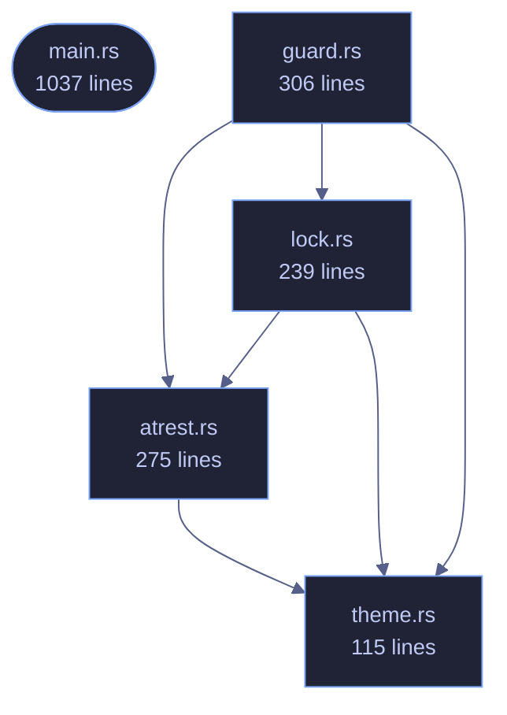

# veilvoice-cli

> Command-line interface for VeilVoice: anonymise files, scramble a microphone live, strip metadata, encrypt recordings.

[[Reference]] &middot; [the same page in the repository](https://github.com/tilas01/veilvoice/blob/main/crates/veilvoice-cli/README.md)

## Contents

- [How the crate fits together](#how-the-crate-fits-together)
- [The files](#the-files)

`veilvoice` — the command-line interface.

Everything VeilVoice does, available without a desktop: it runs over SSH, in
a container, and on machines that have no GUI toolkit at all. The same
engine backs both this and the graphical app.

## How the crate fits together

## The files

| File | Lines | What it is |
|---|---:|---|
| [[`atrest.rs`|File-veilvoice-cli-atrest]] | 275 | Encryption at rest for the recordings VeilVoice writes, and the passphrase prompts that feed it. |
| [[`guard.rs`|File-veilvoice-cli-guard]] | 306 | veilvoice guard -- record what VeilVoice's files should be, and check them. |
| [[`lock.rs`|File-veilvoice-cli-lock]] | 239 | veilvoice lock — manage the application lock from the command line. |
| [[`main.rs`|File-veilvoice-cli-main]] | 1037 | veilvoice — the command-line interface. |
| [[`theme.rs`|File-veilvoice-cli-theme]] | 115 | Tokyo Night colouring for the terminal. |
