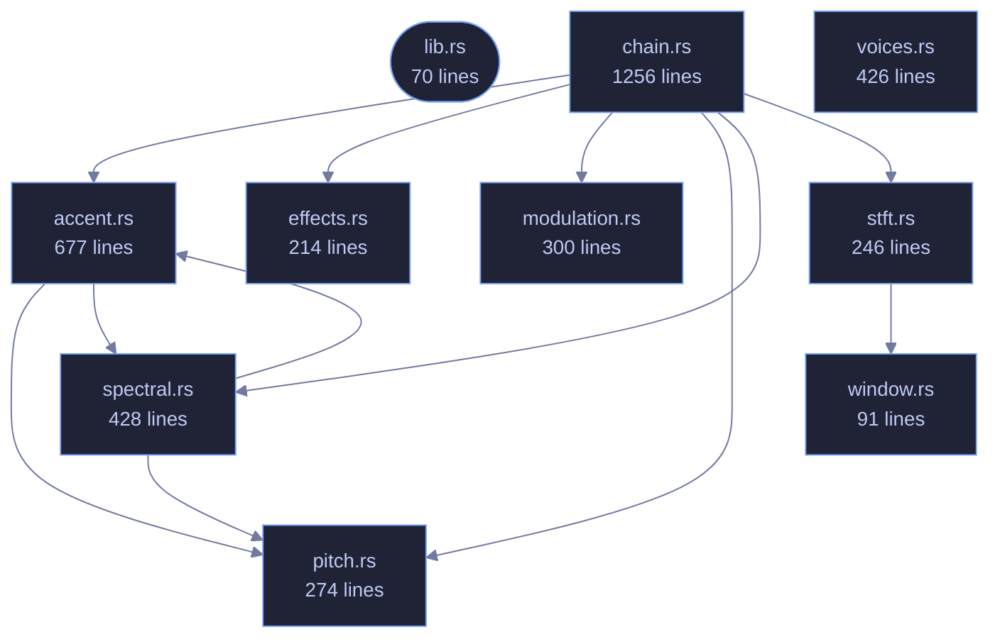

<!-- GENERATED by tools/docs/generate.py from the doc comments in the source. Do not edit: edit the .rs file and run the generator. -->


# veilvoice-core

> Irreversible voice de-identification DSP engine: cryptographically-modulated pitch/formant scrambling with preserved intelligibility.

[[Reference]] &middot; [the same page in the repository](https://github.com/tilas01/veilvoice/blob/main/crates/veilvoice-core/README.md)

## Contents

- [What it guarantees (and what it deliberately does not)](#what-it-guarantees-and-what-it-deliberately-does-not)
- [Accent](#accent)
- [Why it is one-way](#why-it-is-one-way)
- [Example](#example)
- [How the crate fits together](#how-the-crate-fits-together)
- [The files](#the-files)

The security-critical heart of VeilVoice: an **irreversible, cryptographically
modulated voice de-identification** engine.

## What it guarantees (and what it deliberately does not)

VeilVoice destroys the *biometric voiceprint* — fundamental pitch, formant
structure, timbre, accent and micro-timing — so that neither software nor a
human can re-identify the speaker or reconstruct the original waveform. It
does **not** hide the words: intelligibility is preserved on purpose, because
a scrambler you cannot understand or transcribe is useless. "Fill the whole
spectrogram with white noise" and "stay transcribable" are mutually
exclusive; see `docs/WHITEPAPER.md` for the full argument.

## Accent

`AccentConfig` additionally maps every speaker onto one canonical pitch
register, vocal-tract scale and long-term spectrum, so the *melody and
colour* of an accent — along with two of the strongest biometric features
there are — do not survive. What no signal-level transform can remove is the
**segmental** side of an accent: which phonemes were actually produced. At
that level the accent and the words are the same thing, and changing it means
changing what was said. See `AccentConfig` for the full argument and the
limit, which the whitepaper must state rather than overclaim.

## Why it is one-way

Every STFT frame has its **measured phase discarded** and resynthesised from
scratch (see `spectral`). The original excitation phase — which encodes the
precise waveform and a speaker's micro-timing — is never stored and never
reused, so no downstream process can recover it. On top of that, the pitch
and formant shifts are driven every frame by a ChaCha20 CSPRNG
(`modulation`) whose seed never leaves the process and is zeroized on drop,
so there is not even a single fixed transform to invert.

## Example

```
use veilvoice_core::{Deidentifier, DeidConfig};

let mut deid = Deidentifier::new(DeidConfig::default()).unwrap();
let input = vec![0.0f32; 4800];
let output = deid.process_vec(&input);
assert_eq!(output.len(), input.len());
// Live processing cost, e.g. for a latency read-out:
let _ms = deid.stats().last_block_ms();
```

## How the crate fits together



## The files

| File | Lines | What it is |
|---|---:|---|
| [[`accent.rs`|File-veilvoice-core-accent]] | 677 | Accent and speaker-trait neutralisation. |
| [[`chain.rs`|File-veilvoice-core-chain]] | 1256 | The assembled de-identification chain and its live performance statistics. |
| [[`effects.rs`|File-veilvoice-core-effects]] | 214 | Light time-domain effects applied after resynthesis. |
| [[`lib.rs`|File-veilvoice-core-lib]] | 70 | The security-critical heart of VeilVoice: an irreversible, cryptographically modulated voice de-identification engine. |
| [[`modulation.rs`|File-veilvoice-core-modulation]] | 300 | Cryptographically-seeded modulation of the effect parameters. |
| [[`pitch.rs`|File-veilvoice-core-pitch]] | 274 | Monophonic fundamental-frequency tracker (decimated YIN). |
| [[`spectral.rs`|File-veilvoice-core-spectral]] | 428 | Frequency-domain de-identification transform. |
| [[`stft.rs`|File-veilvoice-core-stft]] | 246 | Streaming short-time Fourier transform with overlap-add resynthesis. |
| [[`voices.rs`|File-veilvoice-core-voices]] | 426 | Destination voices: several canonical registers instead of one. |
| [[`window.rs`|File-veilvoice-core-window]] | 91 | Analysis and synthesis windowing, and the one constant that keeps overlap-add honest. |
| [[`spectrum_report.rs`|File-veilvoice-core-examples-spectrum_report]] | 99 | Where do the output partials actually land? |
| [[`veil_a_buffer.rs`|File-veilvoice-core-examples-veil_a_buffer]] | 45 | _no module documentation yet_ |
| [[`hostile_audio.rs`|File-veilvoice-core-tests-hostile_audio]] | 353 | The engine against input that is not well-behaved audio. |
