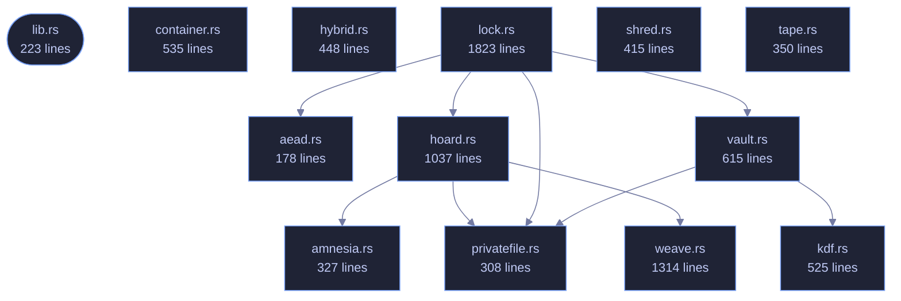

<!-- GENERATED by tools/docs/generate.py from the doc comments in the source. Do not edit: edit the .rs file and run the generator. -->


# veilvoice-crypto

> Argon2id KDF, X25519+ML-KEM-768 hybrid KEM, XChaCha20-Poly1305 at-rest encryption and page-locked amnesic secrets for VeilVoice.

[[Reference]] &middot; [the same page in the repository](https://github.com/tilas01/veilvoice/blob/main/crates/veilvoice-crypto/README.md)

## Contents

  - [What this crate is for](#what-this-crate-is-for)
  - [Threat model, stated plainly](#threat-model-stated-plainly)
  - [Example](#example)
- [In plain words](#in-plain-words)
  - [How the crate fits together](#how-the-crate-fits-together)
  - [The files](#the-files)

Key derivation, post-quantum-hybrid key agreement, authenticated encryption
and amnesic secret storage for VeilVoice.

## What this crate is for

[[`veilvoice_core`|Crate-veilvoice-core]] makes a voice
unrecognisable; it does not hide the *words*, and it is not meant to. When a
recording needs to stay secret as well, at rest on disk or in transit to
someone else, that is this crate's job.

- `kdf`, Argon2id, for turning a password into a key.
- `hybrid`, X25519 + ML-KEM-768, so a recording captured today is not
readable by a quantum adversary tomorrow.
- `aead`, XChaCha20-Poly1305, with random nonces and authenticated
associated data.
- `container`, the `.veil` file format that ties the three together.
- `amnesia`, page-locked, zeroizing, constant-time-comparable secrets.
- `shred`, secure erasure, and an honest account of what that is worth
on flash storage.
- `privatefile`, writing a file that is owner-only from the moment it
exists, rather than world-readable until a second syscall tightens it.
- `lock`, the application lock: an Argon2id verifier with a rate limit,
which protects against casual access and says so rather than pretending to
be tamper-proof.

## Threat model, stated plainly

This crate protects data **at rest and in transit** against an attacker who
later obtains the file, including one who stores it until quantum hardware
exists. It does **not** protect against an attacker who is already running
code as you, or who can read this process's memory: page-locking keeps keys
out of the swap file, not out of a debugger. Hibernation writes RAM to disk
wholesale and defeats locking entirely.

## Example

```
use veilvoice_crypto::{container, kdf};

# fn main() -> Result<(), veilvoice_crypto::Error> {
// Cheap parameters so the doctest is fast; real callers use the default.
let params = kdf::KdfParams::weak_for_tests();
let sealed = container::seal_with_password(b"pass phrase", b"audio bytes", params)?;
assert_eq!(container::open_with_password(b"pass phrase", &sealed)?, b"audio bytes");
assert!(container::open_with_password(b"wrong", &sealed).is_err());
# Ok(())
# }
```

VeilVoice contains **no `unsafe` code at all**, including the page-locking
in `amnesia`, which goes through a safe wrapper.

# In plain words

This is the locking.

Two separate things use it. Recordings are sealed on your disk so that somebody
who takes the disk cannot listen to them, and the app can be put behind a
password so somebody who picks up your unlocked computer cannot open it.

Those two passwords are deliberately different. Opening the program should not
be the same act as unsealing everything it has ever written.

The maths is chosen to be slow to guess and to still be safe if somebody one
day builds a quantum computer. Nothing is sent anywhere; the sealing happens on
your machine and the key is made from your password each time.

## How the crate fits together

<p align="center">
  
</p>

<details>
<summary>The same graph as Mermaid source</summary>



</details>

## The files

| File | Lines | What it is |
|---|---:|---|
| [[`aead.rs`|File-veilvoice-crypto-aead]] | 178 | Authenticated encryption with XChaCha20-Poly1305. |
| [[`amnesia.rs`|File-veilvoice-crypto-amnesia]] | 327 | Amnesic secret storage: page-locked, zeroized, and never printed. |
| [[`container.rs`|File-veilvoice-crypto-container]] | 535 | The .veil encrypted container format. |
| [[`hoard.rs`|File-veilvoice-crypto-hoard]] | 1037 | The obfuscated program folder: what VeilVoice keeps on disk, under names that mean nothing and beside files that hold nothing. |
| [[`hybrid.rs`|File-veilvoice-crypto-hybrid]] | 448 | Post-quantum hybrid key encapsulation: X25519 + ML-KEM-768. |
| [[`kdf.rs`|File-veilvoice-crypto-kdf]] | 525 | Password-based key derivation with Argon2id. |
| [[`lib.rs`|File-veilvoice-crypto-lib]] | 223 | Key derivation, post-quantum-hybrid key agreement, authenticated encryption and amnesic secret storage for VeilVoice. |
| [[`lock.rs`|File-veilvoice-crypto-lock]] | 1823 | The application lock: an Argon2id password verifier with a rate limit. |
| [[`privatefile.rs`|File-veilvoice-crypto-privatefile]] | 308 | Writing a file that only its owner can read. |
| [[`shred.rs`|File-veilvoice-crypto-shred]] | 415 | Secure erasure, the self-destruct. |
| [[`tape.rs`|File-veilvoice-crypto-tape]] | 350 | A recording held in locked, zeroizing memory while it is still being made. |
| [[`vault.rs`|File-veilvoice-crypto-vault]] | 615 | Where the app lock is kept: two copies, unpredictable names, and a restore. |
| [[`weave.rs`|File-veilvoice-crypto-weave]] | 1314 | Thirty-one reversible encodings, chosen at random, applied around the encryption -- before it, after it, or both. |
| [[`seal_and_open.rs`|File-veilvoice-crypto-examples-seal_and_open]] | 80 | _no module documentation yet_ |
| [[`parser_fuzz.rs`|File-veilvoice-crypto-tests-parser_fuzz]] | 368 | Randomised robustness testing for the two parsers that read untrusted input. |
| [[`timing.rs`|File-veilvoice-crypto-tests-timing]] | 249 | Timing measurement of the password paths. |
