<!-- GENERATED by tools/docs/generate.py from the doc comments in the source. Do not edit: edit the .rs file and run the generator. -->

# veilvoice-decoy

> A second passphrase that opens an empty VeilVoice, with the deniability it does not provide stated plainly, and no passphrase that destroys anything.

[[Reference]] &middot; [the same page in the repository](https://github.com/tilas01/veilvoice/blob/main/crates/veilvoice-decoy/README.md)

## Contents

- [What this is for, and what it is honestly worth](#what-this-is-for-and-what-it-is-honestly-worth)
- [The destructive duress passphrase is deliberately not here](#the-destructive-duress-passphrase-is-deliberately-not-here)
- [Typing the wrong one by mistake](#typing-the-wrong-one-by-mistake)
- [Both passphrases are checked the same way](#both-passphrases-are-checked-the-same-way)
- [In plain words](#in-plain-words)
  - [How the crate fits together](#how-the-crate-fits-together)
  - [The files](#the-files)

A second passphrase that opens a different, empty VeilVoice.

# What this is for, and what it is honestly worth

Somebody can be made to unlock a program. A decoy passphrase gives them
something true to say: it opens VeilVoice, the application works, and there
is nothing in it.

**It does not give you deniability, and anyone who tells you otherwise is
selling something.** VeilVoice is open source. This file is published. An
adversary who knows what they are looking at knows the feature exists, can
read exactly how it works, and can simply ask for the other passphrase. What
a decoy buys is a way to *comply* without revealing; what it does not buy is
any argument that there is nothing more to reveal. `SCOPE` says that in
the words a front end must show, and it is the most important thing this
crate produces.

# The destructive duress passphrase is deliberately not here

The roadmap asked for two things: a decoy, and a duress passphrase that
destroys data. The second is not shipped, and `WHY_NO_DESTRUCTION` is the
reason in full. In short: VeilVoice cannot promise a file is gone.

On flash storage a write does not overwrite. The controller maps a logical
block to a new physical page and leaves the old one holding the data until
it is garbage-collected, which may be minutes or may be never, and no
program running as an ordinary user can reach it. This project already
documents that about its own secure-erase feature and refuses to overstate
it there.

A destructive duress passphrase would be believed in exactly the situation
where being wrong costs the most. Somebody types it expecting the recordings
to be gone; the ciphertext is still in unmapped pages; and they then behave
as though it is not. **A control people rely on and that does not work is
worse than no control at all.** So there is not one.

# Typing the wrong one by mistake

The other failure the roadmap named, and the reason this shape was chosen.
Because the decoy destroys nothing, typing it by accident costs a
relaunch and nothing else. There is no state to recover and no decision that
cannot be taken back. That is not a happy accident; it is why the
destructive design was rejected rather than made safer.

# Both passphrases are checked the same way

Which one matched must not be visible in how long the check took. Both are
derived with the same Argon2id parameters and compared in constant time, and
**both are always derived** even when the first one matches: returning early
would make a real passphrase measurably faster than a decoy, which tells an
observer with a stopwatch which of the two they just watched somebody type.

# In plain words

You can set a second passphrase. Typing it opens VeilVoice normally, except
that it is empty: no recordings, no projects, no history. It is there for
the situation where somebody is standing over you asking you to unlock your
computer.

Two honest warnings, and please read them.

It does **not** hide the fact that a second passphrase might exist. This
program's source code is public and this feature is described in it, so
anybody who recognises VeilVoice can ask you for the other one. It buys you
a way to hand something over. It does not buy you an argument.

And there is **no passphrase that destroys your recordings**, deliberately.
On modern storage, deleting a file does not reliably remove it, so a feature
that claimed to would be lying to you at the worst possible moment.

## How the crate fits together

  

The same graph as Mermaid source

```mermaid
%%{init: {"theme":"base","themeVariables":{"background":"#1a1b26","primaryColor":"#1f2335","primaryTextColor":"#c0caf5","primaryBorderColor":"#7aa2f7","secondaryColor":"#16161e","tertiaryColor":"#16161e","lineColor":"#737aa2","textColor":"#c0caf5","mainBkg":"#1f2335","nodeBorder":"#7aa2f7","clusterBkg":"#16161e","clusterBorder":"#2f3549","fontFamily":"ui-monospace, SFMono-Regular, Consolas, monospace","fontSize":"14px"}}}%%
flowchart TD
    n_lib(["lib.rs<br/>466 lines"])
    click n_lib href "https://github.com/tilas01/veilvoice/blob/main/crates/veilvoice-decoy/src/lib.rs" "open the source"
```

## The files

| File | Lines | What it is |
|---|---:|---|
| [[`lib.rs`|File-veilvoice-decoy-lib]] | 466 | A second passphrase that opens a different, empty VeilVoice. |
