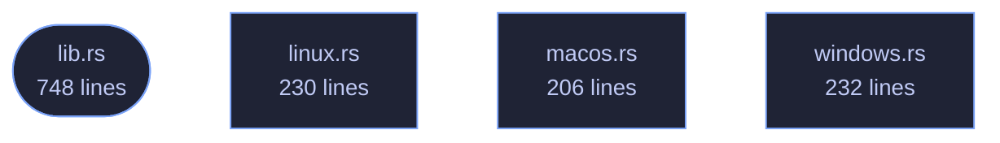

<!-- GENERATED by tools/docs/generate.py from the doc comments in the source. Do not edit: edit the .rs file and run the generator. -->

# veilvoice-drivers

> Notice when a kernel driver or module appears, with a cross-view check and an honest account of what hiding defeats.

[[Reference]] &middot; [the same page in the repository](https://github.com/tilas01/veilvoice/blob/main/crates/veilvoice-drivers/README.md)

## Contents

  - [The limit, stated first](#the-limit-stated-first)
  - [The cross-view check, and what it is actually worth](#the-cross-view-check-and-what-it-is-actually-worth)
  - [A new driver is not by itself a finding](#a-new-driver-is-not-by-itself-a-finding)
  - [Where the answer comes from](#where-the-answer-comes-from)
- [In plain words](#in-plain-words)
  - [How the crate fits together](#how-the-crate-fits-together)
  - [The files](#the-files)

What is loaded into the kernel, recorded, and compared later. A driver
appearing between two looks is worth knowing about: it is the step almost
everything that wants to watch a microphone from underneath has to take.

## The limit, stated first

**This reads a list the operating system hands out.** Anything able to lie
to that list is not in it. A kernel module that has unlinked itself from the
module list, or a driver that hooks the enumeration this calls, will be
invisible here — and would be invisible to any unprivileged program asking
the same question, which is why the answer is "detect carelessness", not
"detect rootkits". See `SCOPE`.

## The cross-view check, and what it is actually worth

On Linux the kernel publishes the same fact twice: `/proc/modules` and the
directories under `/sys/module`. `Report::discrepancies` lists modules
that appear in one and not the other, which catches something that unlinked
itself from one list and forgot the other. That has been a real mistake in
real rootkits.

It is a check for carelessness and nothing more. Both views come from the
same kernel, so anything with the privilege to edit one has the privilege to
edit both. A quiet cross-view check is not evidence that nothing is hiding,
and this crate never says it is.

No other platform here has two independent views to compare, so
`Report::discrepancies` is empty on them — which is reported as "there was
nothing to cross-check", not as "the check passed".

## A new driver is not by itself a finding

Plugging in a printer loads a driver. So does a graphics update, a VPN
client, a virtual audio cable — VeilVoice recommends one — and a game's
anti-cheat. `Change::Appeared` is a fact about a list, and the question
it raises is "did you install something?", which the person at the keyboard
answers in a second. Nothing here tries to answer it for them.

## Where the answer comes from

| Platform | Source | Needs privilege |
|---|---|---|
| Linux | `/proc/modules`, cross-checked against `/sys/module` | no |
| Windows | `driverquery.exe /FO CSV /NH` | no |
| macOS | `kmutil showloaded`, falling back to `kextstat` | no |
| others | nothing is read, and `support` says so | — |

Linux reads two files and spawns nothing. The other two shell out to a tool
the system already ships, for the same reason the rest of this workspace
does: `#![forbid(unsafe_code)]` holds here too, and the native APIs are FFI.

# In plain words

This lists what is loaded deep inside the operating system, and tells you when
that list changes.

Drivers run below almost everything else, so something that gets in there can
see a great deal. Knowing a new one has appeared is worth something.

It asks the system twice, in two different ways, and says so when the two
answers disagree -- which is a hint, not a detection. Anything already down
there can lie to both.

## How the crate fits together

  

The same graph as Mermaid source

## The files

| File | Lines | What it is |
|---|---:|---|
| [[`lib.rs`|File-veilvoice-drivers-lib]] | 748 | What is loaded into the kernel, recorded, and compared later. |
| [[`linux.rs`|File-veilvoice-drivers-linux]] | 230 | Linux: /proc/modules, cross-checked against /sys/module. |
| [[`macos.rs`|File-veilvoice-drivers-macos]] | 206 | macOS: kmutil showloaded, falling back to kextstat. |
| [[`windows.rs`|File-veilvoice-drivers-windows]] | 232 | Windows: driverquery.exe, which the system already ships. |
