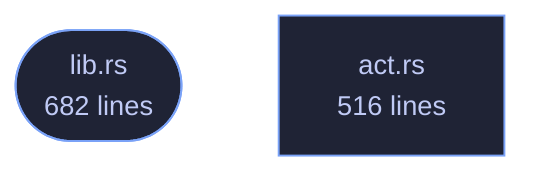

<!-- GENERATED by tools/docs/generate.py from the doc comments in the source. Do not edit: edit the .rs file and run the generator. -->

# veilvoice-failsafe

> The safety catch: notice the moment another program takes a real microphone while you are being veiled, and act -- without ever claiming to have prevented it.

[[Reference]] &middot; [the same page in the repository](https://github.com/tilas01/veilvoice/blob/main/crates/veilvoice-failsafe/README.md)

## Contents

- [The accident this exists to stop](#the-accident-this-exists-to-stop)
- [What it can do, and what it cannot](#what-it-can-do-and-what-it-cannot)
- [Killing another program is a serious thing](#killing-another-program-is-a-serious-thing)
- [In plain words](#in-plain-words)
  - [How the crate fits together](#how-the-crate-fits-together)
  - [The files](#the-files)

Failsafe: nothing leaves this machine in your own voice by accident.

# The accident this exists to stop

You set a calling program to VeilVoice's virtual cable, you start live mode,
and everything is veiled. Then you plug in a headset. Windows offers the new
microphone, the calling program takes it, and from that moment your **real
voice** is going out — with the veiled window still open in front of you,
still showing meters moving, still looking exactly as it did a second ago.

Nobody notices that. It is not a mistake somebody makes through
carelessness; it is a mistake the operating system makes on their behalf.
Failsafe is on by default because the cost of it being off is that the one
thing this whole project exists to prevent happens silently.

# What it can do, and what it cannot

It **watches** which applications hold a microphone, and it knows which
device VeilVoice is veiling. If another program picks up a *real* microphone
while you are veiling, that is the accident, and Failsafe:

1. says so, loudly, because a silent guard is not a guard; and
2. closes that program, if `Posture::CloseIt` is set — which it is by
default, because a warning you have not read yet does not stop your voice
going out.

It **cannot stop the operating system handing a microphone to another
program in the first place.** Doing that needs exclusive-mode capture of
every input device, or a driver, and neither is something this project
ships — see `CANNOT_PREVENT`, which is the wording a front end must show.
What Failsafe does is notice within a second or so and act. That is a real
difference from nothing, and it is a real difference from prevention, and
both halves have to be said.

# Killing another program is a serious thing

So it is bounded rather than general:

* **VeilVoice never closes itself**, which would end the veiling it exists
to protect.
* **It never closes a system process.** `PROTECTED` is a list, checked by
name, and anything on it is reported and left alone.
* **It only closes what is actually holding a microphone**, from the watch
feed, never a name from a guess.
* **Every close is recorded**, because a program that vanishes with nothing
to explain it is indistinguishable from a crash.

# In plain words

Failsafe is on by default and it is the safety catch.

The danger it guards against is this: you are talking through VeilVoice with
your voice disguised, you plug in headphones or a headset, and your computer
quietly switches the call over to the *real* microphone. Your actual voice
goes out and nothing on screen looks any different.

Failsafe watches for exactly that. If another program picks up a real
microphone while you are being veiled, it tells you straight away and closes
that program so your voice stops going out.

What it cannot do is stop your computer from handing the microphone over in
the first place — that needs a level of access this program does not have,
and it says so rather than letting you believe otherwise. It notices, and it
acts, within about a second.

## How the crate fits together

  

The same graph as Mermaid source

## The files

| File | Lines | What it is |
|---|---:|---|
| [[`act.rs`|File-veilvoice-failsafe-act]] | 516 | Actually closing a program, kept apart from deciding to. |
| [[`lib.rs`|File-veilvoice-failsafe-lib]] | 682 | Failsafe: nothing leaves this machine in your own voice by accident. |
