<!-- GENERATED by tools/docs/generate.py from the doc comments in the source. Do not edit: edit the .rs file and run the generator. -->


# veilvoice-gnupg

> Run the GnuPG already on this machine: import the VeilVoice signing key and check a detached signature, reading GnuPG's machine-readable status rather than its translated prose.

[[Reference]] &middot; [the same page in the repository](https://github.com/tilas01/veilvoice/blob/main/crates/veilvoice-gnupg/README.md)

## Contents

- [What this does not fix](#what-this-does-not-fix)
- [Why the status lines and not the words](#why-the-status-lines-and-not-the-words)
- [A good signature from some key proves nothing](#a-good-signature-from-some-key-proves-nothing)
- [In plain words](#in-plain-words)
  - [How the crate fits together](#how-the-crate-fits-together)
  - [The files](#the-files)

Run the GnuPG that is already on this machine.

**Marker 97.** VeilVoice checks a release signature itself, with a key
compiled into the binary, so that somebody with no GnuPG installed is not
stuck. That is a real convenience and it has an obvious circularity: the
program telling you the download is genuine came out of that download.

Until now the answer to that was to print the commands and leave the running
of them to the reader. That is correct, almost nobody does it, and a check
almost nobody runs is a check that is not protecting anybody.

So this runs them. When GnuPG is on the machine, the signature is checked by
**two independent implementations** -- this project's built-in one and
somebody else's -- and both answers are reported. Two implementations
agreeing is worth more than either alone, and two disagreeing is the loudest
thing a verifier can find.

# What this does not fix

Running `gpg` from inside the binary under suspicion does not make the
answer independent of that binary. What it makes independent is the
*implementation*: the packet parsing, the hashing and the signature
arithmetic are somebody else's code. The independent *invocation* is still
the reader typing the commands themselves, and every front end that uses
this goes on printing them for exactly that reason.

# Why the status lines and not the words

`gpg --verify` prints "Good signature from ..." in the reader's own
language. Parsing that would be a verifier whose answer depends on a locale,
and the failure mode is the bad one: an unrecognised string reads as "no
good signature found" in one direction, or matches a translated word in the
other.

`--status-fd` is GnuPG's machine-readable channel and it is not translated.
Measured against GnuPG 2.4.4, which is where these shapes come from rather
than from the manual:

```text
good:      [GNUPG:] GOODSIG <keyid> <uid>
[GNUPG:] VALIDSIG <fingerprint> ...            exit 0
tampered:  [GNUPG:] BADSIG <keyid> <uid>                  exit 1
no key:    [GNUPG:] ERRSIG ... / NO_PUBKEY <keyid>        exit 2
import:    [GNUPG:] IMPORT_OK <flags> <fingerprint>       exit 0
```

# A good signature from *some* key proves nothing

This is the mistake the whole thing exists to avoid making on somebody's
behalf. `gpg --verify` reports success for a valid signature by **any** key
in the keyring, and anybody who can hand you an archive can hand you a
signature by a key they made this morning. So `Gnupg::verify` is given the
fingerprint that is expected and compares `VALIDSIG` against it. A good
signature by a different key is its own outcome, `Outcome::AnotherKey`,
and it is a failure rather than a pass with a note attached.

# In plain words

If you have GnuPG, this uses it, so the answer does not come only from a
program you have just downloaded.

It adds the VeilVoice signing key to your keyring, checks the signature with
your GnuPG, and tells you exactly what your GnuPG said. It also checks that
the signature is by the right key, which is the part that matters and the
part that is easiest to skip.

## How the crate fits together

<p align="center">
  
</p>

<details>
<summary>The same graph as Mermaid source</summary>



</details>

```mermaid
%%{init: {"theme":"base","themeVariables":{"background":"#1a1b26","primaryColor":"#1f2335","primaryTextColor":"#c0caf5","primaryBorderColor":"#7aa2f7","secondaryColor":"#16161e","tertiaryColor":"#16161e","lineColor":"#737aa2","textColor":"#c0caf5","mainBkg":"#1f2335","nodeBorder":"#7aa2f7","clusterBkg":"#16161e","clusterBorder":"#2f3549","fontFamily":"ui-monospace, SFMono-Regular, Consolas, monospace","fontSize":"14px"}}}%%
flowchart TD
    n_lib(["lib.rs<br/>816 lines"])
    click n_lib href "https://github.com/tilas01/veilvoice/blob/main/crates/veilvoice-gnupg/src/lib.rs" "open the source"
```

## The files

| File | Lines | What it is |
|---|---:|---|
| [[`lib.rs`|File-veilvoice-gnupg-lib]] | 816 | Run the GnuPG that is already on this machine. |
