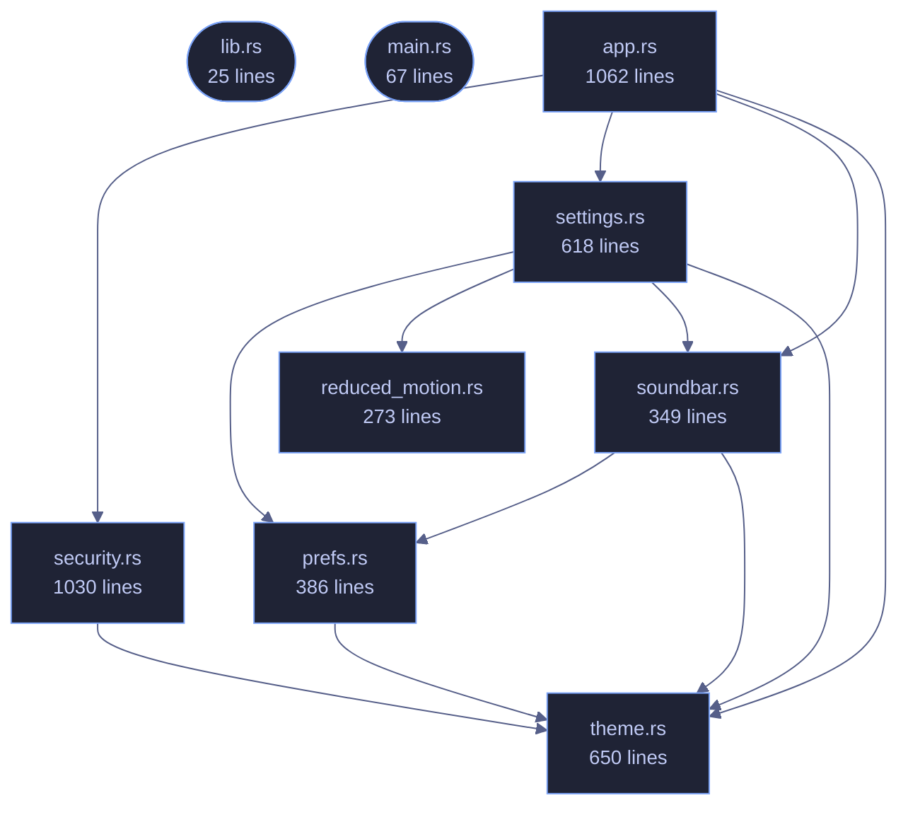

# veilvoice-gui

> egui/eframe front-end for VeilVoice: Tokyo Night, monospace, three modes.

[[Reference]] &middot; [the same page in the repository](https://github.com/tilas01/veilvoice/blob/main/crates/veilvoice-gui/README.md)

## Contents

- [How the crate fits together](#how-the-crate-fits-together)
- [The files](#the-files)

The VeilVoice desktop application: an egui/eframe front-end, monospace
throughout — anonymise a file, scramble a microphone live, watch what is
listening, manage the app lock, choose how the app looks, and an about
panel that states the honest scope.

The binary lives in `main.rs`; this library exists so the UI logic can be
unit tested without opening a window.

## How the crate fits together

## The files

| File | Lines | What it is |
|---|---:|---|
| [[`app.rs`|File-veilvoice-gui-app]] | 1062 | The VeilVoice desktop application. |
| [[`lib.rs`|File-veilvoice-gui-lib]] | 25 | The VeilVoice desktop application: an egui/eframe front-end, monospace throughout — anonymise a file, scramble a microphone live, watch what is listening, manage the app lock, choose how the app looks, and an about panel that states the honest scope. |
| [[`main.rs`|File-veilvoice-gui-main]] | 67 | Entry point for the desktop application: open a window, hand it to veilvoice_gui::VeilVoiceApp, and get out of the way. |
| [[`prefs.rs`|File-veilvoice-gui-prefs]] | 386 | What the user has chosen about how the app looks and moves. |
| [[`reduced_motion.rs`|File-veilvoice-gui-reduced_motion]] | 273 | Whether the operating system has been asked to reduce motion. |
| [[`security.rs`|File-veilvoice-gui-security]] | 1030 | The application lock, and the at-rest encryption of what VeilVoice writes. |
| [[`settings.rs`|File-veilvoice-gui-settings]] | 618 | The settings panel: a menu of pages, each a titled group of choices. |
| [[`soundbar.rs`|File-veilvoice-gui-soundbar]] | 349 | The animated mark: a row of bars that rise and fall. |
| [[`theme.rs`|File-veilvoice-gui-theme]] | 650 | Colour schemes for the desktop app. |
