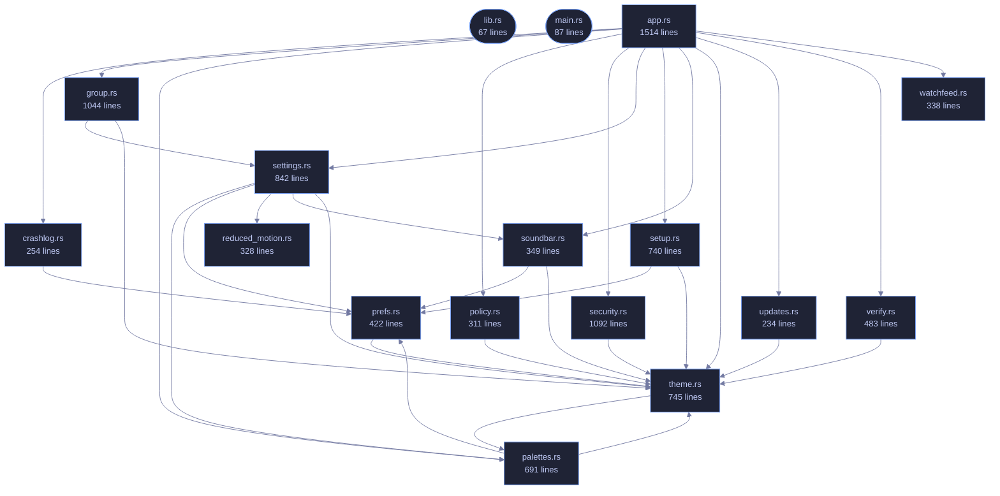

<!-- GENERATED by tools/docs/generate.py from the doc comments in the source. Do not edit: edit the .rs file and run the generator. -->

# veilvoice-gui

> egui/eframe front-end for VeilVoice: Tokyo Night, monospace, three modes.

[[Reference]] &middot; [the same page in the repository](https://github.com/tilas01/veilvoice/blob/main/crates/veilvoice-gui/README.md)

## Contents

- [The modules](#the-modules)
- [Two rules this crate keeps](#two-rules-this-crate-keeps)
  - [How the crate fits together](#how-the-crate-fits-together)
  - [The files](#the-files)

The VeilVoice desktop application: an egui/eframe front-end, monospace
throughout — anonymise a file, scramble a microphone live, watch what is
listening, manage the app lock, choose how the app looks, and an about
panel that states the honest scope.

The binary lives in `main.rs`; this library exists so the UI logic can be
unit tested without opening a window.

That split is worth stating plainly, because it is the reason this crate has
tests at all: a binary crate cannot be unit tested, so everything with logic
in it -- the app lock's state machine, preference loading, palette
resolution, the reduced-motion decision -- lives here where a test can reach
it without a display server. `main.rs` holds only what genuinely needs a
window.

# The modules

| Module | What it owns |
|---|---|
| `security` | The unlock screen, the lock tab, and the at-rest controls |
| `prefs` | Preferences, and recovering from a corrupt preferences file |
| `policy` | Settings somebody has fixed, and the reason beside each one |
| `settings` | The settings tab |
| `setup` | Installing this copy, and the optional companions |
| `theme` | The palette, shared with the command-line front end |
| `soundbar` | The animated level meter |
| `reduced_motion` | Whether to animate at all |
| `watchfeed` | The device monitor, on a thread that is not this one |

# Two rules this crate keeps

**The user interface never softens a scope note.** Where a control has a
bound -- the app lock is a verifier and not disk encryption, tamper detection
detects rather than prevents -- the interface says so next to the control,
and tests fail the build if that text changes. Documentation nobody opens
does not protect anybody.

**Animation is a preference that is honoured, not a decoration.**
`reduced_motion` resolves the platform's own setting alongside the user's
explicit choice, and the whole interface reads that answer rather than each
widget deciding for itself.

## How the crate fits together

  

The same graph as Mermaid source

## The files

| File | Lines | What it is |
|---|---:|---|
| [[`app.rs`|File-veilvoice-gui-app]] | 1514 | The VeilVoice desktop application: seven tabs, one window, no menus. |
| [[`crashlog.rs`|File-veilvoice-gui-crashlog]] | 254 | Make a failure that produces no output produce some. |
| [[`group.rs`|File-veilvoice-gui-group]] | 1044 | Group mode: several people in one recording, each with a name and a colour. |
| [[`lib.rs`|File-veilvoice-gui-lib]] | 67 | The VeilVoice desktop application: an egui/eframe front-end, monospace throughout — anonymise a file, scramble a microphone live, watch what is listening, manage the app lock, choose how the app looks, and an about panel that states the honest scope. |
| [[`main.rs`|File-veilvoice-gui-main]] | 87 | Entry point for the desktop application: open a window, hand it to veilvoice_gui::VeilVoiceApp, and get out of the way. |
| [[`palettes.rs`|File-veilvoice-gui-palettes]] | 691 | User-defined colour schemes, and the contrast check that keeps them usable. |
| [[`policy.rs`|File-veilvoice-gui-policy]] | 311 | The policy in force, and what the interface does about it. |
| [[`prefs.rs`|File-veilvoice-gui-prefs]] | 422 | What the user has chosen about how the app looks and moves. |
| [[`reduced_motion.rs`|File-veilvoice-gui-reduced_motion]] | 328 | Whether the operating system has been asked to reduce motion. |
| [[`security.rs`|File-veilvoice-gui-security]] | 1092 | The application lock, and the at-rest encryption of what VeilVoice writes. |
| [[`settings.rs`|File-veilvoice-gui-settings]] | 842 | The settings panel: a menu of pages, each a titled group of choices. |
| [[`setup.rs`|File-veilvoice-gui-setup]] | 740 | The setup tab: install this copy, undo that, and the optional companions. |
| [[`soundbar.rs`|File-veilvoice-gui-soundbar]] | 349 | The animated mark: a row of bars that rise and fall. |
| [[`theme.rs`|File-veilvoice-gui-theme]] | 745 | Colour schemes for the desktop app. |
| [[`updates.rs`|File-veilvoice-gui-updates]] | 234 | The manual update check, as the window shows it. |
| [[`verify.rs`|File-veilvoice-gui-verify]] | 483 | The verify tab: drop a download on the window and be told what it is. |
| [[`watchfeed.rs`|File-veilvoice-gui-watchfeed]] | 338 | The device monitor, moved off the thread that paints. |
