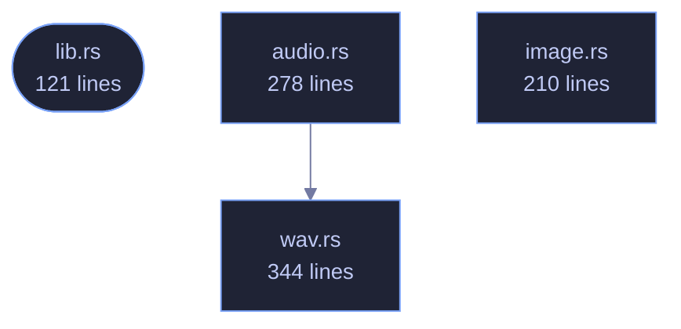

<!-- GENERATED by tools/docs/generate.py from the doc comments in the source. Do not edit: edit the .rs file and run the generator. -->

# veilvoice-meta

> Strip or spoof identifying metadata: audio tags, and image EXIF/GPS.

[[Reference]] &middot; [the same page in the repository](https://github.com/tilas01/veilvoice/blob/main/crates/veilvoice-meta/README.md)

## Contents

  - [Why this exists](#why-this-exists)
  - [Strip versus spoof](#strip-versus-spoof)
  - [What this crate cannot do](#what-this-crate-cannot-do)
- [In plain words](#in-plain-words)
  - [How the crate fits together](#how-the-crate-fits-together)
  - [The files](#the-files)

Strip or spoof the identifying metadata that rides along with media files.

## Why this exists

De-identifying a voice accomplishes nothing if the file still says who
recorded it. A phone recording routinely carries the device model, the
recording software, a precise timestamp and — for images — GPS coordinates
accurate to a few metres. That is often a far easier way to identify someone
than analysing their voice, and it survives every DSP transform because it
is not in the audio at all.

## Strip versus spoof

Removing every tag is not always the least conspicuous choice. A file with
*no* metadata whatsoever is itself a signal: it says the sender was trying to
hide something, and it stands out in a set of otherwise ordinary files.
`Policy` therefore offers two approaches:

- `Policy::Strip` — remove everything. Best when the file is expected to
be sanitised anyway, or when any false statement would be worse than an
obvious absence.
- `Policy::Realistic` — replace the tags with plausible, non-identifying
values so the file looks unremarkable rather than scrubbed.

## What this crate cannot do

It removes *container* metadata. It cannot remove information encoded in the
media itself: a photograph still shows the room it was taken in, and audio
still carries its room acoustics and background noise. Nor does it touch
filesystem timestamps or the filename, both of which are outside the file —
callers that care must handle those separately.

# In plain words

This strips the hidden labels off a file.

Photographs and recordings carry information you never typed: where the picture
was taken, which phone or microphone made it, what the file was called before,
sometimes a name. Removing the sound of a voice and leaving that behind would
be pointless, so this takes it out -- not by blanking the fields, but by
removing the parts of the file that hold them.

## How the crate fits together

  

The same graph as Mermaid source

## The files

| File | Lines | What it is |
|---|---:|---|
| [[`audio.rs`|File-veilvoice-meta-audio]] | 278 | Audio tag removal and replacement. |
| [[`image.rs`|File-veilvoice-meta-image]] | 210 | Image EXIF/GPS removal. |
| [[`lib.rs`|File-veilvoice-meta-lib]] | 121 | Strip or spoof the identifying metadata that rides along with media files. |
| [[`wav.rs`|File-veilvoice-meta-wav]] | 344 | Chunk-level RIFF/WAVE metadata removal. |
| [[`wav_fuzz.rs`|File-veilvoice-meta-tests-wav_fuzz]] | 299 | Randomised robustness testing for the RIFF chunk walker. |
