<!-- GENERATED by tools/docs/generate.py from the doc comments in the source. Do not edit: edit the .rs file and run the generator. -->

# veilvoice-priv

> What privilege VeilVoice is running with and what each level can see -- reported, never acquired.

[[Reference]] &middot; [the same page in the repository](https://github.com/tilas01/veilvoice/blob/main/crates/veilvoice-priv/README.md)

## Contents

- [Three levels, and the third one this project does not ship](#three-levels-and-the-third-one-this-project-does-not-ship)
- [This crate does not elevate anything](#this-crate-does-not-elevate-anything)
- [Detection is a measurement, and it can fail](#detection-is-a-measurement-and-it-can-fail)
- [In plain words](#in-plain-words)
  - [How the crate fits together](#how-the-crate-fits-together)
  - [The files](#the-files)

What privilege VeilVoice is running with, and what each level can actually
see.

# Three levels, and the third one this project does not ship

* `Level::User` is VeilVoice as you. Everything the de-identifier does
happens here, and nothing about the engine, the container format or the
app lock needs any more than this.
* `Level::Elevated` is running as administrator or root. The monitoring
features see further: processes belonging to other users, service
accounts, and a few registry and system paths that are unreadable
otherwise.
* **Kernel level** is not shipped, and not for want of trying. Loading a
kernel driver on 64-bit Windows needs an EV code-signing certificate
issued to a verified legal entity plus Microsoft's attestation signing;
macOS needs an Apple Developer ID and an entitlement granted case by
case. Both are identity checks, and this project is published under a
pseudonym on purpose. `NO_KERNEL` says so in the words a front end
should show.

# This crate does not elevate anything

It reports. It does not re-launch VeilVoice as administrator, install a
service, or ask for a password. Those are changes to somebody's machine and
they belong to the person whose machine it is: `Level::how_to_raise`
prints the command, and they type it.

That is not caution for its own sake. A privacy tool that silently acquires
administrator rights is a privacy tool nobody can reason about, and one that
installs a background service without being asked is worse, because a service
outlives the window it was started from, and somebody who tried VeilVoice
once should not find it still running next month.

# Detection is a measurement, and it can fail

There is no `am_i_admin()` in the standard library and reaching the real
answer is FFI on every platform here. So this asks a tool the system already
ships, exactly as `veilvoice-watch` asks the registry, and when the tool
cannot be run, the answer is `Level::Unknown` rather than a guess.

**`Unknown` is not `User`.** Reporting "not elevated" when the truth is "I
could not tell" would understate what VeilVoice can see, which sounds like
the safe direction and is not: somebody would conclude a feature is
unavailable and stop looking at its output.

# In plain words

Most of VeilVoice needs no special permissions at all, because changing a voice is
something any program can do with your own account.

The parts that *watch* your machine can see more when VeilVoice is run as an
administrator: programs belonging to other accounts, and a few places on the
system that are otherwise off limits. This tells you which of those you are
currently getting, and how to run it the other way if you want to.

It will not do that for you. Running as administrator, or installing a
background service, is a change to your computer and it should be one you
made on purpose. And there is a third level, inside the operating system
itself, that VeilVoice does not reach and says so rather than implying it
does.

## How the crate fits together

  

The same graph as Mermaid source

```mermaid
%%{init: {"theme":"base","themeVariables":{"background":"#1a1b26","primaryColor":"#1f2335","primaryTextColor":"#c0caf5","primaryBorderColor":"#7aa2f7","secondaryColor":"#16161e","tertiaryColor":"#16161e","lineColor":"#737aa2","textColor":"#c0caf5","mainBkg":"#1f2335","nodeBorder":"#7aa2f7","clusterBkg":"#16161e","clusterBorder":"#2f3549","fontFamily":"ui-monospace, SFMono-Regular, Consolas, monospace","fontSize":"14px"}}}%%
flowchart TD
    n_lib(["lib.rs<br/>406 lines"])
    click n_lib href "https://github.com/tilas01/veilvoice/blob/main/crates/veilvoice-priv/src/lib.rs" "open the source"
```

## The files

| File | Lines | What it is |
|---|---:|---|
| [[`lib.rs`|File-veilvoice-priv-lib]] | 406 | What privilege VeilVoice is running with, and what each level can actually see. |
