<!-- GENERATED by tools/docs/generate.py from the doc comments in the source. Do not edit: edit the .rs file and run the generator. -->

# veilvoice-proc

> Which processes are running, per platform, with the limits of that answer stated rather than implied.

[[Reference]] &middot; [the same page in the repository](https://github.com/tilas01/veilvoice/blob/main/crates/veilvoice-proc/README.md)

## Contents

- [Why this is a crate rather than a module](#why-this-is-a-crate-rather-than-a-module)
- [Linux reads files; the other two ask a tool](#linux-reads-files-the-other-two-ask-a-tool)
- [What this can see, and what it cannot](#what-this-can-see-and-what-it-cannot)
- [In plain words](#in-plain-words)
  - [How the crate fits together](#how-the-crate-fits-together)
  - [The files](#the-files)

Which processes are running, per platform, and what that cannot tell you.

# Why this is a crate rather than a module

Two of this workspace's security features need the same answer: which
programs are running. `veilvoice-capture` asks it about screen recorders,
`veilvoice-input` asks it about keyboard and mouse monitors, and the answer
is one platform-specific listing with one set of limits.

It began inside `veilvoice-capture` as a private module. Leaving it there
and depending on that crate would mean a keyboard-monitoring feature pulling
in a table of screen recorders it will never look at, which is exactly what
the design note in `ROADMAP.md` says these crates must not do: *each is a
crate of its own, so that another project can depend on one without taking
all of them*. The alternative -- a second copy of the parser -- is worse:
this project already extracted `veilvoice-check` out of the verifier so the
desktop application and the command line could not drift apart, and the
reasoning is the same here.

# Linux reads files; the other two ask a tool

On Linux every process publishes its own name at `/proc/<pid>/comm`, so the
list is a directory walk and nothing is spawned. Windows and macOS have no
such file, and their native APIs are FFI -- `#![forbid(unsafe_code)]` holds
here as it does everywhere else in the workspace, so this asks a tool the
system already ships, exactly as `veilvoice-watch` asks the registry and
`veilvoice-drivers` asks `driverquery`.

# What this can see, and what it cannot

Processes belonging to the user running VeilVoice, and -- depending on the
platform and the privileges -- usually not much more. A program running as
another user or as a service may not appear at all.

It sees a program that is **running**. It does not see what that program is
doing. Every caller has to phrase its findings accordingly, and `SCOPE`
is the wording to show rather than an invitation to invent one.

`comm` on Linux is truncated to fifteen characters by the kernel, so any
table matched against this must carry a name of fifteen characters or fewer
for every program it expects to find there. A sixteen-character executable
would otherwise stop matching on one platform only, silently -- and the
tables that do this keep their own tests for it, next to the table, because
that is where somebody adds a row.

# In plain words

This asks your computer which programs are open right now, in the way each
operating system prefers to be asked. It is used by the parts of VeilVoice
that warn you when something able to record your screen, or watch your
typing, is running.

Two honest limits. It can only see programs running as you -- something
hidden well enough, or running as the system, will not appear. And it only
knows a program is **open**, never that it is actually recording or
watching. Anything built on top of this has to say so in those words.

## How the crate fits together

  

The same graph as Mermaid source

```mermaid
%%{init: {"theme":"base","themeVariables":{"background":"#1a1b26","primaryColor":"#1f2335","primaryTextColor":"#c0caf5","primaryBorderColor":"#7aa2f7","secondaryColor":"#16161e","tertiaryColor":"#16161e","lineColor":"#737aa2","textColor":"#c0caf5","mainBkg":"#1f2335","nodeBorder":"#7aa2f7","clusterBkg":"#16161e","clusterBorder":"#2f3549","fontFamily":"ui-monospace, SFMono-Regular, Consolas, monospace","fontSize":"14px"}}}%%
flowchart TD
    n_lib(["lib.rs<br/>276 lines"])
    click n_lib href "https://github.com/tilas01/veilvoice/blob/main/crates/veilvoice-proc/src/lib.rs" "open the source"
```

## The files

| File | Lines | What it is |
|---|---:|---|
| [[`lib.rs`|File-veilvoice-proc-lib]] | 276 | Which processes are running, per platform, and what that cannot tell you. |
