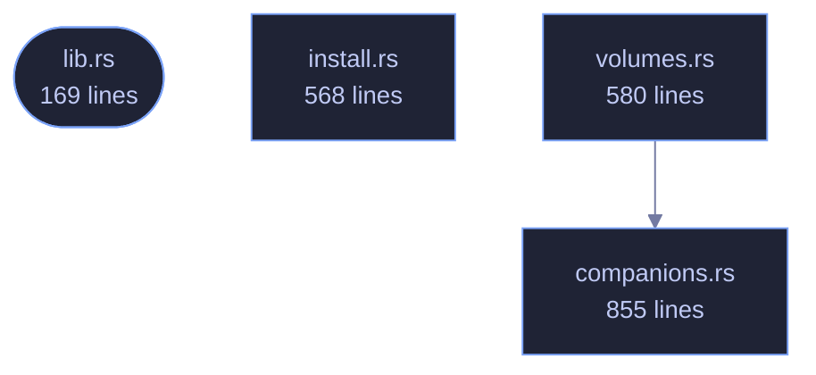

<!-- GENERATED by tools/docs/generate.py from the doc comments in the source. Do not edit: edit the .rs file and run the generator. -->

# veilvoice-setup

> Per-user installation and companion-software detection, shared by the command line and the desktop app.

[[Reference]] &middot; [the same page in the repository](https://github.com/tilas01/veilvoice/blob/main/crates/veilvoice-setup/README.md)

## Contents

- [Why this is a library and not part of the command line](#why-this-is-a-library-and-not-part-of-the-command-line)
- [What it will not do](#what-it-will-not-do)
- [No unsafe, and therefore some subprocesses](#no-unsafe-and-therefore-some-subprocesses)
- [In plain words](#in-plain-words)
  - [How the crate fits together](#how-the-crate-fits-together)
  - [The files](#the-files)

Everything that puts VeilVoice on a machine, and everything that reports
what is already on it. Two modules: `install` does the per-user install
and its exact reversal, `companions` finds the optional third-party
software that live mode is easier with and says who makes each piece.

# Why this is a library and not part of the command line

It was part of the command line. `install.rs` lived inside the
`veilvoice-cli` **binary** crate, which meant the desktop application could
not call a single line of it, because a binary crate has no consumers. The choice
was to reimplement the installer behind the graphical front end, or to move
the logic somewhere both front ends can reach. Reimplementing it would have
produced two programs that edit `PATH`, drifting apart at whatever rate
nobody noticed, and the `PATH` edit is the one operation here that can
damage a machine.

So this crate is the installer, and both front ends are front ends. The
command line calls `install::install`; so does the desktop app's setup
tab. There is one implementation of the careful part, and one set of tests
covering it.

# What it will not do

**It never runs somebody else's installer.** `companions` reports what is
present and prepares an exact command for what is not, and where that
command is "open the vendor's download page" it says so rather than
fetching and executing an unverified binary. A project whose entire subject
is verifying what you run has no business being casual about that.

**It never asks for administrator rights.** Everything `install` does is
inside the user's own account. Where a companion genuinely needs privilege,
such as a system package manager or an audio driver, that fact is reported and the
command is handed over rather than run, because a graphical program cannot
honestly collect a `sudo` password and this one does not try.

**Nothing is ticked by default.** There are no checkboxes at all: each
companion is a separate, deliberate action. The rule that predates this
crate, which is to detect, say what it is and who makes it, and act only on
an explicit yes, is unchanged by the interface getting prettier.

# No `unsafe`, and therefore some subprocesses

`#![forbid(unsafe_code)]` holds here as everywhere else in the workspace,
so the Windows registry is reached through `reg.exe` rather than the Win32
API. `command` wraps every spawn so that none of them flashes a console
window when the desktop application is the caller, which is the defect that
shipped in v0.1.10, and a test reads this crate's own source to catch a spawn that
forgets.

# In plain words

This installs the program, if you want it installed.

You do not have to. Unzipping it and running it is a perfectly normal way to
use it, and this says so rather than treating it as a mistake. Installing does
three small things -- copies the program into your own folder, adds it to your
PATH so typing its name works, and adds an entry so Windows can remove it --
and nothing else. No administrator rights, no service.

It also looks for the few other programs VeilVoice can work alongside, tells
you who makes each one, and installs none of them unless you say so.

## How the crate fits together

  

The same graph as Mermaid source

## The files

| File | Lines | What it is |
|---|---:|---|
| [[`companions.rs`|File-veilvoice-setup-companions]] | 855 | Optional third-party software, detected rather than assumed. |
| [[`install.rs`|File-veilvoice-setup-install]] | 568 | Put this program somewhere the system can find it. |
| [[`lib.rs`|File-veilvoice-setup-lib]] | 169 | Everything that puts VeilVoice on a machine, and everything that reports what is already on it. |
| [[`volumes.rs`|File-veilvoice-setup-volumes]] | 580 | Encrypted volumes this machine already has: Cryptomator and VeraCrypt. |
