<!-- GENERATED by tools/docs/generate.py from the doc comments in the source. Do not edit: edit the .rs file and run the generator. -->

# veilvoice-update

> Ask, when told to, whether a newer VeilVoice release exists. No HTTP client, no automatic check, and nothing is downloaded or installed.

[[Reference]] &middot; [the same page in the repository](https://github.com/tilas01/veilvoice/blob/main/crates/veilvoice-update/README.md)

## Contents

- [What this is, and the claim it changes](#what-this-is-and-the-claim-it-changes)
- [There is still no HTTP client in the dependency graph](#there-is-still-no-http-client-in-the-dependency-graph)
- [What it will not do](#what-it-will-not-do)
- [What a "newer version" is worth here](#what-a-newer-version-is-worth-here)
- [In plain words](#in-plain-words)
  - [How the crate fits together](#how-the-crate-fits-together)
  - [The files](#the-files)

Ask, **only when told to**, whether a newer VeilVoice release exists.

# What this is, and the claim it changes

Until this crate existed, VeilVoice's front page said *"no telemetry, no
update check"*. Half of that is unchanged and half of it is not, and the
wording moved in the same commit as the code rather than afterwards:

* **No telemetry.** Unchanged, and nothing here sends anything about you.
The request is a plain `GET` of a public URL that anybody can open in a
browser; it carries no identifier, no configuration and no counter.
* **No *automatic* update check.** Nothing runs on a timer, at startup, or
in the background. `check` runs because a person pressed a button in
this run of the program, and it does nothing else ever.

An update checker that runs by itself is a beacon: it tells a server that
this machine has VeilVoice on it, roughly how often it is used, and from
which address. That is the thing being refused. A button somebody presses,
once, when they want to know, is a different act with different consequences,
and it is the only one on offer.

# There is still no HTTP client in the dependency graph

This crate has **no dependencies**. It runs the transfer tool the operating
system already ships, exactly as `veilvoice-verify` has fetched releases
since it existed, and reads its output. `cargo tree` shows no `reqwest`, no
`hyper`, no `ureq`; the CI job that fails the build if one appears is
unchanged and still passes.

The tool is found at an **absolute path**, never by bare name. Resolving a
program by name on Windows searches the current directory before most of
`PATH`, so a file called `curl.exe` sitting beside the program would be run
instead of the system one. That is finding F-13, and it does not get to
happen twice.

# What it will not do

It does not download a release, it does not install anything, and it does
not restart the program. It reports a version string and leaves every
decision to the reader. Downloading a release and checking its signature is
`veilvoice-verify`'s job, and that is a separate, deliberate act too.

An update checker that could install its own answer is an update checker
that can be made to install somebody else's.

# What a "newer version" is worth here

The answer comes from a public web page over TLS. That is enough to say
*"there is probably something newer, go and look"* and it is **not** enough
to act on: a name in a document is not a signature. Nothing in this crate
verifies anything, and `Report::caveat` says so in the words the user
sees rather than only in this comment.

# In plain words

This is the "check for updates" button, and nothing else.

It runs when you press it and at no other time. There is no timer and nothing
in the background, because a program that checks by itself is telling somebody
else's computer that yours exists and how often you use it.

It reads a public page anybody can open, tells you the newest version number,
and stops there. It does not download anything and it does not install
anything.

## How the crate fits together

  

The same graph as Mermaid source

```mermaid
%%{init: {"theme":"base","themeVariables":{"background":"#1a1b26","primaryColor":"#1f2335","primaryTextColor":"#c0caf5","primaryBorderColor":"#7aa2f7","secondaryColor":"#16161e","tertiaryColor":"#16161e","lineColor":"#737aa2","textColor":"#c0caf5","mainBkg":"#1f2335","nodeBorder":"#7aa2f7","clusterBkg":"#16161e","clusterBorder":"#2f3549","fontFamily":"ui-monospace, SFMono-Regular, Consolas, monospace","fontSize":"14px"}}}%%
flowchart TD
    n_lib(["lib.rs<br/>536 lines"])
    click n_lib href "https://github.com/tilas01/veilvoice/blob/main/crates/veilvoice-update/src/lib.rs" "open the source"
```

## The files

| File | Lines | What it is |
|---|---:|---|
| [[`lib.rs`|File-veilvoice-update-lib]] | 536 | Ask, only when told to, whether a newer VeilVoice release exists. |
| [[`ask.rs`|File-veilvoice-update-examples-ask]] | 26 | Run the real check once, by hand. |
