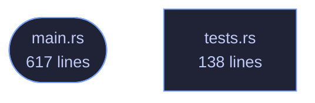

# veilvoice-verify

> Verify a VeilVoice release without GnuPG installed

[[Reference]] &middot; [the same page in the repository](https://github.com/tilas01/veilvoice/blob/main/crates/veilvoice-verify/README.md)

## Contents

- [What this is for](#what-this-is-for)
- [The one thing it cannot embed](#the-one-thing-it-cannot-embed)
- [What it does not do](#what-it-does-not-do)
  - [How the crate fits together](#how-the-crate-fits-together)
  - [The files](#the-files)

The portable verifier: check a VeilVoice release without GnuPG installed.

# What this is for

Verifying a download by hand needs GnuPG and a SHA-256 tool. That is four
commands and two dependencies, and on Windows it is usually neither. This
is one binary that does the same checks with nothing else installed: the
signing key and its fingerprint are compiled into it.

# The one thing it cannot embed

It cannot carry the expected hash of the file it is checking. A file cannot
contain its own digest -- writing the digest in changes the file, which
changes the digest. So the hash has to come from outside, and there are
exactly two places it can come from. They prove **different things**, and
this tool is careful never to blur them:

**From the published `SHA256SUMS`** -- whose signature this tool checks
against the embedded key. A match proves the download is *intact*: it is
byte-for-byte the file that was published, not a corrupted or substituted
one. It says nothing about whether that file corresponds to the source,
because whoever published it produced both the file and the list.

**Typed in by hand, from a hash somebody else produced** by building the
same tagged source themselves. A match proves something strictly stronger:
that the published binary is what that source compiles to, on a machine
that is not the publisher's. That is *reproducibility*, and it is the only
check that does not ultimately rest on trusting whoever signed the release.

Most people want the first. The second is what makes the first worth
anything, and it needs somebody other than the author to have done a build.
`docs/REPRODUCIBLE_BUILDS.md` says how.

# What it does not do

It does not download anything -- this project has no network code and this
binary is not the exception. Fetch the files however you like; this reads
them from disk. It does not install anything, and it writes nothing.

## How the crate fits together

## The files

| File | Lines | What it is |
|---|---:|---|
| [[`main.rs`|File-veilvoice-verify-main]] | 617 | The portable verifier: check a VeilVoice release without GnuPG installed. |
| [[`tests.rs`|File-veilvoice-verify-tests]] | 138 | The verifier's own tests. |
