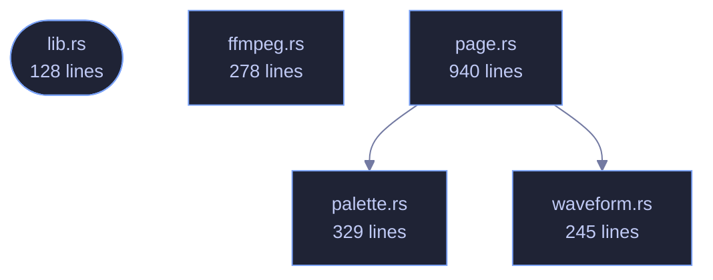

<!-- GENERATED by tools/docs/generate.py from the doc comments in the source. Do not edit: edit the .rs file and run the generator. -->

# veilvoice-video

> A watchable version of a veiled conversation: a waveform, a circle per speaker, subtitles, and an honest account of what needs ffmpeg.

[[Reference]] &middot; [the same page in the repository](https://github.com/tilas01/veilvoice/blob/main/crates/veilvoice-video/README.md)

## Contents

- [What this produces, and what needs something else](#what-this-produces-and-what-needs-something-else)
- [The page needs a little JavaScript, and says so](#the-page-needs-a-little-javascript-and-says-so)
- [A picture is not veiled](#a-picture-is-not-veiled)
- [How the crate fits together](#how-the-crate-fits-together)
- [The files](#the-files)

A watchable version of a veiled conversation: the waveform, a circle per
speaker, the title, the subtitles, and a background.

## What this produces, and what needs something else

**A self-contained page, always.** `page::player` writes one HTML file
that plays the veiled audio, draws its waveform, lights each speaker's
circle as they talk and shows the subtitles. It needs nothing installed, it
contacts nothing, it opens in any browser on any device, and it is what this
crate is for.

**A video file, only if `ffmpeg` is there.** Turning a few thousand frames
into an `.mp4` needs a codec, and this project ships none: writing an H.264
encoder is not a sensible thing for a voice de-identifier to do, and pulling
one in would put a large C dependency into a graph whose emptiness is a
front-page claim. So `ffmpeg` finds the tool if the machine has it and
prepares the exact command; if the machine does not, the page is still
there and nothing has failed.

VeilVoice never downloads or runs `ffmpeg` on your behalf, exactly as it
never installs any other companion.

## The page needs a little JavaScript, and says so

Lighting the right circle means knowing where the audio has got to, and only
the audio element knows that. There is a small inline script — no file, no
network, no library — and a `<noscript>` that says what it does. Without it
the audio still plays, the subtitles still appear and the waveform is still
drawn; the circles simply do not light up.

## A picture is not veiled

A speaker may have a portrait, and it is drawn exactly as supplied. Nothing
here anonymises an image: a photograph of somebody's face beside their
veiled voice identifies them completely. The default is a plain filled
circle for that reason, and `SCOPE` says it where a user will read it.

## How the crate fits together

## The files

| File | Lines | What it is |
|---|---:|---|
| [[`ffmpeg.rs`|File-veilvoice-video-ffmpeg]] | 278 | The video file, which needs a codec this project does not ship. |
| [[`lib.rs`|File-veilvoice-video-lib]] | 128 | A watchable version of a veiled conversation: the waveform, a circle per speaker, the title, the subtitles, and a background. |
| [[`page.rs`|File-veilvoice-video-page]] | 940 | The picture: one still for a preview, and one page that plays. |
| [[`palette.rs`|File-veilvoice-video-palette]] | 329 | Colours: the site's own tokens, and one per speaker. |
| [[`waveform.rs`|File-veilvoice-video-waveform]] | 245 | The shape of the audio, reduced to something a page can draw. |
