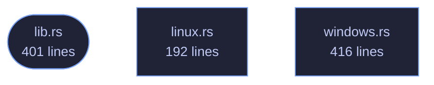

<!-- GENERATED by tools/docs/generate.py from the doc comments in the source. Do not edit: edit the .rs file and run the generator. -->

# veilvoice-watch

> Detect which applications are currently using the microphone and camera, with alerts on change.

[[Reference]] &middot; [the same page in the repository](https://github.com/tilas01/veilvoice/blob/main/crates/veilvoice-watch/README.md)

## Contents

- [Why this belongs in a voice-privacy tool](#why-this-belongs-in-a-voice-privacy-tool)
- [What it can actually see, per platform](#what-it-can-actually-see-per-platform)
- [How the crate fits together](#how-the-crate-fits-together)
- [The files](#the-files)

Find out which applications are using your microphone and camera, right now.

## Why this belongs in a voice-privacy tool

VeilVoice protects the audio you choose to send. This answers a different
and more basic question: *is something listening that you did not choose?*
A de-identified voice on a call is worth very little if a second program is
recording the raw microphone at the same time.

Operating systems have grown indicators for this — the orange dot, the
taskbar icon — but they are small, easily missed, and tell you only that
*something* is active, rarely what. This reports the process, its PID and
how long it has held the device.

## What it can actually see, per platform

Detection is honest about its limits, because a monitor that quietly sees
nothing is worse than no monitor at all — it produces false confidence.
`support` reports what the current platform can do before you rely on it.

| Platform | Microphone | Camera | How |
|---|---|---|---|
| Windows | ✅ | ✅ | The same `CapabilityAccessManager` records the OS privacy indicator uses |
| Linux | ✅ | ✅ | `/proc/*/fd` handles open on `/dev/snd/pcm*` and `/dev/video*` |
| macOS | ❌ | ❌ | No public API exposes it; anything claiming otherwise on macOS is guessing |

On Linux you see every process you have permission to inspect. Without root
that means your own; other users' processes are invisible, and that is a
kernel permission boundary rather than something this crate can work around.

## How the crate fits together

## The files

| File | Lines | What it is |
|---|---:|---|
| [[`lib.rs`|File-veilvoice-watch-lib]] | 401 | Find out which applications are using your microphone and camera, right now. |
| [[`linux.rs`|File-veilvoice-watch-linux]] | 192 | Linux detection, via open file handles in /proc. |
| [[`windows.rs`|File-veilvoice-watch-windows]] | 416 | Windows detection, via the Capability Access Manager. |
| [[`scan_once.rs`|File-veilvoice-watch-examples-scan_once]] | 22 | Print what is using the microphone and camera right now. |
