<!-- GENERATED by tools/docs/generate.py from the doc comments in the source. Do not edit: edit the .rs file and run the generator. -->

# `crates/veilvoice-audio/src/absent.rs`

[[veilvoice-audio|Crate-veilvoice-audio]] &middot; 309 lines &middot; [read the source](https://github.com/tilas01/veilvoice/blob/main/crates/veilvoice-audio/src/absent.rs)

## Contents

- [What this is not](#what-this-is-not)
- [In plain words](#in-plain-words)
  - [What calls what](#what-calls-what)
  - [Items](#items)

The live modules, in a build that has no live capture.

**Roadmap item 162.** `cpal` has no backend for FreeBSD, OpenBSD or NetBSD,
so the `live` feature is off there. The command line has always coped by
leaving its live commands out. The window cannot do that as neatly: the
Studio and the Browser are written against sessions, recorders and players,
and leaving each use out would mean a `cfg` on every line of the tab that
uses them, which is where a build that only one platform exercises goes to
rot.

So the same names exist here, with the same signatures, and **none of them
can do anything**. Every constructor refuses with `REASON`, which a front
end shows where the button was pressed. Every type that stands for a
running thing (a session, a room, a recorder, a player, an opened device)
holds a `std::convert::Infallible`, so no value of it can ever exist and
its methods are proofs that they are never called rather than code that
pretends to measure something.

The data the live path reports is not here: it is in `crate::kinds` and
is the same type in both builds.

# What this is not

It is not a fake microphone. Nothing here produces a sample, a level or a
device name, because a meter that moved on a platform that cannot hear
anything would be a lie about the one thing this program is for.

# In plain words

On a system where VeilVoice cannot use a microphone, the parts that would
use one are still there, and every one of them says that this system cannot
capture sound when it is asked to start.

## What this file contains

309 lines defining **1 function** (0 public), **0 types** and **1 constant**. Everything below is read out of the source, so it cannot disagree with the code.

## What calls what

_Colour key: **helper** -- private to this file._

  

The same graph as Mermaid source

```mermaid
%%{init: {"theme":"base","themeVariables":{"background":"#1a1b26","primaryColor":"#1f2335","primaryTextColor":"#c0caf5","primaryBorderColor":"#7aa2f7","secondaryColor":"#16161e","tertiaryColor":"#16161e","lineColor":"#737aa2","textColor":"#c0caf5","mainBkg":"#1f2335","nodeBorder":"#7aa2f7","clusterBkg":"#16161e","clusterBorder":"#2f3549","fontFamily":"ui-monospace, SFMono-Regular, Consolas, monospace","fontSize":"14px"}}}%%
flowchart TD
    n_refused["refused<br/>line 46"]
    click n_refused href "https://github.com/tilas01/veilvoice/blob/main/crates/veilvoice-audio/src/absent.rs#L46" "open the source"
    classDef helper fill:#1f2335,stroke:#bb9af7,color:#c0caf5
    class n_refused helper
```

## Items

| Item | Line | Documentation |
|---|---:|---|
| `REASON` pub const | [40](https://github.com/tilas01/veilvoice/blob/main/crates/veilvoice-audio/src/absent.rs#L40) | Why nothing live can start in this build, in the words a person reads. |
| `refused` fn | [46](https://github.com/tilas01/veilvoice/blob/main/crates/veilvoice-audio/src/absent.rs#L46) | The one answer every constructor here gives. |
| `devices` pub mod | [51](https://github.com/tilas01/veilvoice/blob/main/crates/veilvoice-audio/src/absent.rs#L51) | Devices, of which this build can see none. |
| `record` pub mod | [82](https://github.com/tilas01/veilvoice/blob/main/crates/veilvoice-audio/src/absent.rs#L82) | Recorders, which only a live session can create. |
| `playback` pub mod | [140](https://github.com/tilas01/veilvoice/blob/main/crates/veilvoice-audio/src/absent.rs#L140) | Playback, which needs an output device this build cannot open. |
| `live` pub mod | [173](https://github.com/tilas01/veilvoice/blob/main/crates/veilvoice-audio/src/absent.rs#L173) | The single-microphone session, which cannot start in this build. |
| `room` pub mod | [226](https://github.com/tilas01/veilvoice/blob/main/crates/veilvoice-audio/src/absent.rs#L226) | Several microphones at once, which cannot start in this build. |
