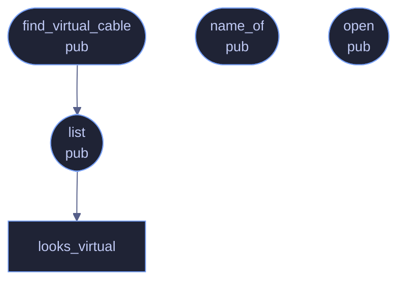

# `crates/veilvoice-audio/src/devices.rs`

[[veilvoice-audio|Crate-veilvoice-audio]] &middot; 188 lines &middot; [read the source](https://github.com/tilas01/veilvoice/blob/main/crates/veilvoice-audio/src/devices.rs)

## Contents

- [What calls what](#what-calls-what)
- [Items](#items)

Device enumeration and virtual-cable detection.

## What calls what

## Items

| Item | Line | Documentation |
|---|---:|---|
| `Direction` pub enum | [9](https://github.com/tilas01/veilvoice/blob/main/crates/veilvoice-audio/src/devices.rs#L9) | Which direction a device carries audio. |
| `DeviceInfo` pub struct | [18](https://github.com/tilas01/veilvoice/blob/main/crates/veilvoice-audio/src/devices.rs#L18) | A device the user can choose. |
| `VIRTUAL_CABLE_HINTS` const | [34](https://github.com/tilas01/veilvoice/blob/main/crates/veilvoice-audio/src/devices.rs#L34) | Name fragments used by the common virtual audio cables. |
| `looks_virtual` fn | [46](https://github.com/tilas01/veilvoice/blob/main/crates/veilvoice-audio/src/devices.rs#L46) |  |
| `list` pub fn | [52](https://github.com/tilas01/veilvoice/blob/main/crates/veilvoice-audio/src/devices.rs#L52) | List the devices available in one direction. |
| `find_virtual_cable` pub fn | [85](https://github.com/tilas01/veilvoice/blob/main/crates/veilvoice-audio/src/devices.rs#L85) | Find the first output device that looks like a virtual audio cable. |
| `name_of` pub fn | [95](https://github.com/tilas01/veilvoice/blob/main/crates/veilvoice-audio/src/devices.rs#L95) | The name of an opened device, or a placeholder when the OS will not say. |
| `open` pub fn | [100](https://github.com/tilas01/veilvoice/blob/main/crates/veilvoice-audio/src/devices.rs#L100) | Look up a device by exact name, or the host default when name is None. |
