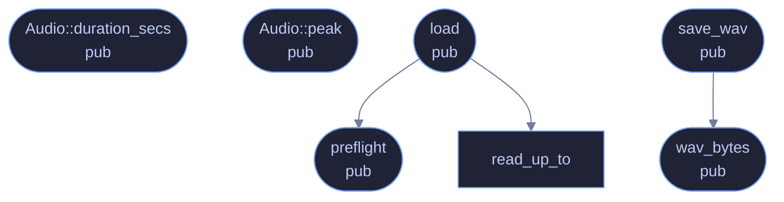

<!-- GENERATED by tools/docs/generate.py from the doc comments in the source. Do not edit: edit the .rs file and run the generator. -->

# `crates/veilvoice-audio/src/io.rs`

[[veilvoice-audio|Crate-veilvoice-audio]] &middot; 555 lines &middot; [read the source](https://github.com/tilas01/veilvoice/blob/main/crates/veilvoice-audio/src/io.rs)

## Contents

- [A decoder is a parser, and this one reads files somebody else made](#a-decoder-is-a-parser-and-this-one-reads-files-somebody-else-made)
- [Writing is WAV only, and that is a decision](#writing-is-wav-only-and-that-is-a-decision)
- [In-memory encoding, so plaintext never reaches the disk](#in-memory-encoding-so-plaintext-never-reaches-the-disk)
  - [What calls what](#what-calls-what)
  - [Items](#items)

Reading and writing audio files.

Decoding goes through `symphonia`, which is pure Rust and covers WAV, MP3,
FLAC, OGG/Vorbis, MP4/AAC and friends without shelling out to a codec
library. Writing is WAV only, on purpose: VeilVoice's job is to hand back
audio that has not been degraded, and re-encoding to a lossy format after
de-identification would throw away quality for no benefit. Callers who want
MP3 can transcode with whatever they already trust.

# A decoder is a parser, and this one reads files somebody else made

`symphonia` is the largest attacker-facing surface in this crate: it is
handed whole files of a format VeilVoice does not itself define. It is pure
Rust, which removes the memory-corruption class outright, but it does not
remove panics -- and this workspace builds with `panic = "abort"`, so a
panic inside a decoder is not an error a caller can handle, it is the
process ending.

That is why a pre-flight check runs before a file reaches the decoder, and
why the honest position is recorded in the audit rather than glossed:
decoding in a separate process is the only complete answer to "the next
malformed file in a format we do not parse ourselves", and it is not built.

# Writing is WAV only, and that is a decision

Re-encoding to a lossy format after de-identification would throw away
quality for no privacy benefit -- the voiceprint is already gone, and what
remains is the words, which is the part worth keeping intact.

# In-memory encoding, so plaintext never reaches the disk

`wav_bytes` exists so a recording can be encoded and then sealed without
ever being written in the clear. It has an awkward shape for a real reason:
`hound::WavWriter::finalize` consumes the writer, so the encode has to borrow
the cursor (`WavWriter::new(&mut cursor, spec)`) and read the bytes back
through `cursor.into_inner()` after the writer has been dropped.

## What calls what

## Items

| Item | Line | Documentation |
|---|---:|---|
| `MAX_DECODED_SAMPLES` pub const | [62](https://github.com/tilas01/veilvoice/blob/main/crates/veilvoice-audio/src/io.rs#L62) | The most decoded audio load will hold, in mono f32 samples. |
| `preflight` pub fn | [92](https://github.com/tilas01/veilvoice/blob/main/crates/veilvoice-audio/src/io.rs#L92) | Reject a file whose own header carries a value that will crash the decoder, before the decoder is given the file. |
| `Audio` pub struct | [137](https://github.com/tilas01/veilvoice/blob/main/crates/veilvoice-audio/src/io.rs#L137) | Mono audio in memory. |
| `Audio::duration_secs` pub fn | [146](https://github.com/tilas01/veilvoice/blob/main/crates/veilvoice-audio/src/io.rs#L146) | Duration in seconds. |
| `Audio::peak` pub fn | [154](https://github.com/tilas01/veilvoice/blob/main/crates/veilvoice-audio/src/io.rs#L154) | Peak absolute sample value. |
| `load` pub fn | [165](https://github.com/tilas01/veilvoice/blob/main/crates/veilvoice-audio/src/io.rs#L165) | Decode any supported audio file to mono f32. |
| `read_up_to` fn | [268](https://github.com/tilas01/veilvoice/blob/main/crates/veilvoice-audio/src/io.rs#L268) | Fill as much of buf as the file has, tolerating short reads. |
| `wav_bytes` pub fn | [289](https://github.com/tilas01/veilvoice/blob/main/crates/veilvoice-audio/src/io.rs#L289) | Encode mono f32 audio as a 16-bit PCM WAV, in memory. |
| `save_wav` pub fn | [309](https://github.com/tilas01/veilvoice/blob/main/crates/veilvoice-audio/src/io.rs#L309) | Write mono f32 audio to a 16-bit PCM WAV file. |
