<!-- GENERATED by tools/docs/generate.py from the doc comments in the source. Do not edit: edit the .rs file and run the generator. -->

# `crates/veilvoice-audio/src/lib.rs`

[[veilvoice-audio|Crate-veilvoice-audio]] &middot; 222 lines &middot; [read the source](https://github.com/tilas01/veilvoice/blob/main/crates/veilvoice-audio/src/lib.rs)

## Contents

  - [The live feature](#the-live-feature)
  - [Routing, and why a virtual cable matters](#routing-and-why-a-virtual-cable-matters)
- [In plain words](#in-plain-words)
  - [What calls what](#what-calls-what)
  - [Items](#items)

Everything between the sound hardware and
[[`veilvoice_core`|Crate-veilvoice-core]]: device enumeration, file
import and export, and the real-time capture → de-identify → playback path.

- `io` — decode any common audio file to mono `f32`, write 16-bit WAV, or
encode one in memory so it can be encrypted without ever landing on disk
in the clear.
- `devices` — enumerate inputs and outputs, and spot a virtual audio cable.
- `live` — run the engine live between two devices.

## The `live` feature

`devices` and `live` sit behind the default-on `live` feature. They are the
only part of this crate that needs `cpal`, and `cpal` has no backend for the
BSDs. Everything else — decoding, encoding, and running the engine over a
buffer — is pure Rust and builds anywhere, so turning the feature off keeps
file processing working on platforms that cannot do live capture rather than
failing to build at all.

## Routing, and why a virtual cable matters

Scrambling a microphone is only useful if other applications can hear the
result. Selecting a virtual audio cable as the output makes the veiled voice
appear as an ordinary microphone to any call, stream or recorder on the
machine, with no per-application setup. `devices::find_virtual_cable`
detects an installed one so the UI can offer it directly.

# In plain words

This is the plumbing between your microphone, your speakers and the part that
changes the voice.

It finds the sound devices you have, opens the recording you point at whatever
kind of file it is, and writes the result back out. For live use it does the
whole loop while you talk -- in from the microphone, through the engine, out to
whatever else is listening -- fast enough that a conversation still works.

It also reports how loud things are, which is what the level bars in the
program are drawing.

## What this file contains

222 lines defining **5 functions** (1 public), **1 type** and **1 constant**. Everything below is read out of the source, so it cannot disagree with the code.

**The types it owns.**

- `enum Error` (line 69) -- Everything that can go wrong in this crate.

**What happens when it runs.** These are the ways in: public, and nothing else in this file calls them, so they are what an outside caller reaches first.

- `deidentify` (line 128) -- De-identify a whole buffer of audio in one call.

## What calls what

_Colour key: **entry** -- a way in: public, and nothing in this file calls it; **helper** -- private to this file._

  

The same graph as Mermaid source

```mermaid
%%{init: {"theme":"base","themeVariables":{"background":"#1a1b26","primaryColor":"#1f2335","primaryTextColor":"#c0caf5","primaryBorderColor":"#7aa2f7","secondaryColor":"#16161e","tertiaryColor":"#16161e","lineColor":"#737aa2","textColor":"#c0caf5","mainBkg":"#1f2335","nodeBorder":"#7aa2f7","clusterBkg":"#16161e","clusterBorder":"#2f3549","fontFamily":"ui-monospace, SFMono-Regular, Consolas, monospace","fontSize":"14px"}}}%%
flowchart TD
    n_from["Error::from<br/>line 87"]
    n_from["Error::from<br/>line 93"]
    n_fmt["Error::fmt<br/>line 99"]
    n_source["Error::source<br/>line 114"]
    n_deidentify(["deidentify<br/>line 128"])
    click n_from href "https://github.com/tilas01/veilvoice/blob/main/crates/veilvoice-audio/src/lib.rs#L87" "open the source"
    click n_from href "https://github.com/tilas01/veilvoice/blob/main/crates/veilvoice-audio/src/lib.rs#L93" "open the source"
    click n_fmt href "https://github.com/tilas01/veilvoice/blob/main/crates/veilvoice-audio/src/lib.rs#L99" "open the source"
    click n_source href "https://github.com/tilas01/veilvoice/blob/main/crates/veilvoice-audio/src/lib.rs#L114" "open the source"
    click n_deidentify href "https://github.com/tilas01/veilvoice/blob/main/crates/veilvoice-audio/src/lib.rs#L128" "open the source"
    classDef entry fill:#1f2335,stroke:#7aa2f7,color:#c0caf5
    class n_deidentify entry
    classDef helper fill:#1f2335,stroke:#bb9af7,color:#c0caf5
    class n_from,n_from,n_fmt,n_source helper
```

## Items

| Item | Line | Documentation |
|---|---:|---|
| `VERSION` pub const | [64](https://github.com/tilas01/veilvoice/blob/main/crates/veilvoice-audio/src/lib.rs#L64) | Crate version string, surfaced in the About panel. |
| `Error` pub enum | [69](https://github.com/tilas01/veilvoice/blob/main/crates/veilvoice-audio/src/lib.rs#L69) | Everything that can go wrong in this crate. |
| `Error::from` fn | [87](https://github.com/tilas01/veilvoice/blob/main/crates/veilvoice-audio/src/lib.rs#L87) |  |
| `Error::from` fn | [93](https://github.com/tilas01/veilvoice/blob/main/crates/veilvoice-audio/src/lib.rs#L93) |  |
| `Error::fmt` fn | [99](https://github.com/tilas01/veilvoice/blob/main/crates/veilvoice-audio/src/lib.rs#L99) |  |
| `Error::source` fn | [114](https://github.com/tilas01/veilvoice/blob/main/crates/veilvoice-audio/src/lib.rs#L114) |  |
| `deidentify` pub fn | [128](https://github.com/tilas01/veilvoice/blob/main/crates/veilvoice-audio/src/lib.rs#L128) | De-identify a whole buffer of audio in one call. |
