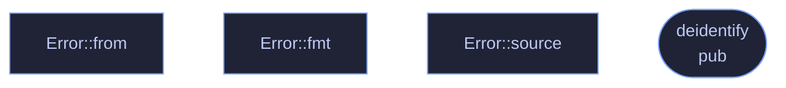

# `crates/veilvoice-audio/src/lib.rs`

[[veilvoice-audio|Crate-veilvoice-audio]] &middot; 204 lines &middot; [read the source](https://github.com/tilas01/veilvoice/blob/main/crates/veilvoice-audio/src/lib.rs)

## Contents

- [The live feature](#the-live-feature)
- [Routing, and why a virtual cable matters](#routing-and-why-a-virtual-cable-matters)
- [What calls what](#what-calls-what)
- [Items](#items)

Everything between the sound hardware and
[[`veilvoice_core`|Crate-veilvoice-core]]: device enumeration, file
import and export, and the real-time capture → de-identify → playback path.

- `io` — decode any common audio file to mono `f32`, write 16-bit WAV, or
encode one in memory so it can be encrypted without ever landing on disk
in the clear.
- `devices` — enumerate inputs and outputs, and spot a virtual audio cable.
- `live` — run the engine live between two devices.

## The `live` feature

`devices` and `live` sit behind the default-on `live` feature. They are the
only part of this crate that needs `cpal`, and `cpal` has no backend for the
BSDs. Everything else — decoding, encoding, and running the engine over a
buffer — is pure Rust and builds anywhere, so turning the feature off keeps
file processing working on platforms that cannot do live capture rather than
failing to build at all.

## Routing, and why a virtual cable matters

Scrambling a microphone is only useful if other applications can hear the
result. Selecting a virtual audio cable as the output makes the veiled voice
appear as an ordinary microphone to any call, stream or recorder on the
machine, with no per-application setup. `devices::find_virtual_cable`
detects an installed one so the UI can offer it directly.

## What calls what

## Items

| Item | Line | Documentation |
|---|---:|---|
| `VERSION` pub const | [46](https://github.com/tilas01/veilvoice/blob/main/crates/veilvoice-audio/src/lib.rs#L46) | Crate version string, surfaced in the About panel. |
| `Error` pub enum | [51](https://github.com/tilas01/veilvoice/blob/main/crates/veilvoice-audio/src/lib.rs#L51) | Everything that can go wrong in this crate. |
| `Error::from` fn | [69](https://github.com/tilas01/veilvoice/blob/main/crates/veilvoice-audio/src/lib.rs#L69) |  |
| `Error::from` fn | [75](https://github.com/tilas01/veilvoice/blob/main/crates/veilvoice-audio/src/lib.rs#L75) |  |
| `Error::fmt` fn | [81](https://github.com/tilas01/veilvoice/blob/main/crates/veilvoice-audio/src/lib.rs#L81) |  |
| `Error::source` fn | [96](https://github.com/tilas01/veilvoice/blob/main/crates/veilvoice-audio/src/lib.rs#L96) |  |
| `deidentify` pub fn | [110](https://github.com/tilas01/veilvoice/blob/main/crates/veilvoice-audio/src/lib.rs#L110) | De-identify a whole buffer of audio in one call. |
