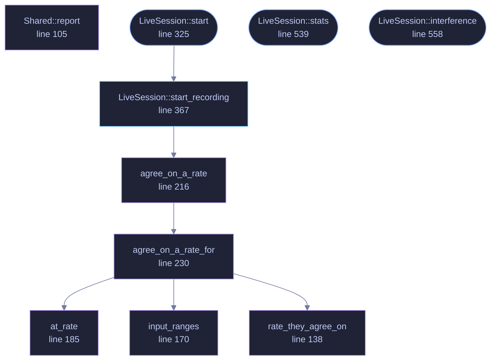

<!-- GENERATED by tools/docs/generate.py from the doc comments in the source. Do not edit: edit the .rs file and run the generator. -->

# `crates/veilvoice-audio/src/live.rs`

[[veilvoice-audio|Crate-veilvoice-audio]] &middot; 774 lines &middot; [read the source](https://github.com/tilas01/veilvoice/blob/main/crates/veilvoice-audio/src/live.rs)

## Contents

- [Structure](#structure)
- [Rules the callbacks follow](#rules-the-callbacks-follow)
- [Latency](#latency)
- [In plain words](#in-plain-words)
  - [What calls what](#what-calls-what)
  - [Items](#items)

Live microphone scrambling.

# Structure

Capture and playback run as two independent callbacks driven by the audio
hardware, joined by a lock-free SPSC ring buffer. The de-identification runs
inside the *output* callback, which is the shortest path: adding a worker
thread would mean a second buffer and a second scheduling delay for no
benefit, and `veilvoice_core::Deidentifier::process` is explicitly
allocation-free and safe to call from an audio callback.

# Rules the callbacks follow

An audio callback that blocks produces a dropout, so neither callback ever
allocates, locks, or waits. Statistics are published through a mutex the
callback only ever *tries* to take: if the UI thread happens to hold it, the
update is skipped rather than the audio stalling.

# Latency

Total latency is the input buffer, plus the ring backlog, plus the engine's
one-frame group delay (~21 ms at the defaults), plus the output buffer. The
ring is intentionally short, enough to absorb jitter between two clocks
that are not synchronised, not enough to accumulate a delay the user would
notice while speaking.

# In plain words

This is live mode: your microphone in one end, a voice that is not yours out
the other, fast enough to hold a conversation.

Sound arrives from the microphone in small pieces, and each one has to be dealt
with before the next arrives. There is no room to be late. So the veiling
happens on the same short path the sound is already travelling, with nothing
queued up behind it and nothing that could pause to allocate memory or wait for
another part of the program.

If the computer ever cannot keep up, that is counted and shown rather than
hidden. A gap in the sound you can see explained is far better than one you
cannot.

## What this file contains

774 lines defining **10 functions** (4 public), **3 types** and **1 constant**. Everything below is read out of the source, so it cannot disagree with the code.

**The types it owns.**

- `struct Kept` (line 62) -- The recorders a session was asked for, one per side of Keeping.
- `struct LiveSession` (line 70) -- A running live-scramble session.
- `struct Shared` (line 86) -- What the audio callbacks and the caller both touch, held behind one handle.

**What happens when it runs.** These are the ways in: public, and nothing else in this file calls them, so they are what an outside caller reaches first.

- `LiveSession::start` (line 325) -- Start scrambling from input into output.
  - reaches: `start_recording`, `agree_on_a_rate`, `agree_on_a_rate_for`, `at_rate`, `input_ranges`, `rate_they_agree_on`
- `LiveSession::stats` (line 539) -- Read the current statistics, resetting the peak meters.
- `LiveSession::interference` (line 558) -- What the platform last reported about either stream.

## What calls what

_Colour key: **entry** -- a way in: public, and nothing in this file calls it; **api** -- public, and also used inside this file; **helper** -- private to this file._

  

The same graph as Mermaid source

## Items

| Item | Line | Documentation |
|---|---:|---|
| `RING_MILLIS` pub(crate) const | [53](https://github.com/tilas01/veilvoice/blob/main/crates/veilvoice-audio/src/live.rs#L53) | How much jitter the ring absorbs before it starts dropping samples. |
| `Kept` pub struct | [62](https://github.com/tilas01/veilvoice/blob/main/crates/veilvoice-audio/src/live.rs#L62) | The recorders a session was asked for, one per side of Keeping. |
| `LiveSession` pub struct | [70](https://github.com/tilas01/veilvoice/blob/main/crates/veilvoice-audio/src/live.rs#L70) | A running live-scramble session. |
| `Shared` struct | [86](https://github.com/tilas01/veilvoice/blob/main/crates/veilvoice-audio/src/live.rs#L86) | What the audio callbacks and the caller both touch, held behind one handle. |
| `Shared::report` fn | [105](https://github.com/tilas01/veilvoice/blob/main/crates/veilvoice-audio/src/live.rs#L105) | Record what the platform said about a stream. |
| `rate_they_agree_on` fn | [138](https://github.com/tilas01/veilvoice/blob/main/crates/veilvoice-audio/src/live.rs#L138) | Which sample rate a set of devices can all run at, if any. |
| `input_ranges` pub(crate) fn | [170](https://github.com/tilas01/veilvoice/blob/main/crates/veilvoice-audio/src/live.rs#L170) | The ranges a device reports, as plain numbers. |
| `at_rate` fn | [185](https://github.com/tilas01/veilvoice/blob/main/crates/veilvoice-audio/src/live.rs#L185) | One of a device's configurations at rate, preferring f32. |
| `agree_on_a_rate` fn | [216](https://github.com/tilas01/veilvoice/blob/main/crates/veilvoice-audio/src/live.rs#L216) | A microphone and an output, configured to one rate. |
| `agree_on_a_rate_for` pub(crate) fn | [230](https://github.com/tilas01/veilvoice/blob/main/crates/veilvoice-audio/src/live.rs#L230) | The same, for any number of microphones. |
| `LiveSession::start` pub fn | [325](https://github.com/tilas01/veilvoice/blob/main/crates/veilvoice-audio/src/live.rs#L325) | Start scrambling from input into output. |
| `LiveSession::start_recording` pub fn | [367](https://github.com/tilas01/veilvoice/blob/main/crates/veilvoice-audio/src/live.rs#L367) | Start scrambling, keeping the sides of it Keeping asks for. |
| `LiveSession::stats` pub fn | [539](https://github.com/tilas01/veilvoice/blob/main/crates/veilvoice-audio/src/live.rs#L539) | Read the current statistics, resetting the peak meters. |
| `LiveSession::interference` pub fn | [558](https://github.com/tilas01/veilvoice/blob/main/crates/veilvoice-audio/src/live.rs#L558) | What the platform last reported about either stream. |
