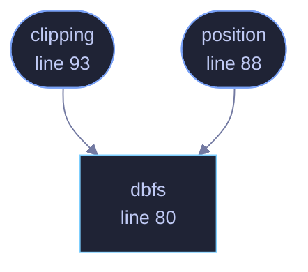

<!-- GENERATED by tools/docs/generate.py from the doc comments in the source. Do not edit: edit the .rs file and run the generator. -->

# `crates/veilvoice-audio/src/meter.rs`

[[veilvoice-audio|Crate-veilvoice-audio]] &middot; 166 lines &middot; [read the source](https://github.com/tilas01/veilvoice/blob/main/crates/veilvoice-audio/src/meter.rs)

## Contents

- [Why this is here rather than in a front end](#why-this-is-here-rather-than-in-a-front-end)
- [Why not linear](#why-not-linear)
- [What it measures, and what it does not](#what-it-measures-and-what-it-does-not)
- [In plain words](#in-plain-words)
  - [What calls what](#what-calls-what)
  - [Items](#items)

The scale a level meter is drawn on.

# Why this is here rather than in a front end

`crate::live::LiveStats` reports a peak, and both front ends draw it. They
drew it *differently*: both were linear, and the desktop one printed a
decibel number beside a bar filled linearly — so the number said -12 dB and
the bar showed a quarter. Two meters disagreeing about the same reading is
worse than one bad meter, because it makes the reader doubt the number.

The scale belongs with the measurement. This module owns the arithmetic;
the front ends own how it looks.

# Why not linear

Loudness is not linear, and a meter that is has almost no useful range.
Ordinary speech recorded at a sensible level peaks around **-12 dBFS**,
which is 0.25 linear: a quarter of the bar, which reads as near-silence.
The only way to fill a linear bar is to be clipping. Every real meter is
logarithmic for exactly this reason.

# What it measures, and what it does not

**Sample peak**, since the last read. It is not a loudness meter: RMS, LUFS
and anything else that correlates with how loud a thing *sounds* needs a
window and a weighting curve, and answers a different question. This one
answers "am I being recorded, and am I clipping".

It also cannot see an **inter-sample peak** — a waveform that passes above
full scale between two samples and clips in a converter without any single
sample exceeding 1.0. Catching those needs oversampling. A front end may say
`CLIP` when a sample reaches full scale, and must not imply it caught the
ones it cannot see.

# In plain words

This decides how a level meter is drawn, so that the bar and the number beside
it always agree.

They did not, once. Both the window and the terminal drew the bar filling
evenly with the signal, while the number beside it was in decibels, which do
not rise evenly at all. So the number could read -12 dB while the bar looked a
quarter full, and a reader who noticed stopped trusting both.

One piece of arithmetic, in one place, used by both. Now they cannot disagree.

## What this file contains

166 lines defining **3 functions** (3 public), **0 types** and **2 constants**. Everything below is read out of the source, so it cannot disagree with the code.

**What happens when it runs.** These are the ways in: public, and nothing else in this file calls them, so they are what an outside caller reaches first.

- `position` (line 88) -- Where a level sits along a bar: 0.0 at the floor, 1.0 at full scale.
  - reaches: `dbfs`
- `clipping` (line 93) -- Whether a reading counts as clipping.
  - reaches: `dbfs`

## What calls what

_Colour key: **entry** -- a way in: public, and nothing in this file calls it; **api** -- public, and also used inside this file._

  

The same graph as Mermaid source

## Items

| Item | Line | Documentation |
|---|---:|---|
| `FLOOR_DB` pub const | [52](https://github.com/tilas01/veilvoice/blob/main/crates/veilvoice-audio/src/meter.rs#L52) | The quietest level worth drawing. |
| `CLIP_DB` pub const | [63](https://github.com/tilas01/veilvoice/blob/main/crates/veilvoice-audio/src/meter.rs#L63) | At or above this, the level is called clipping. |
| `dbfs` pub fn | [80](https://github.com/tilas01/veilvoice/blob/main/crates/veilvoice-audio/src/meter.rs#L80) | Level in decibels relative to full scale. |
| `position` pub fn | [88](https://github.com/tilas01/veilvoice/blob/main/crates/veilvoice-audio/src/meter.rs#L88) | Where a level sits along a bar: 0.0 at the floor, 1.0 at full scale. |
| `clipping` pub fn | [93](https://github.com/tilas01/veilvoice/blob/main/crates/veilvoice-audio/src/meter.rs#L93) | Whether a reading counts as clipping. |
