<!-- GENERATED by tools/docs/generate.py from the doc comments in the source. Do not edit: edit the .rs file and run the generator. -->

# `crates/veilvoice-audio/src/playback.rs`

[[veilvoice-audio|Crate-veilvoice-audio]] &middot; 212 lines &middot; [read the source](https://github.com/tilas01/veilvoice/blob/main/crates/veilvoice-audio/src/playback.rs)

## Contents

- [What this is for](#what-this-is-for)
- [The samples are held, not streamed from the vault](#the-samples-are-held-not-streamed-from-the-vault)
- [In plain words](#in-plain-words)
  - [What calls what](#what-calls-what)
  - [Items](#items)

Playing a recording that is only in memory, and never on disk.

# What this is for

A take in the studio vault is sealed. Hearing it back means decrypting it,
and the obvious way to hear a WAV is to write it somewhere and hand the path
to something that plays files. That would put an unencrypted recording on
the disk, which is the one thing the vault exists to prevent, and it would
leave it there until somebody remembered to shred it.

So this takes the samples as they already are, in page-locked memory, and
plays them from there. Nothing is written. When playback stops the buffer is
dropped and `veilvoice_crypto::Secret` wipes itself.

# The samples are held, not streamed from the vault

Be plain about the shape rather than implying a stronger one. The whole take
is decrypted into locked memory before a note is heard, because the
container is sealed and authenticated as one piece: there is no way to open
the first second of it without opening all of it, and an AEAD that let you
would not be authenticating anything.

What that buys is still the thing that matters: **no plaintext file, at any
point.** What it does not buy is a smaller footprint than the recording, and
an hour of audio is an hour of audio in RAM. A format sealed in blocks would
change that and is not what the vault writes today.

# In plain words

Plays a recording straight out of protected memory, so listening to one
never leaves a copy on the disk for somebody to find later.

## What this file contains

212 lines defining **5 functions** (5 public), **2 types** and **0 constants**. Everything below is read out of the source, so it cannot disagree with the code.

**The types it owns.**

- `struct Shared` (line 42) -- What both sides can see while a take is playing.
- `struct Playing` (line 57) -- A take being played, for as long as this is held.

**What happens when it runs.** These are the ways in: public, and nothing else in this file calls them, so they are what an outside caller reaches first.

- `Playing::position` (line 67) -- How far in, in seconds.
- `Playing::duration` (line 75) -- How long the take is, in seconds.
- `Playing::finished` (line 83) -- Whether it has reached the end.
- `Playing::peak` (line 88) -- The loudest sample since this was last called, and it resets.
- `start` (line 107) -- Start playing samples at rate on the default output device.

## What calls what

_Colour key: **entry** -- a way in: public, and nothing in this file calls it._

  

The same graph as Mermaid source

```mermaid
%%{init: {"theme":"base","themeVariables":{"background":"#1a1b26","primaryColor":"#1f2335","primaryTextColor":"#c0caf5","primaryBorderColor":"#7aa2f7","secondaryColor":"#16161e","tertiaryColor":"#16161e","lineColor":"#737aa2","textColor":"#c0caf5","mainBkg":"#1f2335","nodeBorder":"#7aa2f7","clusterBkg":"#16161e","clusterBorder":"#2f3549","fontFamily":"ui-monospace, SFMono-Regular, Consolas, monospace","fontSize":"14px"}}}%%
flowchart TD
    n_position(["Playing::position<br/>line 67"])
    n_duration(["Playing::duration<br/>line 75"])
    n_finished(["Playing::finished<br/>line 83"])
    n_peak(["Playing::peak<br/>line 88"])
    n_start(["start<br/>line 107"])
    click n_position href "https://github.com/tilas01/veilvoice/blob/main/crates/veilvoice-audio/src/playback.rs#L67" "open the source"
    click n_duration href "https://github.com/tilas01/veilvoice/blob/main/crates/veilvoice-audio/src/playback.rs#L75" "open the source"
    click n_finished href "https://github.com/tilas01/veilvoice/blob/main/crates/veilvoice-audio/src/playback.rs#L83" "open the source"
    click n_peak href "https://github.com/tilas01/veilvoice/blob/main/crates/veilvoice-audio/src/playback.rs#L88" "open the source"
    click n_start href "https://github.com/tilas01/veilvoice/blob/main/crates/veilvoice-audio/src/playback.rs#L107" "open the source"
    classDef entry fill:#1f2335,stroke:#7aa2f7,color:#c0caf5
    class n_position,n_duration,n_finished,n_peak,n_start entry
```

## Items

| Item | Line | Documentation |
|---|---:|---|
| `Shared` struct | [42](https://github.com/tilas01/veilvoice/blob/main/crates/veilvoice-audio/src/playback.rs#L42) | What both sides can see while a take is playing. |
| `Playing` pub struct | [57](https://github.com/tilas01/veilvoice/blob/main/crates/veilvoice-audio/src/playback.rs#L57) | A take being played, for as long as this is held. |
| `Playing::position` pub fn | [67](https://github.com/tilas01/veilvoice/blob/main/crates/veilvoice-audio/src/playback.rs#L67) | How far in, in seconds. |
| `Playing::duration` pub fn | [75](https://github.com/tilas01/veilvoice/blob/main/crates/veilvoice-audio/src/playback.rs#L75) | How long the take is, in seconds. |
| `Playing::finished` pub fn | [83](https://github.com/tilas01/veilvoice/blob/main/crates/veilvoice-audio/src/playback.rs#L83) | Whether it has reached the end. |
| `Playing::peak` pub fn | [88](https://github.com/tilas01/veilvoice/blob/main/crates/veilvoice-audio/src/playback.rs#L88) | The loudest sample since this was last called, and it resets. |
| `start` pub fn | [107](https://github.com/tilas01/veilvoice/blob/main/crates/veilvoice-audio/src/playback.rs#L107) | Start playing samples at rate on the default output device. |
