<!-- GENERATED by tools/docs/generate.py from the doc comments in the source. Do not edit: edit the .rs file and run the generator. -->

# `crates/veilvoice-audio/src/room.rs`

[[veilvoice-audio|Crate-veilvoice-audio]] &middot; 614 lines &middot; [read the source](https://github.com/tilas01/veilvoice/blob/main/crates/veilvoice-audio/src/room.rs)

## Contents

- [What this is for](#what-this-is-for)
- [One engine per guest is one FFT chain per guest, on one deadline](#one-engine-per-guest-is-one-fft-chain-per-guest-on-one-deadline)
- [The mix is summed and clipped, and never limited](#the-mix-is-summed-and-clipped-and-never-limited)
- [Every microphone has its own clock](#every-microphone-has-its-own-clock)
- [In plain words](#in-plain-words)
  - [What calls what](#what-calls-what)
  - [Items](#items)

**Marker 147.** Several microphones at once: a guest each, veiled each,
mixed once.

# What this is for

An interview with everybody in the room on their own microphone. Each guest
gets their own engine with their own seed and their own destination voice,
exactly as a group *render* gives them, and the veiled results are mixed
into the one output the call or the recorder is listening to.

[`live`](crate::live) opens one input. That is the right shape for one
person on a call and the wrong shape for a room, because one microphone
carrying four people is one signal: whatever it is turned into, everybody in
it is turned into the same thing, and a listener can no longer follow who is
speaking.

# One engine per guest is one FFT chain per guest, on one deadline

The output callback runs every guest's engine before it returns. They share
a deadline of a few milliseconds, so the cost is the sum, and this is the
honest account the marker asked for rather than a paragraph promising it is
fine: `RoomStats::load` is that sum measured against that deadline, drawn
where somebody can see it. At 1.0 the engines have used the whole of the
time the block had, and what follows is dropouts.

It is a measurement rather than a limit, because the number of guests a
machine can carry is a fact about the machine. `MAX_GUESTS` is a bound on
the arithmetic, not a claim about performance.

# The mix is summed and clipped, and never limited

Two people talking at once is two signals added together, which can go past
full scale. A render fixes that afterwards by scaling the whole file by one
factor, which a live path cannot do because it cannot see the rest of the
conversation.

So the sum is clipped, the peak *before* clipping is reported, and the
number of blocks that clipped is counted. There is deliberately **no
limiter**: a limiter is a dynamics processor, it changes the voice, and this
program's entire claim is about what changes a voice and what does not.
Adding one to avoid a warning would mean a second thing altering the sound
that nobody asked for. The warning is the honest end of that.

# Every microphone has its own clock

Two USB microphones are two oscillators, and neither is the output's. Each
guest gets their own ring, of the same length [`live`](crate::live) uses,
which absorbs the jitter and reports what it could not: a guest whose device
runs slightly fast fills their ring and drops samples, counted against that
guest, and one running slow starves and is padded with silence.

What is **not** absorbed is a rate mismatch, which is F-168 and is refused
before anything starts: see `live::agree_on_a_rate_for`.

# In plain words

Everybody in the room speaks into their own microphone. Each voice is
disguised separately, so they still sound like different people, and the
result is mixed together into one signal for the call or the recording.

Disguising four voices at once is four times the work, on the same short
deadline, so the screen shows how much of that deadline is being used. If it
reaches the top, the computer cannot keep up and the sound will break.

## What this file contains

614 lines defining **5 functions** (4 public), **7 types** and **1 constant**. Everything below is read out of the source, so it cannot disagree with the code.

**The types it owns.**

- `struct Guest` (line 84) -- One guest: the microphone they speak into and the voice they become.
- `struct GuestStats` (line 103) -- What one guest's half of a running room is doing.
- `struct RoomStats` (line 118) -- What a running room is doing, safe to read from the interface.
- `struct KeptRoom` (line 145) -- The recorders a room was asked for.
- `struct RoomSession` (line 153) -- A running room.
- `struct Shared` (line 161)
- `struct Voice` (line 192) -- Everything one guest's engine needs, owned by the output callback.

**What happens when it runs.** These are the ways in: public, and nothing else in this file calls them, so they are what an outside caller reaches first.

- `RoomSession::start` (line 208) -- Open every guest's microphone, veil each, and mix into output.
- `RoomSession::guests` (line 448) -- How many guests this room opened.
- `RoomSession::stats` (line 460) -- Read the counters, resetting the peak meters.
- `RoomSession::interference` (line 483) -- What the platform last reported about any of the streams.

## What calls what

_Colour key: **entry** -- a way in: public, and nothing in this file calls it; **helper** -- private to this file._

  

The same graph as Mermaid source

```mermaid
%%{init: {"theme":"base","themeVariables":{"background":"#1a1b26","primaryColor":"#1f2335","primaryTextColor":"#c0caf5","primaryBorderColor":"#7aa2f7","secondaryColor":"#16161e","tertiaryColor":"#16161e","lineColor":"#737aa2","textColor":"#c0caf5","mainBkg":"#1f2335","nodeBorder":"#7aa2f7","clusterBkg":"#16161e","clusterBorder":"#2f3549","fontFamily":"ui-monospace, SFMono-Regular, Consolas, monospace","fontSize":"14px"}}}%%
flowchart TD
    n_report["Shared::report<br/>line 174"]
    n_start(["RoomSession::start<br/>line 208"])
    n_guests(["RoomSession::guests<br/>line 448"])
    n_stats(["RoomSession::stats<br/>line 460"])
    n_interference(["RoomSession::interference<br/>line 483"])
    click n_report href "https://github.com/tilas01/veilvoice/blob/main/crates/veilvoice-audio/src/room.rs#L174" "open the source"
    click n_start href "https://github.com/tilas01/veilvoice/blob/main/crates/veilvoice-audio/src/room.rs#L208" "open the source"
    click n_guests href "https://github.com/tilas01/veilvoice/blob/main/crates/veilvoice-audio/src/room.rs#L448" "open the source"
    click n_stats href "https://github.com/tilas01/veilvoice/blob/main/crates/veilvoice-audio/src/room.rs#L460" "open the source"
    click n_interference href "https://github.com/tilas01/veilvoice/blob/main/crates/veilvoice-audio/src/room.rs#L483" "open the source"
    classDef entry fill:#1f2335,stroke:#7aa2f7,color:#c0caf5
    class n_start,n_guests,n_stats,n_interference entry
    classDef helper fill:#1f2335,stroke:#bb9af7,color:#c0caf5
    class n_report helper
```

## Items

| Item | Line | Documentation |
|---|---:|---|
| `MAX_GUESTS` pub const | [81](https://github.com/tilas01/veilvoice/blob/main/crates/veilvoice-audio/src/room.rs#L81) | The most microphones one room will open at once. |
| `Guest` pub struct | [84](https://github.com/tilas01/veilvoice/blob/main/crates/veilvoice-audio/src/room.rs#L84) | One guest: the microphone they speak into and the voice they become. |
| `GuestStats` pub struct | [103](https://github.com/tilas01/veilvoice/blob/main/crates/veilvoice-audio/src/room.rs#L103) | What one guest's half of a running room is doing. |
| `RoomStats` pub struct | [118](https://github.com/tilas01/veilvoice/blob/main/crates/veilvoice-audio/src/room.rs#L118) | What a running room is doing, safe to read from the interface. |
| `KeptRoom` pub struct | [145](https://github.com/tilas01/veilvoice/blob/main/crates/veilvoice-audio/src/room.rs#L145) | The recorders a room was asked for. |
| `RoomSession` pub struct | [153](https://github.com/tilas01/veilvoice/blob/main/crates/veilvoice-audio/src/room.rs#L153) | A running room. |
| `Shared` struct | [161](https://github.com/tilas01/veilvoice/blob/main/crates/veilvoice-audio/src/room.rs#L161) |  |
| `Shared::report` fn | [174](https://github.com/tilas01/veilvoice/blob/main/crates/veilvoice-audio/src/room.rs#L174) | Record what the platform said about one of the streams. |
| `Voice` struct | [192](https://github.com/tilas01/veilvoice/blob/main/crates/veilvoice-audio/src/room.rs#L192) | Everything one guest's engine needs, owned by the output callback. |
| `RoomSession::start` pub fn | [208](https://github.com/tilas01/veilvoice/blob/main/crates/veilvoice-audio/src/room.rs#L208) | Open every guest's microphone, veil each, and mix into output. |
| `RoomSession::guests` pub fn | [448](https://github.com/tilas01/veilvoice/blob/main/crates/veilvoice-audio/src/room.rs#L448) | How many guests this room opened. |
| `RoomSession::stats` pub fn | [460](https://github.com/tilas01/veilvoice/blob/main/crates/veilvoice-audio/src/room.rs#L460) | Read the counters, resetting the peak meters. |
| `RoomSession::interference` pub fn | [483](https://github.com/tilas01/veilvoice/blob/main/crates/veilvoice-audio/src/room.rs#L483) | What the platform last reported about any of the streams. |
