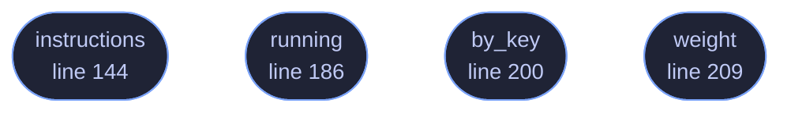

<!-- GENERATED by tools/docs/generate.py from the doc comments in the source. Do not edit: edit the .rs file and run the generator. -->


# `crates/veilvoice-capture/src/comms.rs`

[[veilvoice-capture|Crate-veilvoice-capture]] &middot; 321 lines &middot; [read the source](https://github.com/tilas01/veilvoice/blob/main/crates/veilvoice-capture/src/comms.rs)

## Contents

- [What this does, and the one thing it deliberately does not](#what-this-does-and-the-one-thing-it-deliberately-does-not)
- [The route, and why it is a virtual cable](#the-route-and-why-it-is-a-virtual-cable)
- [Your voice, not theirs](#your-voice-not-theirs)
- [In plain words](#in-plain-words)
  - [What calls what](#what-calls-what)
  - [Items](#items)

Communication programs, and how to put VeilVoice between you and them.

# What this does, and the one thing it deliberately does not

It finds the calling and messaging programs on this machine and tells you,
for each one, exactly where to point it so your voice goes through VeilVoice
before it goes to anybody else.

It does **not** reach inside any of them. It does not read Signal's or
Matrix's traffic, hook their audio, inject into their processes or decrypt
anything. That is not a limitation being apologised for — it is the same
act this whole project exists to make useless, and a privacy tool that
shipped a way to intercept an end-to-end encrypted call would be arguing
against itself.

# The route, and why it is a virtual cable

Every program here lets you choose which microphone it uses. So:

```text
your microphone  ->  VeilVoice  ->  a virtual audio cable
|
v
Discord / Signal / anything,
with the cable chosen as its "microphone"
```

Nothing has to know VeilVoice exists. The program asks the operating system
for a microphone, the operating system hands it the cable, and the cable
carries a voice that is not yours. That is why this works with programs
nobody here has ever tested, including ones that do not exist yet.

# Your voice, not theirs

This route veils **what you send**. It does nothing to what you receive:
the other people on the call are not going through VeilVoice, and their
voices arrive as they always did.

Veiling a whole call — everybody, including the people at the other end —
means capturing what the program *plays*, which is a different mechanism on
every platform and is not built. `INCOMING` says so in the words a front
end should show, rather than letting somebody assume a recording of a call
is veiled on both sides.

# In plain words

If you want to talk to people through Discord, Signal, Telegram or anything
like them without your real voice going out, this tells you how: send your
microphone through VeilVoice, out to a virtual cable, and then tell the chat
program that the cable *is* your microphone. It never knows the difference.

It only changes what **you** send. Everybody else on the call still sounds
like themselves, and this does not record or read anything they send you.

## What this file contains

321 lines defining **4 functions** (4 public), **1 type** and **4 constants**. Everything below is read out of the source, so it cannot disagree with the code.

**The types it owns.**

- `struct Comm` (line 60) -- One communication program, and where its microphone setting lives.

**What happens when it runs.** These are the ways in: public, and nothing else in this file calls them, so they are what an outside caller reaches first.

- `instructions` (line 144) -- What to do, for one program.
- `running` (line 186) -- Which of these are running now, and anything that went wrong looking.
- `by_key` (line 200) -- The program with this identifier.
- `weight` (line 209) -- How a running communication program should be described.

## What calls what

_Colour key: **entry** -- a way in: public, and nothing in this file calls it._

<p align="center">
  
</p>

<details>
<summary>The same graph as Mermaid source</summary>



</details>

## Items

| Item | Line | Documentation |
|---|---:|---|
| `Comm` <sub>pub struct</sub> | [60](https://github.com/tilas01/veilvoice/blob/main/crates/veilvoice-capture/src/comms.rs#L60) | One communication program, and where its microphone setting lives. |
| `COMMS` <sub>pub const</sub> | [81](https://github.com/tilas01/veilvoice/blob/main/crates/veilvoice-capture/src/comms.rs#L81) | The programs this build knows where to look in. |
| `instructions` <sub>pub fn</sub> | [144](https://github.com/tilas01/veilvoice/blob/main/crates/veilvoice-capture/src/comms.rs#L144) | What to do, for one program. |
| `ANY_PROGRAM` <sub>pub const</sub> | [154](https://github.com/tilas01/veilvoice/blob/main/crates/veilvoice-capture/src/comms.rs#L154) | The general route, for a program not in the table. |
| `INCOMING` <sub>pub const</sub> | [162](https://github.com/tilas01/veilvoice/blob/main/crates/veilvoice-capture/src/comms.rs#L162) | What this route does not cover, in the words a front end should show. |
| `NO_INTERCEPTION` <sub>pub const</sub> | [170](https://github.com/tilas01/veilvoice/blob/main/crates/veilvoice-capture/src/comms.rs#L170) | What this crate will not do, and why that is not an oversight. |
| `running` <sub>pub fn</sub> | [186](https://github.com/tilas01/veilvoice/blob/main/crates/veilvoice-capture/src/comms.rs#L186) | Which of these are running now, and anything that went wrong looking. |
| `by_key` <sub>pub fn</sub> | [200](https://github.com/tilas01/veilvoice/blob/main/crates/veilvoice-capture/src/comms.rs#L200) | The program with this identifier. |
| `weight` <sub>pub fn</sub> | [209](https://github.com/tilas01/veilvoice/blob/main/crates/veilvoice-capture/src/comms.rs#L209) | How a running communication program should be described. |
