<!-- GENERATED by tools/docs/generate.py from the doc comments in the source. Do not edit: edit the .rs file and run the generator. -->

# `crates/veilvoice-capture/src/lib.rs`

[[veilvoice-capture|Crate-veilvoice-capture]] &middot; 557 lines &middot; [read the source](https://github.com/tilas01/veilvoice/blob/main/crates/veilvoice-capture/src/lib.rs)

## Contents

- [VeilVoice does not hide itself from your recorder](#veilvoice-does-not-hide-itself-from-your-recorder)
- [Telling you, and then not telling you again](#telling-you-and-then-not-telling-you-again)
- [Running is not recording, and this crate never confuses them](#running-is-not-recording-and-this-crate-never-confuses-them)
- [And it only knows the programs it knows](#and-it-only-knows-the-programs-it-knows)
- [What calls what](#what-calls-what)
- [Items](#items)

Which screen-recording programs are running, an allowlist for the ones you
meant to run, and a plain account of the two things this cannot do.

## VeilVoice does not hide itself from your recorder

Stated first, because it is the question people actually have: **you can
record VeilVoice's window with OBS, and nothing here stops you.** Screen
capture of this application is not blocked, not degraded, and not detected
as an attack. If you are making a video about VeilVoice, or streaming while
you use it, it will appear on the recording exactly like any other window.

That is not only a choice, it is also a limit. Excluding a window from
capture means `SetWindowDisplayAffinity` on Windows and the equivalent
elsewhere, which is FFI — and every crate in this workspace carries
`#![forbid(unsafe_code)]`, which is a front-page claim. So the exclusion is
**not built**, and `ROADMAP.md` records it as a decision waiting on the
maintainer rather than as an oversight. Anybody who needs a window that
cannot be recorded does not have it here, and should know that before they
rely on it.

## Telling you, and then not telling you again

A monitor that says "OBS is running" every thirty seconds while you
deliberately record a tutorial is a monitor you turn off, and then it is not
watching for the recorder you did **not** start. So `Allowlist` exists:
name a program once, and it stops raising a notification.

Allowed is not hidden. `Sighting::allowed` is a flag on a sighting that is
still in the report, and `Report::all` still lists it. Only
`Report::worth_saying` filters, because that is the one a notification
reads. Something that vanished from the interface entirely would be a
setting for lying to yourself.

## Running is not recording, and this crate never confuses them

Zoom being open does not mean Zoom is sharing your screen; Discord running
does not mean anybody is watching. This reports **what is running**, and
`programs::Purpose` separates a program whose job is recording from one
that merely can. Every sentence produced here keeps the distinction, because
a privacy tool that announces surveillance every time somebody opens a chat
application has taught its user to ignore it.

Knowing whether a capture is actually in progress means asking the
compositor who holds a capture session, and that is FFI on every platform
here. Same trade, same answer, same place it is recorded.

## And it only knows the programs it knows

`programs::ALL` is a table of names. Something not in it is not reported,
and something written to record a screen quietly would not be called
`obs64.exe`. An empty report is not evidence that nothing is recording, and
`SCOPE` says so.

## What this file contains

557 lines defining **19 functions** (16 public), **4 types** and **3 constants**. Everything below is read out of the source, so it cannot disagree with the code.

**The types it owns.**

- `struct Allowlist` (line 89) -- Programs the user has said they meant to run.
- `struct Sighting` (line 219) -- One capture-capable program found running.
- `struct Report` (line 246) -- What is running, and anything that got in the way of finding out.
- `enum Error` (line 313) -- Everything that can go wrong in this crate.

**What happens when it runs.** These are the ways in: public, and nothing else in this file calls them, so they are what an outside caller reaches first.

- `Allowlist::allow` (line 107) -- Stop notifying about this program.
- `Allowlist::deny` (line 117) -- Start notifying about this program again.
- `Allowlist::allows` (line 122) -- Whether this program is allowed.
- `Allowlist::keys` (line 127) -- The allowed keys, in a stable order.
- `Allowlist::len` (line 132) -- How many programs are allowed.
- `Allowlist::is_empty` (line 137) -- Whether nothing is allowed.
- `Allowlist::save` (line 191) -- Write the allowlist to path.
  - reaches: `to_text`
- `Allowlist::load` (line 208) -- Read an allowlist written by Allowlist::save, treating a missing file as "nothing is allowed".
  - reaches: `new`, `parse`
- `Sighting::describe` (line 235) -- One line for a terminal, a log or a notification.
- `Report::take` (line 256) -- Look at what is running now.
- `Report::all` (line 290) -- Everything found, allowed or not.
- `Report::worth_saying` (line 297) -- The sightings a notification should raise: the ones not allowed.
- `Report::is_empty` (line 305) -- Whether anything at all was found, allowed or not.

## What calls what

_Colour key: **entry** -- a way in: public, and nothing in this file calls it; **api** -- public, and also used inside this file; **helper** -- private to this file._

  

The same graph as Mermaid source

```mermaid
%%{init: {"theme":"base","themeVariables":{"background":"#1a1b26","primaryColor":"#1f2335","primaryTextColor":"#c0caf5","primaryBorderColor":"#7aa2f7","secondaryColor":"#16161e","tertiaryColor":"#16161e","lineColor":"#737aa2","textColor":"#c0caf5","mainBkg":"#1f2335","nodeBorder":"#7aa2f7","clusterBkg":"#16161e","clusterBorder":"#2f3549","fontFamily":"ui-monospace, SFMono-Regular, Consolas, monospace","fontSize":"14px"}}}%%
flowchart TD
    n_new["Allowlist::new<br/>line 98"]
    n_allow(["Allowlist::allow<br/>line 107"])
    n_deny(["Allowlist::deny<br/>line 117"])
    n_allows(["Allowlist::allows<br/>line 122"])
    n_keys(["Allowlist::keys<br/>line 127"])
    n_len(["Allowlist::len<br/>line 132"])
    n_is_empty(["Allowlist::is_empty<br/>line 137"])
    n_to_text["Allowlist::to_text<br/>line 142"]
    n_parse["Allowlist::parse<br/>line 156"]
    n_save(["Allowlist::save<br/>line 191"])
    n_load(["Allowlist::load<br/>line 208"])
    n_describe(["Sighting::describe<br/>line 235"])
    n_take(["Report::take<br/>line 256"])
    n_all(["Report::all<br/>line 290"])
    n_worth_saying(["Report::worth_saying<br/>line 297"])
    n_is_empty(["Report::is_empty<br/>line 305"])
    n_from["Error::from<br/>line 323"]
    n_fmt["Error::fmt<br/>line 329"]
    n_source["Error::source<br/>line 348"]
    n_load --> n_new
    n_load --> n_parse
    n_parse --> n_new
    n_save --> n_to_text
    click n_new href "https://github.com/tilas01/veilvoice/blob/main/crates/veilvoice-capture/src/lib.rs#L98" "open the source"
    click n_allow href "https://github.com/tilas01/veilvoice/blob/main/crates/veilvoice-capture/src/lib.rs#L107" "open the source"
    click n_deny href "https://github.com/tilas01/veilvoice/blob/main/crates/veilvoice-capture/src/lib.rs#L117" "open the source"
    click n_allows href "https://github.com/tilas01/veilvoice/blob/main/crates/veilvoice-capture/src/lib.rs#L122" "open the source"
    click n_keys href "https://github.com/tilas01/veilvoice/blob/main/crates/veilvoice-capture/src/lib.rs#L127" "open the source"
    click n_len href "https://github.com/tilas01/veilvoice/blob/main/crates/veilvoice-capture/src/lib.rs#L132" "open the source"
    click n_is_empty href "https://github.com/tilas01/veilvoice/blob/main/crates/veilvoice-capture/src/lib.rs#L137" "open the source"
    click n_to_text href "https://github.com/tilas01/veilvoice/blob/main/crates/veilvoice-capture/src/lib.rs#L142" "open the source"
    click n_parse href "https://github.com/tilas01/veilvoice/blob/main/crates/veilvoice-capture/src/lib.rs#L156" "open the source"
    click n_save href "https://github.com/tilas01/veilvoice/blob/main/crates/veilvoice-capture/src/lib.rs#L191" "open the source"
    click n_load href "https://github.com/tilas01/veilvoice/blob/main/crates/veilvoice-capture/src/lib.rs#L208" "open the source"
    click n_describe href "https://github.com/tilas01/veilvoice/blob/main/crates/veilvoice-capture/src/lib.rs#L235" "open the source"
    click n_take href "https://github.com/tilas01/veilvoice/blob/main/crates/veilvoice-capture/src/lib.rs#L256" "open the source"
    click n_all href "https://github.com/tilas01/veilvoice/blob/main/crates/veilvoice-capture/src/lib.rs#L290" "open the source"
    click n_worth_saying href "https://github.com/tilas01/veilvoice/blob/main/crates/veilvoice-capture/src/lib.rs#L297" "open the source"
    click n_is_empty href "https://github.com/tilas01/veilvoice/blob/main/crates/veilvoice-capture/src/lib.rs#L305" "open the source"
    click n_from href "https://github.com/tilas01/veilvoice/blob/main/crates/veilvoice-capture/src/lib.rs#L323" "open the source"
    click n_fmt href "https://github.com/tilas01/veilvoice/blob/main/crates/veilvoice-capture/src/lib.rs#L329" "open the source"
    click n_source href "https://github.com/tilas01/veilvoice/blob/main/crates/veilvoice-capture/src/lib.rs#L348" "open the source"
    classDef entry fill:#1f2335,stroke:#7aa2f7,color:#c0caf5
    class n_allow,n_deny,n_allows,n_keys,n_len,n_is_empty,n_save,n_load,n_describe,n_take,n_all,n_worth_saying,n_is_empty entry
    classDef api fill:#1f2335,stroke:#7dcfff,color:#c0caf5
    class n_new,n_to_text,n_parse api
    classDef helper fill:#1f2335,stroke:#bb9af7,color:#c0caf5
    class n_from,n_fmt,n_source helper
```

## Items

| Item | Line | Documentation |
|---|---:|---|
| `VERSION` pub const | [68](https://github.com/tilas01/veilvoice/blob/main/crates/veilvoice-capture/src/lib.rs#L68) | Crate version string, surfaced in the About panel. |
| `SCOPE` pub const | [74](https://github.com/tilas01/veilvoice/blob/main/crates/veilvoice-capture/src/lib.rs#L74) | What this is worth, in the words a front end should show. |
| `Allowlist` pub struct | [89](https://github.com/tilas01/veilvoice/blob/main/crates/veilvoice-capture/src/lib.rs#L89) | Programs the user has said they meant to run. |
| `MAGIC` const | [94](https://github.com/tilas01/veilvoice/blob/main/crates/veilvoice-capture/src/lib.rs#L94) | Magic first line. |
| `Allowlist::new` pub fn | [98](https://github.com/tilas01/veilvoice/blob/main/crates/veilvoice-capture/src/lib.rs#L98) | An allowlist that allows nothing. |
| `Allowlist::allow` pub fn | [107](https://github.com/tilas01/veilvoice/blob/main/crates/veilvoice-capture/src/lib.rs#L107) | Stop notifying about this program. |
| `Allowlist::deny` pub fn | [117](https://github.com/tilas01/veilvoice/blob/main/crates/veilvoice-capture/src/lib.rs#L117) | Start notifying about this program again. |
| `Allowlist::allows` pub fn | [122](https://github.com/tilas01/veilvoice/blob/main/crates/veilvoice-capture/src/lib.rs#L122) | Whether this program is allowed. |
| `Allowlist::keys` pub fn | [127](https://github.com/tilas01/veilvoice/blob/main/crates/veilvoice-capture/src/lib.rs#L127) | The allowed keys, in a stable order. |
| `Allowlist::len` pub fn | [132](https://github.com/tilas01/veilvoice/blob/main/crates/veilvoice-capture/src/lib.rs#L132) | How many programs are allowed. |
| `Allowlist::is_empty` pub fn | [137](https://github.com/tilas01/veilvoice/blob/main/crates/veilvoice-capture/src/lib.rs#L137) | Whether nothing is allowed. |
| `Allowlist::to_text` pub fn | [142](https://github.com/tilas01/veilvoice/blob/main/crates/veilvoice-capture/src/lib.rs#L142) | Serialise to a text format, one key per line. |
| `Allowlist::parse` pub fn | [156](https://github.com/tilas01/veilvoice/blob/main/crates/veilvoice-capture/src/lib.rs#L156) | Parse the text format. |
| `Allowlist::save` pub fn | [191](https://github.com/tilas01/veilvoice/blob/main/crates/veilvoice-capture/src/lib.rs#L191) | Write the allowlist to path. |
| `Allowlist::load` pub fn | [208](https://github.com/tilas01/veilvoice/blob/main/crates/veilvoice-capture/src/lib.rs#L208) | Read an allowlist written by Allowlist::save, treating a missing file as "nothing is allowed". |
| `Sighting` pub struct | [219](https://github.com/tilas01/veilvoice/blob/main/crates/veilvoice-capture/src/lib.rs#L219) | One capture-capable program found running. |
| `Sighting::describe` pub fn | [235](https://github.com/tilas01/veilvoice/blob/main/crates/veilvoice-capture/src/lib.rs#L235) | One line for a terminal, a log or a notification. |
| `Report` pub struct | [246](https://github.com/tilas01/veilvoice/blob/main/crates/veilvoice-capture/src/lib.rs#L246) | What is running, and anything that got in the way of finding out. |
| `Report::take` pub fn | [256](https://github.com/tilas01/veilvoice/blob/main/crates/veilvoice-capture/src/lib.rs#L256) | Look at what is running now. |
| `Report::all` pub fn | [290](https://github.com/tilas01/veilvoice/blob/main/crates/veilvoice-capture/src/lib.rs#L290) | Everything found, allowed or not. |
| `Report::worth_saying` pub fn | [297](https://github.com/tilas01/veilvoice/blob/main/crates/veilvoice-capture/src/lib.rs#L297) | The sightings a notification should raise: the ones not allowed. |
| `Report::is_empty` pub fn | [305](https://github.com/tilas01/veilvoice/blob/main/crates/veilvoice-capture/src/lib.rs#L305) | Whether anything at all was found, allowed or not. |
| `Error` pub enum | [313](https://github.com/tilas01/veilvoice/blob/main/crates/veilvoice-capture/src/lib.rs#L313) | Everything that can go wrong in this crate. |
| `Error::from` fn | [323](https://github.com/tilas01/veilvoice/blob/main/crates/veilvoice-capture/src/lib.rs#L323) |  |
| `Error::fmt` fn | [329](https://github.com/tilas01/veilvoice/blob/main/crates/veilvoice-capture/src/lib.rs#L329) |  |
| `Error::source` fn | [348](https://github.com/tilas01/veilvoice/blob/main/crates/veilvoice-capture/src/lib.rs#L348) |  |
