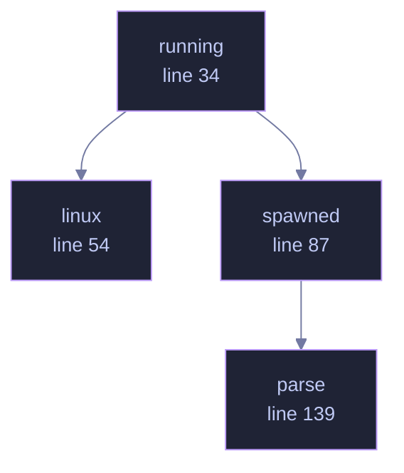

<!-- GENERATED by tools/docs/generate.py from the doc comments in the source. Do not edit: edit the .rs file and run the generator. -->

# `crates/veilvoice-capture/src/processes.rs`

[[veilvoice-capture|Crate-veilvoice-capture]] &middot; 255 lines &middot; [read the source](https://github.com/tilas01/veilvoice/blob/main/crates/veilvoice-capture/src/processes.rs)

## Contents

- [Linux reads files; the other two ask a tool](#linux-reads-files-the-other-two-ask-a-tool)
- [What this can see](#what-this-can-see)
  - [What calls what](#what-calls-what)
  - [Items](#items)

Listing the processes that are running, per platform.

# Linux reads files; the other two ask a tool

On Linux every process publishes its own name at `/proc/<pid>/comm`, so the
list is a directory walk and nothing is spawned. Windows and macOS have no
such file, and their native APIs are FFI — `#![forbid(unsafe_code)]` holds
here as it does everywhere else in the workspace, so this asks a tool the
system already ships, exactly as `veilvoice-watch` asks the registry and
`veilvoice-drivers` asks `driverquery`.

# What this can see

Processes belonging to the user running VeilVoice, and — depending on the
platform and the privileges — usually not much more. A recorder running as
another user or as a service may not appear at all. That is a real limit and
`crate::SCOPE` states it rather than leaving an empty list to be read as
an empty machine.

`comm` on Linux is truncated to fifteen characters by the kernel, so a
longer name in `crate::programs` never appears there. Two entries in that
table are longer than fifteen characters and carry **both** spellings for
exactly that reason — `ps` and every Windows listing give the full one. A
test holds the rule that every program with a Unix name has at least one
that survives truncation, because a sixteen-character executable added later
would otherwise stop matching on one platform only, silently.

## What this file contains

255 lines defining **4 functions** (0 public), **0 types** and **0 constants**. Everything below is read out of the source, so it cannot disagree with the code.

## What calls what

_Colour key: **helper** -- private to this file._

  

The same graph as Mermaid source

## Items

| Item | Line | Documentation |
|---|---:|---|
| `running` pub(crate) fn | [34](https://github.com/tilas01/veilvoice/blob/main/crates/veilvoice-capture/src/processes.rs#L34) | Every process name this build can see, lower-cased and without a path. |
| `linux` fn | [54](https://github.com/tilas01/veilvoice/blob/main/crates/veilvoice-capture/src/processes.rs#L54) | Walk /proc and read each process's own name. |
| `spawned` fn | [87](https://github.com/tilas01/veilvoice/blob/main/crates/veilvoice-capture/src/processes.rs#L87) | Ask the system's own process lister. |
| `parse` fn | [139](https://github.com/tilas01/veilvoice/blob/main/crates/veilvoice-capture/src/processes.rs#L139) | Pull process names out of a listing. |
