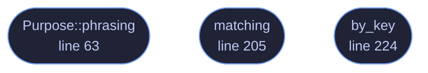

<!-- GENERATED by tools/docs/generate.py from the doc comments in the source. Do not edit: edit the .rs file and run the generator. -->

# `crates/veilvoice-capture/src/programs.rs`

[[veilvoice-capture|Crate-veilvoice-capture]] &middot; 342 lines &middot; [read the source](https://github.com/tilas01/veilvoice/blob/main/crates/veilvoice-capture/src/programs.rs)

## Contents

- [A list, and therefore incomplete](#a-list-and-therefore-incomplete)
- [Capable of capturing is not the same as capturing](#capable-of-capturing-is-not-the-same-as-capturing)
  - [What calls what](#what-calls-what)
  - [Items](#items)

The programs this build knows can capture a screen.

# A list, and therefore incomplete

This is a table of names. Anything not in it is not reported, and the table
will never be complete: new recorders appear, people rename executables, and
a program written specifically to capture a screen quietly would simply not
be called `obs64.exe`. `crate::SCOPE` says so, and no front end may present
an empty report as "nothing is recording".

What it is genuinely good for is the ordinary case, which is also the common
one: you have OBS open, VeilVoice notices, and you either wanted that or you
did not.

# Capable of capturing is not the same as capturing

Zoom being open does not mean Zoom is sharing your screen. Discord running
does not mean anybody is watching it. This crate reports **what is running**,
and the distinction is carried in every string it produces, because the
alternative is a privacy tool that cries wolf every time somebody opens a
chat application.

Telling the difference needs the compositor to say who is holding a capture
session, and reaching that is FFI on every platform here. See
`crate` for what that costs and why it is not paid.

## What this file contains

342 lines defining **3 functions** (3 public), **2 types** and **1 constant**. Everything below is read out of the source, so it cannot disagree with the code.

**The types it owns.**

- `struct Program` (line 30) -- One program known to be able to capture a screen.
- `enum Purpose` (line 50) -- Why a program is in the table.

**What happens when it runs.** These are the ways in: public, and nothing else in this file calls them, so they are what an outside caller reaches first.

- `Purpose::phrasing` (line 63) -- The wording a front end should use for this kind of program.
- `matching` (line 205) -- Find the program a process name belongs to, if this build knows it.
- `by_key` (line 224) -- Find a program by its Program::key.

## What calls what

_Colour key: **entry** -- a way in: public, and nothing in this file calls it._

## Items

| Item | Line | Documentation |
|---|---:|---|
| `Program` pub struct | [30](https://github.com/tilas01/veilvoice/blob/main/crates/veilvoice-capture/src/programs.rs#L30) | One program known to be able to capture a screen. |
| `Purpose` pub enum | [50](https://github.com/tilas01/veilvoice/blob/main/crates/veilvoice-capture/src/programs.rs#L50) | Why a program is in the table. |
| `Purpose::phrasing` pub fn | [63](https://github.com/tilas01/veilvoice/blob/main/crates/veilvoice-capture/src/programs.rs#L63) | The wording a front end should use for this kind of program. |
| `ALL` pub const | [78](https://github.com/tilas01/veilvoice/blob/main/crates/veilvoice-capture/src/programs.rs#L78) | Every program in the table. |
| `matching` pub fn | [205](https://github.com/tilas01/veilvoice/blob/main/crates/veilvoice-capture/src/programs.rs#L205) | Find the program a process name belongs to, if this build knows it. |
| `by_key` pub fn | [224](https://github.com/tilas01/veilvoice/blob/main/crates/veilvoice-capture/src/programs.rs#L224) | Find a program by its Program::key. |
