<!-- GENERATED by tools/docs/generate.py from the doc comments in the source. Do not edit: edit the .rs file and run the generator. -->


# `crates/veilvoice-check/src/contents.rs`

[[veilvoice-check|Crate-veilvoice-check]] &middot; 438 lines &middot; [read the source](https://github.com/tilas01/veilvoice/blob/main/crates/veilvoice-check/src/contents.rs)

## Contents

- [The gap this closes](#the-gap-this-closes)
- [What it still does not prove](#what-it-still-does-not-prove)
- [Why the paths are checked before they are used](#why-the-paths-are-checked-before-they-are-used)
- [In plain words](#in-plain-words)
  - [What calls what](#what-calls-what)
  - [Items](#items)

The signed list of what is inside each release archive.

**Marker 97.** `SHA256SUMS` covers the archives. That proves a download is
the one that was published, and it says nothing at all about the folder
somebody unzipped it into, which is the copy they actually run.

# The gap this closes

Until this existed, a verifier could check the archive and could not check
the extracted directory beside it, and the reason was not laziness: nothing
on disk records which archive a directory came from, and no signed list
covered the loose files. The honest report was therefore two separate
answers and the advice to extract the checked archive again.

That advice is still correct and it is a poor substitute for an answer. A
release now publishes `CONTENTS.sha256`, which lists every file inside every
archive with its SHA-256, and it is staged **before** `SHA256SUMS` is
computed, so the hash list covers it and the signature therefore covers it
too. The chain is complete and every link in it is checkable:

```text
SHA256SUMS.asc -> SHA256SUMS -> CONTENTS.sha256 -> each file on disk
```

So the question "is the program I am about to run the one that was
published" now has an arithmetic answer rather than an inference.

# What it still does not prove

The same limit as everywhere else in this crate, and it is worth repeating
rather than assuming somebody read it in `crate`: this proves the files
are the ones the holder of the key published. It does not prove they are
safe, and it does not prove they were built from the source you can read.

# Why the paths are checked before they are used

The manifest is signed, and a caller is told in the plainest terms to verify
the signature before parsing it. That is a rule a caller can get wrong, and
the cost of getting it wrong here would be a file of somebody else's
choosing deciding which paths this reads. So `parse` refuses an absolute
path, a path with a `..` component, a Windows drive letter and a backslash,
rather than trusting the order the caller did things in.

Refusing rather than sanitising, because a manifest containing such a path
is not a manifest with one bad line in it: it is a file that did not come
from this project's release job, and the useful thing to do with it is say
so.

# In plain words

The list of every file inside a release, with its fingerprint, signed along
with everything else.

It is what lets a checker tell you that the program sitting in your folder
is the one that was published, rather than only that the zip you downloaded
was.

## What this file contains

438 lines defining **9 functions** (6 public), **4 types** and **1 constant**. Everything below is read out of the source, so it cannot disagree with the code.

**The types it owns.**

- `struct Member` (line 69) -- One file inside a release archive, and the hash published for it.
- `struct ArchiveContents` (line 78) -- Everything one archive carries.
- `enum Verdict` (line 103) -- What checking one published file against the disk found.
- `struct Outcome` (line 119) -- One published file, checked against the disk.

**What happens when it runs.** These are the ways in: public, and nothing else in this file calls them, so they are what an outside caller reaches first.

- `ArchiveContents::roots` (line 91) -- The top-level directories the archive extracts into.
- `Outcome::is_good` (line 128) -- Whether this one is as published.
- `parse` (line 166) -- Read a CONTENTS.sha256.
  - reaches: `looks_like_a_digest`, `safe`
- `for_archive` (line 217) -- The section of a manifest covering one archive.
- `check` (line 227) -- Check every file the archive published, against root.
- `extras` (line 256) -- Files sitting in the extracted directory that the release never published.
  - reaches: `walk`

## What calls what

_Colour key: **entry** -- a way in: public, and nothing in this file calls it; **helper** -- private to this file._

<p align="center">
  
</p>

<details>
<summary>The same graph as Mermaid source</summary>



</details>

```mermaid
%%{init: {"theme":"base","themeVariables":{"background":"#1a1b26","primaryColor":"#1f2335","primaryTextColor":"#c0caf5","primaryBorderColor":"#7aa2f7","secondaryColor":"#16161e","tertiaryColor":"#16161e","lineColor":"#737aa2","textColor":"#c0caf5","mainBkg":"#1f2335","nodeBorder":"#7aa2f7","clusterBkg":"#16161e","clusterBorder":"#2f3549","fontFamily":"ui-monospace, SFMono-Regular, Consolas, monospace","fontSize":"14px"}}}%%
flowchart TD
    n_roots(["ArchiveContents::roots<br/>line 91"])
    n_is_good(["Outcome::is_good<br/>line 128"])
    n_safe["safe<br/>line 137"]
    n_looks_like_a_digest["looks_like_a_digest<br/>line 151"]
    n_parse(["parse<br/>line 166"])
    n_for_archive(["for_archive<br/>line 217"])
    n_check(["check<br/>line 227"])
    n_extras(["extras<br/>line 256"])
    n_walk["walk<br/>line 276"]
    n_extras --> n_walk
    n_parse --> n_looks_like_a_digest
    n_parse --> n_safe
    click n_roots href "https://github.com/tilas01/veilvoice/blob/main/crates/veilvoice-check/src/contents.rs#L91" "open the source"
    click n_is_good href "https://github.com/tilas01/veilvoice/blob/main/crates/veilvoice-check/src/contents.rs#L128" "open the source"
    click n_safe href "https://github.com/tilas01/veilvoice/blob/main/crates/veilvoice-check/src/contents.rs#L137" "open the source"
    click n_looks_like_a_digest href "https://github.com/tilas01/veilvoice/blob/main/crates/veilvoice-check/src/contents.rs#L151" "open the source"
    click n_parse href "https://github.com/tilas01/veilvoice/blob/main/crates/veilvoice-check/src/contents.rs#L166" "open the source"
    click n_for_archive href "https://github.com/tilas01/veilvoice/blob/main/crates/veilvoice-check/src/contents.rs#L217" "open the source"
    click n_check href "https://github.com/tilas01/veilvoice/blob/main/crates/veilvoice-check/src/contents.rs#L227" "open the source"
    click n_extras href "https://github.com/tilas01/veilvoice/blob/main/crates/veilvoice-check/src/contents.rs#L256" "open the source"
    click n_walk href "https://github.com/tilas01/veilvoice/blob/main/crates/veilvoice-check/src/contents.rs#L276" "open the source"
    classDef entry fill:#1f2335,stroke:#7aa2f7,color:#c0caf5
    class n_roots,n_is_good,n_parse,n_for_archive,n_check,n_extras entry
    classDef helper fill:#1f2335,stroke:#bb9af7,color:#c0caf5
    class n_safe,n_looks_like_a_digest,n_walk helper
```

## Items

| Item | Line | Documentation |
|---|---:|---|
| `CONTENTS` <sub>pub const</sub> | [65](https://github.com/tilas01/veilvoice/blob/main/crates/veilvoice-check/src/contents.rs#L65) | The name a release publishes its contents list under. |
| `Member` <sub>pub struct</sub> | [69](https://github.com/tilas01/veilvoice/blob/main/crates/veilvoice-check/src/contents.rs#L69) | One file inside a release archive, and the hash published for it. |
| `ArchiveContents` <sub>pub struct</sub> | [78](https://github.com/tilas01/veilvoice/blob/main/crates/veilvoice-check/src/contents.rs#L78) | Everything one archive carries. |
| `ArchiveContents::roots` <sub>pub fn</sub> | [91](https://github.com/tilas01/veilvoice/blob/main/crates/veilvoice-check/src/contents.rs#L91) | The top-level directories the archive extracts into. |
| `Verdict` <sub>pub enum</sub> | [103](https://github.com/tilas01/veilvoice/blob/main/crates/veilvoice-check/src/contents.rs#L103) | What checking one published file against the disk found. |
| `Outcome` <sub>pub struct</sub> | [119](https://github.com/tilas01/veilvoice/blob/main/crates/veilvoice-check/src/contents.rs#L119) | One published file, checked against the disk. |
| `Outcome::is_good` <sub>pub fn</sub> | [128](https://github.com/tilas01/veilvoice/blob/main/crates/veilvoice-check/src/contents.rs#L128) | Whether this one is as published. |
| `safe` <sub>fn</sub> | [137](https://github.com/tilas01/veilvoice/blob/main/crates/veilvoice-check/src/contents.rs#L137) | Whether a path from the manifest is safe to join onto a directory. |
| `looks_like_a_digest` <sub>fn</sub> | [151](https://github.com/tilas01/veilvoice/blob/main/crates/veilvoice-check/src/contents.rs#L151) | Whether a string is 64 lowercase hex characters. |
| `parse` <sub>pub fn</sub> | [166](https://github.com/tilas01/veilvoice/blob/main/crates/veilvoice-check/src/contents.rs#L166) | Read a CONTENTS.sha256. |
| `for_archive` <sub>pub fn</sub> | [217](https://github.com/tilas01/veilvoice/blob/main/crates/veilvoice-check/src/contents.rs#L217) | The section of a manifest covering one archive. |
| `check` <sub>pub fn</sub> | [227](https://github.com/tilas01/veilvoice/blob/main/crates/veilvoice-check/src/contents.rs#L227) | Check every file the archive published, against root. |
| `extras` <sub>pub fn</sub> | [256](https://github.com/tilas01/veilvoice/blob/main/crates/veilvoice-check/src/contents.rs#L256) | Files sitting in the extracted directory that the release never published. |
| `walk` <sub>fn</sub> | [276](https://github.com/tilas01/veilvoice/blob/main/crates/veilvoice-check/src/contents.rs#L276) | Every file under directory that is not in published. |
