<!-- GENERATED by tools/docs/generate.py from the doc comments in the source. Do not edit: edit the .rs file and run the generator. -->

# `crates/veilvoice-check/src/reproduce.rs`

[[veilvoice-check|Crate-veilvoice-check]] &middot; 536 lines &middot; [read the source](https://github.com/tilas01/veilvoice/blob/main/crates/veilvoice-check/src/reproduce.rs)

## Contents

- [What this is for, and why it is stronger than checking a hash](#what-this-is-for-and-why-it-is-stronger-than-checking-a-hash)
- [Why the toolchain version is not typed in here](#why-the-toolchain-version-is-not-typed-in-here)
- [What it will not do](#what-it-will-not-do)
  - [What calls what](#what-calls-what)
  - [Items](#items)

A script that rebuilds a release and compares it with what was published.

# What this is for, and why it is stronger than checking a hash

Checking a download against `SHA256SUMS` proves the file is the one whose
hash was signed. It says nothing about what is *in* it. The signature and
the hash are both made by whoever published the release, and if that
machine was compromised, or the person was, both are made over a binary
nobody wants.

Rebuilding closes that. Compile the source at the tag, hash what came out,
and compare it with the published hash for this platform. If they match,
the published binary is what that source compiles to, and the question
moves from "do I trust the publisher" to "do I trust the source", which is
a question anybody can act on because the source is here to read.

This is the check the verify tab describes as the one worth more than any
of the others and says it cannot perform for you. This writes the script
that performs it.

# Why the toolchain version is not typed in here

Reproducibility depends on the exact compiler, and this project pins it in
`rust-toolchain.toml`. A script carrying its own copy of that version would
be wrong the first time the pin moved, and wrong in the worst possible way:
it would report a mismatch on a genuine release and tell somebody their
download had been tampered with.

So the script does not name a version at all. It relies on `rustup`
reading the file in the checkout, which is what `rustup` does with no
encouragement, and it says so where the reader can see it.

# What it will not do

It does not install a compiler, and it does not fetch the release. It says
what to run. A script that installed a toolchain would be asking somebody
to let an unfamiliar program put a compiler on their machine as part of
deciding whether to trust that program.

## What this file contains

536 lines defining **10 functions** (5 public), **1 type** and **1 constant**. Everything below is read out of the source, so it cannot disagree with the code.

**The types it owns.**

- `enum System` (line 48) -- The system a script is being written for.

**What happens when it runs.** These are the ways in: public, and nothing else in this file calls them, so they are what an outside caller reaches first.

- `System::file_name` (line 61) -- The name to save the script under.
- `System::key` (line 71) -- The name this is called on the command line.
- `System::from_key` (line 81) -- The system with this name, if it is one.
- `System::here` (line 96) -- The one this program is running on, when it is one of these.
- `script` (line 145) -- The script for this system.
  - reaches: `posix`, `windows`, `veilvoice_check_fingerprint`

## What calls what

_Colour key: **entry** -- a way in: public, and nothing in this file calls it; **helper** -- private to this file._

  

The same graph as Mermaid source

```mermaid
%%{init: {"theme":"base","themeVariables":{"background":"#1a1b26","primaryColor":"#1f2335","primaryTextColor":"#c0caf5","primaryBorderColor":"#7aa2f7","secondaryColor":"#16161e","tertiaryColor":"#16161e","lineColor":"#737aa2","textColor":"#c0caf5","mainBkg":"#1f2335","nodeBorder":"#7aa2f7","clusterBkg":"#16161e","clusterBorder":"#2f3549","fontFamily":"ui-monospace, SFMono-Regular, Consolas, monospace","fontSize":"14px"}}}%%
flowchart TD
    n_file_name(["System::file_name<br/>line 61"])
    n_key(["System::key<br/>line 71"])
    n_from_key(["System::from_key<br/>line 81"])
    n_here(["System::here<br/>line 96"])
    n_hash_check_command["System::hash_check_command<br/>line 113"]
    n_hash_tool["System::hash_tool<br/>line 125"]
    n_veilvoice_check_fingerprint["veilvoice_check_fingerprint<br/>line 140"]
    n_script(["script<br/>line 145"])
    n_posix["posix<br/>line 157"]
    n_windows["windows<br/>line 349"]
    n_posix --> n_veilvoice_check_fingerprint
    n_script --> n_posix
    n_script --> n_windows
    click n_file_name href "https://github.com/tilas01/veilvoice/blob/main/crates/veilvoice-check/src/reproduce.rs#L61" "open the source"
    click n_key href "https://github.com/tilas01/veilvoice/blob/main/crates/veilvoice-check/src/reproduce.rs#L71" "open the source"
    click n_from_key href "https://github.com/tilas01/veilvoice/blob/main/crates/veilvoice-check/src/reproduce.rs#L81" "open the source"
    click n_here href "https://github.com/tilas01/veilvoice/blob/main/crates/veilvoice-check/src/reproduce.rs#L96" "open the source"
    click n_hash_check_command href "https://github.com/tilas01/veilvoice/blob/main/crates/veilvoice-check/src/reproduce.rs#L113" "open the source"
    click n_hash_tool href "https://github.com/tilas01/veilvoice/blob/main/crates/veilvoice-check/src/reproduce.rs#L125" "open the source"
    click n_veilvoice_check_fingerprint href "https://github.com/tilas01/veilvoice/blob/main/crates/veilvoice-check/src/reproduce.rs#L140" "open the source"
    click n_script href "https://github.com/tilas01/veilvoice/blob/main/crates/veilvoice-check/src/reproduce.rs#L145" "open the source"
    click n_posix href "https://github.com/tilas01/veilvoice/blob/main/crates/veilvoice-check/src/reproduce.rs#L157" "open the source"
    click n_windows href "https://github.com/tilas01/veilvoice/blob/main/crates/veilvoice-check/src/reproduce.rs#L349" "open the source"
    classDef entry fill:#1f2335,stroke:#7aa2f7,color:#c0caf5
    class n_file_name,n_key,n_from_key,n_here,n_script entry
    classDef helper fill:#1f2335,stroke:#bb9af7,color:#c0caf5
    class n_hash_check_command,n_hash_tool,n_veilvoice_check_fingerprint,n_posix,n_windows helper
```

## Items

| Item | Line | Documentation |
|---|---:|---|
| `System` pub enum | [48](https://github.com/tilas01/veilvoice/blob/main/crates/veilvoice-check/src/reproduce.rs#L48) | The system a script is being written for. |
| `System::file_name` pub fn | [61](https://github.com/tilas01/veilvoice/blob/main/crates/veilvoice-check/src/reproduce.rs#L61) | The name to save the script under. |
| `System::key` pub fn | [71](https://github.com/tilas01/veilvoice/blob/main/crates/veilvoice-check/src/reproduce.rs#L71) | The name this is called on the command line. |
| `System::from_key` pub fn | [81](https://github.com/tilas01/veilvoice/blob/main/crates/veilvoice-check/src/reproduce.rs#L81) | The system with this name, if it is one. |
| `System::ALL` pub const | [92](https://github.com/tilas01/veilvoice/blob/main/crates/veilvoice-check/src/reproduce.rs#L92) | Every system, in the order a front end should offer them. |
| `System::here` pub fn | [96](https://github.com/tilas01/veilvoice/blob/main/crates/veilvoice-check/src/reproduce.rs#L96) | The one this program is running on, when it is one of these. |
| `System::hash_check_command` fn | [113](https://github.com/tilas01/veilvoice/blob/main/crates/veilvoice-check/src/reproduce.rs#L113) | How this system checks a folder against a SHA256SUMS. |
| `System::hash_tool` fn | [125](https://github.com/tilas01/veilvoice/blob/main/crates/veilvoice-check/src/reproduce.rs#L125) | How this system spells "hash this file". |
| `veilvoice_check_fingerprint` fn | [140](https://github.com/tilas01/veilvoice/blob/main/crates/veilvoice-check/src/reproduce.rs#L140) | The project's signing fingerprint, from the one place it is written. |
| `script` pub fn | [145](https://github.com/tilas01/veilvoice/blob/main/crates/veilvoice-check/src/reproduce.rs#L145) | The script for this system. |
| `posix` fn | [157](https://github.com/tilas01/veilvoice/blob/main/crates/veilvoice-check/src/reproduce.rs#L157) | The POSIX script, which covers Linux, macOS and the BSDs. |
| `windows` fn | [349](https://github.com/tilas01/veilvoice/blob/main/crates/veilvoice-check/src/reproduce.rs#L349) | The Windows script, for cmd.exe. |
