<!-- GENERATED by tools/docs/generate.py from the doc comments in the source. Do not edit: edit the .rs file and run the generator. -->

# `crates/veilvoice-cli/src/appctl.rs`

[[veilvoice-cli|Crate-veilvoice-cli]] &middot; 295 lines &middot; [read the source](https://github.com/tilas01/veilvoice/blob/main/crates/veilvoice-cli/src/appctl.rs)

## Contents

- [In plain words](#in-plain-words)
  - [What calls what](#what-calls-what)
  - [Items](#items)

`veilvoice appctl` learns what normally runs, so it can notice what does not.

Every subcommand prints the scope note. Not once at setup, not behind a
flag: **every time**, because the one thing a reader must not come away
believing is that this stopped something. It did not and it cannot, and a
warning shown once is a warning forgotten by the second week.

# In plain words

Run `learn` for a while and VeilVoice writes down which programs you
normally use. Run `check` afterwards and it tells you about anything running
that was not on that list.

It does not block anything. It is a way of noticing.

## What this file contains

295 lines defining **10 functions** (6 public), **0 types** and **0 constants**. Everything below is read out of the source, so it cannot disagree with the code.

**What happens when it runs.** These are the ways in: public, and nothing else in this file calls them, so they are what an outside caller reaches first.

- `learn` (line 90) -- Record what is running as ordinary.
  - reaches: `baseline_path`, `load`, `running`, `save`, `scope`
- `check` (line 143) -- Compare what is running against the baseline.
  - reaches: `baseline_path`, `load`, `running`, `save`, `scope`
- `allow` (line 218) -- Allow a program, for a while or for good.
  - reaches: `baseline_path`, `load`, `save`, `scope`
- `revoke` (line 251) -- Withdraw a grant.
  - reaches: `baseline_path`, `load`, `save`, `scope`
- `log` (line 263) -- Show the decision log.
  - reaches: `baseline_path`, `load`, `scope`

## What calls what

_Colour key: **entry** -- a way in: public, and nothing in this file calls it; **api** -- public, and also used inside this file; **helper** -- private to this file._

  

The same graph as Mermaid source

```mermaid
%%{init: {"theme":"base","themeVariables":{"background":"#1a1b26","primaryColor":"#1f2335","primaryTextColor":"#c0caf5","primaryBorderColor":"#7aa2f7","secondaryColor":"#16161e","tertiaryColor":"#16161e","lineColor":"#737aa2","textColor":"#c0caf5","mainBkg":"#1f2335","nodeBorder":"#7aa2f7","clusterBkg":"#16161e","clusterBorder":"#2f3549","fontFamily":"ui-monospace, SFMono-Regular, Consolas, monospace","fontSize":"14px"}}}%%
flowchart TD
    n_baseline_path["baseline_path<br/>line 23"]
    n_load["load<br/>line 44"]
    n_save["save<br/>line 54"]
    n_scope["scope<br/>line 76"]
    n_running["running<br/>line 85"]
    n_learn(["learn<br/>line 90"])
    n_check(["check<br/>line 143"])
    n_allow(["allow<br/>line 218"])
    n_revoke(["revoke<br/>line 251"])
    n_log(["log<br/>line 263"])
    n_allow --> n_baseline_path
    n_allow --> n_load
    n_allow --> n_save
    n_allow --> n_scope
    n_check --> n_baseline_path
    n_check --> n_load
    n_check --> n_running
    n_check --> n_save
    n_check --> n_scope
    n_learn --> n_baseline_path
    n_learn --> n_load
    n_learn --> n_running
    n_learn --> n_save
    n_learn --> n_scope
    n_log --> n_baseline_path
    n_log --> n_load
    n_log --> n_scope
    n_revoke --> n_baseline_path
    n_revoke --> n_load
    n_revoke --> n_save
    n_revoke --> n_scope
    click n_baseline_path href "https://github.com/tilas01/veilvoice/blob/main/crates/veilvoice-cli/src/appctl.rs#L23" "open the source"
    click n_load href "https://github.com/tilas01/veilvoice/blob/main/crates/veilvoice-cli/src/appctl.rs#L44" "open the source"
    click n_save href "https://github.com/tilas01/veilvoice/blob/main/crates/veilvoice-cli/src/appctl.rs#L54" "open the source"
    click n_scope href "https://github.com/tilas01/veilvoice/blob/main/crates/veilvoice-cli/src/appctl.rs#L76" "open the source"
    click n_running href "https://github.com/tilas01/veilvoice/blob/main/crates/veilvoice-cli/src/appctl.rs#L85" "open the source"
    click n_learn href "https://github.com/tilas01/veilvoice/blob/main/crates/veilvoice-cli/src/appctl.rs#L90" "open the source"
    click n_check href "https://github.com/tilas01/veilvoice/blob/main/crates/veilvoice-cli/src/appctl.rs#L143" "open the source"
    click n_allow href "https://github.com/tilas01/veilvoice/blob/main/crates/veilvoice-cli/src/appctl.rs#L218" "open the source"
    click n_revoke href "https://github.com/tilas01/veilvoice/blob/main/crates/veilvoice-cli/src/appctl.rs#L251" "open the source"
    click n_log href "https://github.com/tilas01/veilvoice/blob/main/crates/veilvoice-cli/src/appctl.rs#L263" "open the source"
    classDef entry fill:#1f2335,stroke:#7aa2f7,color:#c0caf5
    class n_learn,n_check,n_allow,n_revoke,n_log entry
    classDef api fill:#1f2335,stroke:#7dcfff,color:#c0caf5
    class n_baseline_path api
    classDef helper fill:#1f2335,stroke:#bb9af7,color:#c0caf5
    class n_load,n_save,n_scope,n_running helper
```

## Items

| Item | Line | Documentation |
|---|---:|---|
| `baseline_path` pub fn | [23](https://github.com/tilas01/veilvoice/blob/main/crates/veilvoice-cli/src/appctl.rs#L23) | Where the baseline is kept. |
| `load` fn | [44](https://github.com/tilas01/veilvoice/blob/main/crates/veilvoice-cli/src/appctl.rs#L44) | The baseline at path, or an empty one if there is no file yet. |
| `save` fn | [54](https://github.com/tilas01/veilvoice/blob/main/crates/veilvoice-cli/src/appctl.rs#L54) | Write baseline to path, creating the directory if it is not there, and readable by this account alone. |
| `scope` fn | [76](https://github.com/tilas01/veilvoice/blob/main/crates/veilvoice-cli/src/appctl.rs#L76) | The note that goes with every answer. |
| `running` fn | [85](https://github.com/tilas01/veilvoice/blob/main/crates/veilvoice-cli/src/appctl.rs#L85) | What is running now, through the shared listing. |
| `learn` pub fn | [90](https://github.com/tilas01/veilvoice/blob/main/crates/veilvoice-cli/src/appctl.rs#L90) | Record what is running as ordinary. |
| `check` pub fn | [143](https://github.com/tilas01/veilvoice/blob/main/crates/veilvoice-cli/src/appctl.rs#L143) | Compare what is running against the baseline. |
| `allow` pub fn | [218](https://github.com/tilas01/veilvoice/blob/main/crates/veilvoice-cli/src/appctl.rs#L218) | Allow a program, for a while or for good. |
| `revoke` pub fn | [251](https://github.com/tilas01/veilvoice/blob/main/crates/veilvoice-cli/src/appctl.rs#L251) | Withdraw a grant. |
| `log` pub fn | [263](https://github.com/tilas01/veilvoice/blob/main/crates/veilvoice-cli/src/appctl.rs#L263) | Show the decision log. |
