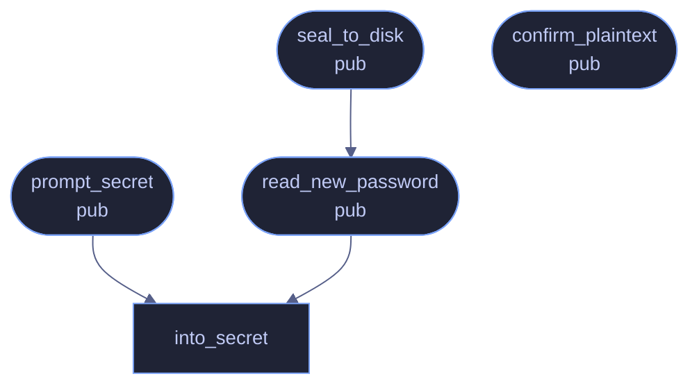

# `crates/veilvoice-cli/src/atrest.rs`

[[veilvoice-cli|Crate-veilvoice-cli]] &middot; 275 lines &middot; [read the source](https://github.com/tilas01/veilvoice/blob/main/crates/veilvoice-cli/src/atrest.rs)

## Contents

- [Why this is the default](#why-this-is-the-default)
- [Never through a plaintext file](#never-through-a-plaintext-file)
  - [What calls what](#what-calls-what)
  - [Items](#items)

Encryption at rest for the recordings VeilVoice writes, and the passphrase
prompts that feed it.

# Why this is the default

De-identification and confidentiality are different problems, and VeilVoice
only solves the first: the words survive on purpose, so a veiled recording
sitting on disk is still a recording of everything that was said. Writing it
in the clear by default would quietly leave the second problem unsolved for
everyone who did not think to ask.

So the result is sealed into a `container` — Argon2id or the X25519 +
ML-KEM-768 hybrid — unless the user asks for plaintext, and asking for
plaintext prints `PLAINTEXT_WARNING` and, on a terminal, waits for an
answer.

# Never through a plaintext file

The WAV is encoded in memory and sealed there. It is never written to disk
and then encrypted, because a plaintext file that is created and deleted is
precisely what `veilvoice_crypto::shred` explains cannot be reliably taken
back on flash storage.

## What calls what

## Items

| Item | Line | Documentation |
|---|---:|---|
| `PLAINTEXT_WARNING` pub const | [35](https://github.com/tilas01/veilvoice/blob/main/crates/veilvoice-cli/src/atrest.rs#L35) | What the user is told before a recording is written in the clear. |
| `Recipient` pub enum | [52](https://github.com/tilas01/veilvoice/blob/main/crates/veilvoice-cli/src/atrest.rs#L52) | How a recording is to be sealed. |
| `seal_to_disk` pub fn | [60](https://github.com/tilas01/veilvoice/blob/main/crates/veilvoice-cli/src/atrest.rs#L60) | Seal plaintext and write it to <path>.veil, returning where it landed. |
| `confirm_plaintext` pub fn | [111](https://github.com/tilas01/veilvoice/blob/main/crates/veilvoice-cli/src/atrest.rs#L111) | Print the plaintext warning and, on an interactive terminal, require an explicit answer before continuing. |
| `into_secret` fn | [154](https://github.com/tilas01/veilvoice/blob/main/crates/veilvoice-cli/src/atrest.rs#L154) | Move a typed password into page-locked, zeroizing storage, wiping the String it arrived in. |
| `prompt_secret` pub fn | [162](https://github.com/tilas01/veilvoice/blob/main/crates/veilvoice-cli/src/atrest.rs#L162) | Prompt once, without echoing, and keep the answer in a Secret. |
| `read_new_password` pub fn | [168](https://github.com/tilas01/veilvoice/blob/main/crates/veilvoice-cli/src/atrest.rs#L168) | Read a password twice, without echoing it, and check the two agree. |
