<!-- GENERATED by tools/docs/generate.py from the doc comments in the source. Do not edit: edit the .rs file and run the generator. -->

# `crates/veilvoice-cli/src/decoy.rs`

[[veilvoice-cli|Crate-veilvoice-cli]] &middot; 58 lines &middot; [read the source](https://github.com/tilas01/veilvoice/blob/main/crates/veilvoice-cli/src/decoy.rs)

## Contents

- [In plain words](#in-plain-words)
  - [What calls what](#what-calls-what)
  - [Items](#items)

`veilvoice decoy`, and what a second passphrase is worth and what it is not.

# In plain words

Explains the decoy passphrase: what it does, the two things it cannot do,
and the rules a pair has to satisfy. It does not set one up. Choosing a
passphrase is done where passphrases are already handled, and printing one
into a terminal's history would be a poor start.

## What this file contains

58 lines defining **1 function** (1 public), **0 types** and **0 constants**. Everything below is read out of the source, so it cannot disagree with the code.

**What happens when it runs.** These are the ways in: public, and nothing else in this file calls them, so they are what an outside caller reaches first.

- `explain` (line 14) -- Explain the feature and its limits.

## What calls what

_Colour key: **entry** -- a way in: public, and nothing in this file calls it._

  

The same graph as Mermaid source

```mermaid
%%{init: {"theme":"base","themeVariables":{"background":"#1a1b26","primaryColor":"#1f2335","primaryTextColor":"#c0caf5","primaryBorderColor":"#7aa2f7","secondaryColor":"#16161e","tertiaryColor":"#16161e","lineColor":"#737aa2","textColor":"#c0caf5","mainBkg":"#1f2335","nodeBorder":"#7aa2f7","clusterBkg":"#16161e","clusterBorder":"#2f3549","fontFamily":"ui-monospace, SFMono-Regular, Consolas, monospace","fontSize":"14px"}}}%%
flowchart TD
    n_explain(["explain<br/>line 14"])
    click n_explain href "https://github.com/tilas01/veilvoice/blob/main/crates/veilvoice-cli/src/decoy.rs#L14" "open the source"
    classDef entry fill:#1f2335,stroke:#7aa2f7,color:#c0caf5
    class n_explain entry
```

## Items

| Item | Line | Documentation |
|---|---:|---|
| `explain` pub fn | [14](https://github.com/tilas01/veilvoice/blob/main/crates/veilvoice-cli/src/decoy.rs#L14) | Explain the feature and its limits. |
