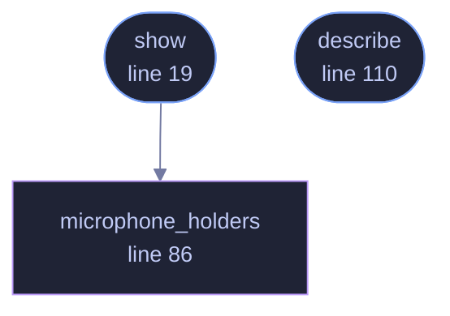

<!-- GENERATED by tools/docs/generate.py from the doc comments in the source. Do not edit: edit the .rs file and run the generator. -->

# `crates/veilvoice-cli/src/failsafe.rs`

[[veilvoice-cli|Crate-veilvoice-cli]] &middot; 112 lines &middot; [read the source](https://github.com/tilas01/veilvoice/blob/main/crates/veilvoice-cli/src/failsafe.rs)

## Contents

- [In plain words](#in-plain-words)
  - [What calls what](#what-calls-what)
  - [Items](#items)

`veilvoice failsafe` is the safety catch. What it can and cannot do.

# In plain words

Shows whether the safety catch is on, what it would do, and what is holding
a microphone right now. It is the same guard the desktop application runs;
this is how to look at it from a terminal.

The limits are printed every time, because the one thing a reader must not
come away believing is that this stops their computer handing a microphone
to another program. It notices, and it acts, and there is a moment between
the two.

## What this file contains

112 lines defining **3 functions** (2 public), **0 types** and **0 constants**. Everything below is read out of the source, so it cannot disagree with the code.

**What happens when it runs.** These are the ways in: public, and nothing else in this file calls them, so they are what an outside caller reaches first.

- `show` (line 19) -- Show what Failsafe would make of this machine right now.
  - reaches: `microphone_holders`
- `describe` (line 110) -- A named finding, for the tests to reach without a machine.

## What calls what

_Colour key: **entry** -- a way in: public, and nothing in this file calls it; **helper** -- private to this file._

  

The same graph as Mermaid source

## Items

| Item | Line | Documentation |
|---|---:|---|
| `show` pub fn | [19](https://github.com/tilas01/veilvoice/blob/main/crates/veilvoice-cli/src/failsafe.rs#L19) | Show what Failsafe would make of this machine right now. |
| `microphone_holders` fn | [86](https://github.com/tilas01/veilvoice/blob/main/crates/veilvoice-cli/src/failsafe.rs#L86) | Everything holding a microphone, through the shared watch layer. |
| `describe` pub fn | [110](https://github.com/tilas01/veilvoice/blob/main/crates/veilvoice-cli/src/failsafe.rs#L110) | A named finding, for the tests to reach without a machine. |
