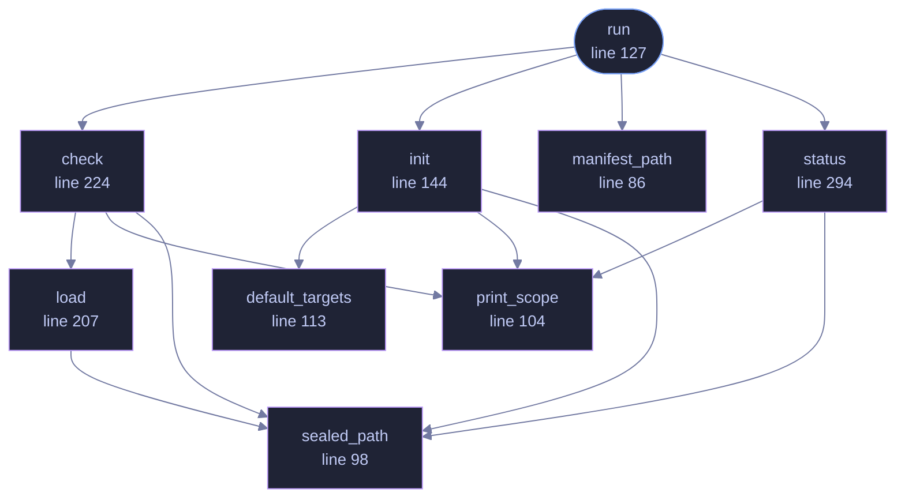

<!-- GENERATED by tools/docs/generate.py from the doc comments in the source. Do not edit: edit the .rs file and run the generator. -->

# `crates/veilvoice-cli/src/guard.rs`

[[veilvoice-cli|Crate-veilvoice-cli]] &middot; 369 lines &middot; [read the source](https://github.com/tilas01/veilvoice/blob/main/crates/veilvoice-cli/src/guard.rs)

## Contents

- [What the three steps actually do](#what-the-three-steps-actually-do)
- [Why attribution usually fails, and why that is reported rather than hidden](#why-attribution-usually-fails-and-why-that-is-reported-rather-than-hidden)
- [The bound, again](#the-bound-again)
- [In plain words](#in-plain-words)
  - [What calls what](#what-calls-what)
  - [Items](#items)

`veilvoice guard` -- record what VeilVoice's files should be, and check them.

Detection, not prevention. See `veilvoice_guard::SCOPE`, which every path
through this module prints, for the same reason the app lock prints its own:
a protection someone over-trusts has made them less safe, not more.

# What the three steps actually do

* **`init`** walks the files that make up this installation and records a
SHA-256 for each. Optionally sealed with a passphrase, so the record
itself cannot be quietly rewritten to match tampered files.
* **`check`** re-walks and reports what is **modified**, **removed** and
**added**. All three matter: an added file in the installation directory
is as interesting as a changed one.
* **`blame`** tries to say *which process* made a change, and says plainly
when it cannot.

# Why attribution usually fails, and why that is reported rather than hidden

Attribution needs the operating system to have been recording. On Linux that
means an `auditd` watch; on Windows a SACL on the path plus the audit policy
enabled, and reading it needs elevation. Neither is on by default on a
normal machine.

So the common answer is "something changed this file and I cannot tell you
what", and this module prints exactly that rather than an empty list. An
empty list reads as *nothing happened*, which is the opposite of the truth,
and is the same mistake as a monitor reporting an empty machine because a
registry query silently matched nothing.

# The bound, again

A manifest running as the user protects nothing from that user, and detects
rather than prevents even when it works. Anything that can write these files
can write the manifest beside them. That is why the passphrase-sealed record
exists, why `veilvoice_guard::SCOPE` is printed on every path through this
module, and why the word "tamper-proof" appears nowhere in it.

# In plain words

Writes down what VeilVoice's own files should look like, and checks later that
they still do.

It notices changes. It does not prevent them, and every path through it says
so, because a check somebody believes is a lock is worse than no check.

## What this file contains

369 lines defining **9 functions** (1 public), **1 type** and **0 constants**. Everything below is read out of the source, so it cannot disagree with the code.

**The types it owns.**

- `enum Action` (line 61) -- What veilvoice guard can be asked to do.

**What happens when it runs.** These are the ways in: public, and nothing else in this file calls them, so they are what an outside caller reaches first.

- `run` (line 127) -- Dispatch veilvoice guard to the subcommand that was asked for.
  - reaches: `check`, `init`, `manifest_path`, `status`, `load`, `print_scope`, `sealed_path`, `default_targets`

## What calls what

_Colour key: **entry** -- a way in: public, and nothing in this file calls it; **helper** -- private to this file._

  

The same graph as Mermaid source

## Items

| Item | Line | Documentation |
|---|---:|---|
| `Action` pub enum | [61](https://github.com/tilas01/veilvoice/blob/main/crates/veilvoice-cli/src/guard.rs#L61) | What veilvoice guard can be asked to do. |
| `manifest_path` fn | [86](https://github.com/tilas01/veilvoice/blob/main/crates/veilvoice-cli/src/guard.rs#L86) | Where the manifest lives, beside the app lock. |
| `sealed_path` fn | [98](https://github.com/tilas01/veilvoice/blob/main/crates/veilvoice-cli/src/guard.rs#L98) | A sealed manifest sits beside the plain one, with a different suffix. |
| `print_scope` fn | [104](https://github.com/tilas01/veilvoice/blob/main/crates/veilvoice-cli/src/guard.rs#L104) | Say what the integrity record detects and what it cannot, before it is used. |
| `default_targets` fn | [113](https://github.com/tilas01/veilvoice/blob/main/crates/veilvoice-cli/src/guard.rs#L113) | The files worth watching when the user names none: the running binary, and the app lock beside it. |
| `run` pub fn | [127](https://github.com/tilas01/veilvoice/blob/main/crates/veilvoice-cli/src/guard.rs#L127) | Dispatch veilvoice guard to the subcommand that was asked for. |
| `init` fn | [144](https://github.com/tilas01/veilvoice/blob/main/crates/veilvoice-cli/src/guard.rs#L144) | veilvoice guard init: record what these files are now. |
| `load` fn | [207](https://github.com/tilas01/veilvoice/blob/main/crates/veilvoice-cli/src/guard.rs#L207) | Load whichever form of the record exists, asking for a passphrase only if the sealed one is the one that is there. |
| `check` fn | [224](https://github.com/tilas01/veilvoice/blob/main/crates/veilvoice-cli/src/guard.rs#L224) | veilvoice guard check: compare the files against the record and report. |
| `status` fn | [294](https://github.com/tilas01/veilvoice/blob/main/crates/veilvoice-cli/src/guard.rs#L294) | veilvoice guard status: what the record covers, and when it was taken. |
