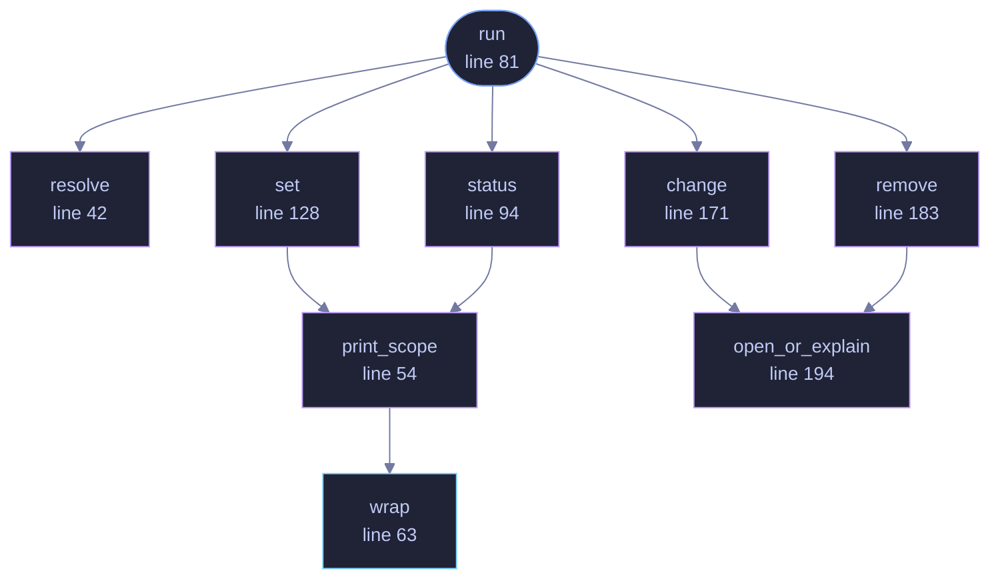

<!-- GENERATED by tools/docs/generate.py from the doc comments in the source. Do not edit: edit the .rs file and run the generator. -->

# `crates/veilvoice-cli/src/lock.rs`

[[veilvoice-cli|Crate-veilvoice-cli]] &middot; 248 lines &middot; [read the source](https://github.com/tilas01/veilvoice/blob/main/crates/veilvoice-cli/src/lock.rs)

## Contents

- [In plain words](#in-plain-words)
  - [What calls what](#what-calls-what)
  - [Items](#items)

`veilvoice lock` — manage the application lock from the command line.

The lock guards the desktop app: with one set, VeilVoice asks for a password
before it will show anything or start a live scramble. Managing it from here
exists because a headless machine still has a config directory, and because
anything the GUI can do to a file on disk should be inspectable without the
GUI.

Every path through this module prints `veilvoice_crypto::lock::SCOPE`, for
one reason: a lock the user believes is stronger than it is has made them
*less* safe, not more.

# In plain words

Sets, changes and clears the passphrase that opens the desktop application,
from a terminal.

It is the same lock the window uses and the same file, so the two cannot get
out of step. What it is worth is printed with it: it stops somebody who picks
up your unlocked computer, and it does not stop somebody holding your disk.

## What this file contains

248 lines defining **9 functions** (2 public), **1 type** and **0 constants**. Everything below is read out of the source, so it cannot disagree with the code.

**The types it owns.**

- `enum Action` (line 30)

**What happens when it runs.** These are the ways in: public, and nothing else in this file calls them, so they are what an outside caller reaches first.

- `run` (line 81)
  - reaches: `change`, `remove`, `resolve`, `set`, `status`, `open_or_explain`, `print_scope`, `wrap`

## What calls what

_Colour key: **entry** -- a way in: public, and nothing in this file calls it; **api** -- public, and also used inside this file; **helper** -- private to this file._

  

The same graph as Mermaid source

## Items

| Item | Line | Documentation |
|---|---:|---|
| `Action` pub enum | [30](https://github.com/tilas01/veilvoice/blob/main/crates/veilvoice-cli/src/lock.rs#L30) |  |
| `resolve` fn | [42](https://github.com/tilas01/veilvoice/blob/main/crates/veilvoice-cli/src/lock.rs#L42) | Resolve the lock file, preferring an explicit --path. |
| `print_scope` fn | [54](https://github.com/tilas01/veilvoice/blob/main/crates/veilvoice-cli/src/lock.rs#L54) | Print the honest scope note, wrapped for a terminal. |
| `wrap` pub fn | [63](https://github.com/tilas01/veilvoice/blob/main/crates/veilvoice-cli/src/lock.rs#L63) | Greedy word wrap. |
| `run` pub fn | [81](https://github.com/tilas01/veilvoice/blob/main/crates/veilvoice-cli/src/lock.rs#L81) |  |
| `status` fn | [94](https://github.com/tilas01/veilvoice/blob/main/crates/veilvoice-cli/src/lock.rs#L94) |  |
| `set` fn | [128](https://github.com/tilas01/veilvoice/blob/main/crates/veilvoice-cli/src/lock.rs#L128) |  |
| `change` fn | [171](https://github.com/tilas01/veilvoice/blob/main/crates/veilvoice-cli/src/lock.rs#L171) |  |
| `remove` fn | [183](https://github.com/tilas01/veilvoice/blob/main/crates/veilvoice-cli/src/lock.rs#L183) |  |
| `open_or_explain` fn | [194](https://github.com/tilas01/veilvoice/blob/main/crates/veilvoice-cli/src/lock.rs#L194) |  |
