<!-- GENERATED by tools/docs/generate.py from the doc comments in the source. Do not edit: edit the .rs file and run the generator. -->

# `crates/veilvoice-cli/src/main.rs`

[[veilvoice-cli|Crate-veilvoice-cli]] &middot; 1554 lines &middot; [read the source](https://github.com/tilas01/veilvoice/blob/main/crates/veilvoice-cli/src/main.rs)

## Contents

- [What is here](#what-is-here)
- [Two behaviours that surprise people, on purpose](#two-behaviours-that-surprise-people-on-purpose)
- [Passphrase prompts cannot be piped](#passphrase-prompts-cannot-be-piped)
- [A clap ordering rule worth knowing](#a-clap-ordering-rule-worth-knowing)
  - [What calls what](#what-calls-what)
  - [Items](#items)

`veilvoice` — the command-line interface.

Everything VeilVoice does, available without a desktop: it runs over SSH, in
a container, and on machines that have no GUI toolkit at all. The same
engine backs both this and the graphical app.

# What is here

Seventeen subcommands, and they divide into five groups:

* **Audio** -- `anonymise` a file, `live` scramble a microphone, list
`devices`.
* **Privacy of the files themselves** -- `clean` metadata, `encrypt`,
`decrypt`, `keygen`, `shred`.
* **Watching the machine** -- `watch` the microphone and camera, `guard`
VeilVoice's own files against tampering, `sentry` for canaries and how
fast a folder is changing.
* **The app lock** -- `lock set|status|change|remove`.
* **Getting it onto the machine** -- `install`, `uninstall`, `companions`,
and `gui` to open the desktop application.

That last group is a front end over `veilvoice_setup`, which the desktop
application's setup tab also calls. The careful part -- editing `PATH` --
has one implementation and one set of tests, rather than one per front
end.

# Two behaviours that surprise people, on purpose

**`anonymise` writes `<out>.veil`, not a bare WAV.** Recordings are
encrypted at rest by default. `--encrypt=false` opts out and requires
`--yes`, because an unsealed recording is the thing somebody later wishes
they had not produced. The wiki explains where the WAV went.

**The front-ends refuse rather than downgrade.** Asked to encrypt with
nothing to encrypt with, this exits with an error instead of writing plain
audio and mentioning it. Quiet degradation to a weaker posture is the defect
class this project has found in itself most often.

# Passphrase prompts cannot be piped

`rpassword` needs a real console; piping a passphrase in blocks on
`CONIN$` rather than reading it. That is a property of terminal input, not a
bug here, and it means anything that prompts cannot be smoke-tested from a
non-interactive shell. The layer *beneath* each prompt is therefore tested
instead -- see `crate::atrest` and `crate::lock`, where the logic lives
precisely so it can be reached without a terminal.

# A clap ordering rule worth knowing

An argument declared beside `#[command(subcommand)]` must precede the
subcommand on the command line unless it is marked `global = true`. So
`veilvoice lock --path X status` parses and `veilvoice lock status --path X`
does not, except that `--path` is now global specifically so both do.

## What this file contains

1554 lines defining **20 functions** (0 public), **6 types** and **0 constants**. Everything below is read out of the source, so it cannot disagree with the code.

**The types it owns.**

- `struct Cli` (line 86)
- `enum Command` (line 92)
- `enum SentryCommand` (line 300) -- What veilvoice sentry can do.
- `enum CleanPolicy` (line 361)
- `struct Tuning` (line 785) -- The engine settings a user can reach from the command line.
- `struct AtRest` (line 813) -- What to do with the result once it exists.

## What calls what

_Colour key: **helper** -- private to this file._

```mermaid
%%{init: {"theme":"base","themeVariables":{"background":"#1a1b26","primaryColor":"#1f2335","primaryTextColor":"#c0caf5","primaryBorderColor":"#7aa2f7","secondaryColor":"#16161e","tertiaryColor":"#16161e","lineColor":"#737aa2","textColor":"#c0caf5","mainBkg":"#1f2335","nodeBorder":"#7aa2f7","clusterBkg":"#16161e","clusterBorder":"#2f3549","fontFamily":"ui-monospace, SFMono-Regular, Consolas, monospace","fontSize":"14px"}}}%%
flowchart TD
    n_from["Policy::from<br/>line 369"]
    n_main["main<br/>line 377"]
    n_run["run<br/>line 388"]
    n_list_companions["list_companions<br/>line 645"]
    n_offer_line["offer_line<br/>line 678"]
    n_install_companion["install_companion<br/>line 702"]
    n_config["config<br/>line 791"]
    n_describe_reseed["describe_reseed<br/>line 804"]
    n_anonymise["anonymise<br/>line 822"]
    n_live["live<br/>line 961"]
    n_meter["meter<br/>line 1047"]
    n_list_devices["list_devices<br/>line 1062"]
    n_clean["clean<br/>line 1094"]
    n_encrypt["encrypt<br/>line 1111"]
    n_decrypt["decrypt<br/>line 1140"]
    n_load_secret_key["load_secret_key<br/>line 1172"]
    n_keygen["keygen<br/>line 1180"]
    n_watch["watch<br/>line 1256"]
    n_shred["shred<br/>line 1346"]
    n_info["info<br/>line 1414"]
    n_anonymise --> n_config
    n_anonymise --> n_describe_reseed
    n_decrypt --> n_load_secret_key
    n_install_companion --> n_offer_line
    n_list_companions --> n_offer_line
    n_live --> n_config
    n_live --> n_describe_reseed
    n_live --> n_meter
    n_main --> n_run
    n_run --> n_anonymise
    n_run --> n_clean
    n_run --> n_decrypt
    n_run --> n_encrypt
    n_run --> n_info
    n_run --> n_install_companion
    n_run --> n_keygen
    n_run --> n_list_companions
    n_run --> n_list_devices
    n_run --> n_live
    n_run --> n_shred
    n_run --> n_watch
    click n_from href "https://github.com/tilas01/veilvoice/blob/main/crates/veilvoice-cli/src/main.rs#L369" "open the source"
    click n_main href "https://github.com/tilas01/veilvoice/blob/main/crates/veilvoice-cli/src/main.rs#L377" "open the source"
    click n_run href "https://github.com/tilas01/veilvoice/blob/main/crates/veilvoice-cli/src/main.rs#L388" "open the source"
    click n_list_companions href "https://github.com/tilas01/veilvoice/blob/main/crates/veilvoice-cli/src/main.rs#L645" "open the source"
    click n_offer_line href "https://github.com/tilas01/veilvoice/blob/main/crates/veilvoice-cli/src/main.rs#L678" "open the source"
    click n_install_companion href "https://github.com/tilas01/veilvoice/blob/main/crates/veilvoice-cli/src/main.rs#L702" "open the source"
    click n_config href "https://github.com/tilas01/veilvoice/blob/main/crates/veilvoice-cli/src/main.rs#L791" "open the source"
    click n_describe_reseed href "https://github.com/tilas01/veilvoice/blob/main/crates/veilvoice-cli/src/main.rs#L804" "open the source"
    click n_anonymise href "https://github.com/tilas01/veilvoice/blob/main/crates/veilvoice-cli/src/main.rs#L822" "open the source"
    click n_live href "https://github.com/tilas01/veilvoice/blob/main/crates/veilvoice-cli/src/main.rs#L961" "open the source"
    click n_meter href "https://github.com/tilas01/veilvoice/blob/main/crates/veilvoice-cli/src/main.rs#L1047" "open the source"
    click n_list_devices href "https://github.com/tilas01/veilvoice/blob/main/crates/veilvoice-cli/src/main.rs#L1062" "open the source"
    click n_clean href "https://github.com/tilas01/veilvoice/blob/main/crates/veilvoice-cli/src/main.rs#L1094" "open the source"
    click n_encrypt href "https://github.com/tilas01/veilvoice/blob/main/crates/veilvoice-cli/src/main.rs#L1111" "open the source"
    click n_decrypt href "https://github.com/tilas01/veilvoice/blob/main/crates/veilvoice-cli/src/main.rs#L1140" "open the source"
    click n_load_secret_key href "https://github.com/tilas01/veilvoice/blob/main/crates/veilvoice-cli/src/main.rs#L1172" "open the source"
    click n_keygen href "https://github.com/tilas01/veilvoice/blob/main/crates/veilvoice-cli/src/main.rs#L1180" "open the source"
    click n_watch href "https://github.com/tilas01/veilvoice/blob/main/crates/veilvoice-cli/src/main.rs#L1256" "open the source"
    click n_shred href "https://github.com/tilas01/veilvoice/blob/main/crates/veilvoice-cli/src/main.rs#L1346" "open the source"
    click n_info href "https://github.com/tilas01/veilvoice/blob/main/crates/veilvoice-cli/src/main.rs#L1414" "open the source"
    classDef helper fill:#1f2335,stroke:#bb9af7,color:#c0caf5
    class n_from,n_main,n_run,n_list_companions,n_offer_line,n_install_companion,n_config,n_describe_reseed,n_anonymise,n_live,n_meter,n_list_devices,n_clean,n_encrypt,n_decrypt,n_load_secret_key,n_keygen,n_watch,n_shred,n_info helper
```

## Items

| Item | Line | Documentation |
|---|---:|---|
| `Cli` struct | [86](https://github.com/tilas01/veilvoice/blob/main/crates/veilvoice-cli/src/main.rs#L86) |  |
| `Command` enum | [92](https://github.com/tilas01/veilvoice/blob/main/crates/veilvoice-cli/src/main.rs#L92) |  |
| `SentryCommand` enum | [300](https://github.com/tilas01/veilvoice/blob/main/crates/veilvoice-cli/src/main.rs#L300) | What veilvoice sentry can do. |
| `CleanPolicy` enum | [361](https://github.com/tilas01/veilvoice/blob/main/crates/veilvoice-cli/src/main.rs#L361) |  |
| `Policy::from` fn | [369](https://github.com/tilas01/veilvoice/blob/main/crates/veilvoice-cli/src/main.rs#L369) |  |
| `main` fn | [377](https://github.com/tilas01/veilvoice/blob/main/crates/veilvoice-cli/src/main.rs#L377) |  |
| `run` fn | [388](https://github.com/tilas01/veilvoice/blob/main/crates/veilvoice-cli/src/main.rs#L388) |  |
| `list_companions` fn | [645](https://github.com/tilas01/veilvoice/blob/main/crates/veilvoice-cli/src/main.rs#L645) | Report every companion that means anything on this platform. |
| `offer_line` fn | [678](https://github.com/tilas01/veilvoice/blob/main/crates/veilvoice-cli/src/main.rs#L678) | One line describing what VeilVoice can do about a missing companion. |
| `install_companion` fn | [702](https://github.com/tilas01/veilvoice/blob/main/crates/veilvoice-cli/src/main.rs#L702) | Act on one named companion. |
| `Tuning` struct | [785](https://github.com/tilas01/veilvoice/blob/main/crates/veilvoice-cli/src/main.rs#L785) | The engine settings a user can reach from the command line. |
| `config` fn | [791](https://github.com/tilas01/veilvoice/blob/main/crates/veilvoice-cli/src/main.rs#L791) |  |
| `describe_reseed` fn | [804](https://github.com/tilas01/veilvoice/blob/main/crates/veilvoice-cli/src/main.rs#L804) | How the seed-rolling setting reads in the output. |
| `AtRest` struct | [813](https://github.com/tilas01/veilvoice/blob/main/crates/veilvoice-cli/src/main.rs#L813) | What to do with the result once it exists. |
| `anonymise` fn | [822](https://github.com/tilas01/veilvoice/blob/main/crates/veilvoice-cli/src/main.rs#L822) |  |
| `live` fn | [961](https://github.com/tilas01/veilvoice/blob/main/crates/veilvoice-cli/src/main.rs#L961) |  |
| `meter` fn | [1047](https://github.com/tilas01/veilvoice/blob/main/crates/veilvoice-cli/src/main.rs#L1047) | A small textual level meter. |
| `list_devices` fn | [1062](https://github.com/tilas01/veilvoice/blob/main/crates/veilvoice-cli/src/main.rs#L1062) |  |
| `clean` fn | [1094](https://github.com/tilas01/veilvoice/blob/main/crates/veilvoice-cli/src/main.rs#L1094) |  |
| `encrypt` fn | [1111](https://github.com/tilas01/veilvoice/blob/main/crates/veilvoice-cli/src/main.rs#L1111) |  |
| `decrypt` fn | [1140](https://github.com/tilas01/veilvoice/blob/main/crates/veilvoice-cli/src/main.rs#L1140) |  |
| `load_secret_key` fn | [1172](https://github.com/tilas01/veilvoice/blob/main/crates/veilvoice-cli/src/main.rs#L1172) | Load a private key file, which is itself a password-locked container. |
| `keygen` fn | [1180](https://github.com/tilas01/veilvoice/blob/main/crates/veilvoice-cli/src/main.rs#L1180) |  |
| `watch` fn | [1256](https://github.com/tilas01/veilvoice/blob/main/crates/veilvoice-cli/src/main.rs#L1256) | Report, and keep reporting, what is using the microphone and camera. |
| `shred` fn | [1346](https://github.com/tilas01/veilvoice/blob/main/crates/veilvoice-cli/src/main.rs#L1346) | Destroy a file's contents, then delete it. |
| `info` fn | [1414](https://github.com/tilas01/veilvoice/blob/main/crates/veilvoice-cli/src/main.rs#L1414) |  |
