<!-- GENERATED by tools/docs/generate.py from the doc comments in the source. Do not edit: edit the .rs file and run the generator. -->

# `crates/veilvoice-cli/src/main.rs`

[[veilvoice-cli|Crate-veilvoice-cli]] &middot; 3437 lines &middot; [read the source](https://github.com/tilas01/veilvoice/blob/main/crates/veilvoice-cli/src/main.rs)

## Contents

- [What is here](#what-is-here)
- [Two behaviours that surprise people, on purpose](#two-behaviours-that-surprise-people-on-purpose)
- [Passphrase prompts cannot be piped](#passphrase-prompts-cannot-be-piped)
- [A clap ordering rule worth knowing](#a-clap-ordering-rule-worth-knowing)
- [In plain words](#in-plain-words)
  - [What calls what](#what-calls-what)
  - [Items](#items)

`veilvoice`, the command-line interface.

Everything VeilVoice does, available without a desktop: it runs over SSH, in
a container, and on machines that have no GUI toolkit at all. The same
engine backs both this and the graphical app.

# What is here

Twenty subcommands, and they divide into five groups:

* **Audio** -- `anonymise` a file, `live` scramble a microphone, list
`devices`, `conversation` for a recording with several people in it.
* **Privacy of the files themselves** -- `clean` metadata, `encrypt`,
`decrypt`, `keygen`, `shred`.
* **Watching the machine** -- `watch` the microphone and camera, `guard`
VeilVoice's own files against tampering, `sentry` for canaries and how
fast a folder is changing, `capture` for which screen recorders are
running.
* **The app lock** -- `lock set|status|change|remove`, and `policy` for
settings somebody has fixed so the interface cannot turn them off.
* **Getting it onto the machine** -- `install`, `uninstall`, `companions`,
and `gui` to open the desktop application.

That last group is a front end over `veilvoice_setup`, which the desktop
application's setup tab also calls. The careful part -- editing `PATH` --
has one implementation and one set of tests, rather than one per front
end.

# Two behaviours that surprise people, on purpose

**`anonymise` writes `<out>.veil`, not a bare WAV.** Recordings are
encrypted at rest by default. `--encrypt=false` opts out and requires
`--yes`, because an unsealed recording is the thing somebody later wishes
they had not produced. The wiki explains where the WAV went.

**The front-ends refuse rather than downgrade.** Asked to encrypt with
nothing to encrypt with, this exits with an error instead of writing plain
audio and mentioning it. Quiet degradation to a weaker posture is the defect
class this project has found in itself most often.

# Passphrase prompts cannot be piped

`rpassword` needs a real console; piping a passphrase in blocks on
`CONIN$` rather than reading it. That is a property of terminal input, not a
bug here, and it means anything that prompts cannot be smoke-tested from a
non-interactive shell. The layer *beneath* each prompt is therefore tested
instead -- see `crate::atrest` and `crate::lock`, where the logic lives
precisely so it can be reached without a terminal.

# A clap ordering rule worth knowing

An argument declared beside `#[command(subcommand)]` must precede the
subcommand on the command line unless it is marked `global = true`. So
`veilvoice lock --path X status` parses and `veilvoice lock status --path X`
does not, except that `--path` is now global specifically so both do.

# In plain words

This is VeilVoice without a window.

Everything the program does, typed instead of clicked: disguise a recording,
scramble a microphone while you talk, seal a file, strip a photograph's hidden
labels, handle a recording with several people in it.

It is the same code underneath, so it works the same way -- over a remote
connection, on a machine with no desktop, or from a script that runs it a
thousand times.

## What this file contains

3437 lines defining **29 functions** (0 public), **13 types** and **0 constants**. Everything below is read out of the source, so it cannot disagree with the code.

**The types it owns.**

- `struct Cli` (line 118)
- `enum Command` (line 124)
- `enum FixCommand` (line 731) -- The corrections veilvoice conversation fix can make.
- `enum ConversationCommand` (line 815)
- `enum AppctlCommand` (line 973) -- What veilvoice capture can do.
- `enum InputCommand` (line 1000)
- `enum CaptureCommand` (line 1013)
- `enum MandateCommand` (line 1053) -- What veilvoice mandate can do.
- `enum PolicyCommand` (line 1089) -- What veilvoice policy can do.
- `enum SentryCommand` (line 1142) -- What veilvoice sentry can do.
- `enum CleanPolicy` (line 1203)
- `struct Tuning` (line 2188) -- The engine settings a user can reach from the command line.
- `struct AtRest` (line 2260) -- What to do with the result once it exists.

## What calls what

_22 of 28 functions are drawn; the diagram is bounded at 22 so it stays readable._

_Colour key: **helper** -- private to this file._

  

The same graph as Mermaid source

```mermaid
%%{init: {"theme":"base","themeVariables":{"background":"#1a1b26","primaryColor":"#1f2335","primaryTextColor":"#c0caf5","primaryBorderColor":"#7aa2f7","secondaryColor":"#16161e","tertiaryColor":"#16161e","lineColor":"#737aa2","textColor":"#c0caf5","mainBkg":"#1f2335","nodeBorder":"#7aa2f7","clusterBkg":"#16161e","clusterBorder":"#2f3549","fontFamily":"ui-monospace, SFMono-Regular, Consolas, monospace","fontSize":"14px"}}}%%
flowchart TD
    n_flavour_for["flavour_for<br/>line 1225"]
    n_explain_verification["explain_verification<br/>line 1243"]
    n_main["main<br/>line 1320"]
    n_run["run<br/>line 1357"]
    n_run_ffmpeg["run_ffmpeg<br/>line 1925"]
    n_list_volumes["list_volumes<br/>line 2000"]
    n_list_companions["list_companions<br/>line 2048"]
    n_offer_line["offer_line<br/>line 2081"]
    n_install_companion["install_companion<br/>line 2105"]
    n_reseed_range_from["reseed_range_from<br/>line 2207"]
    n_config["config<br/>line 2222"]
    n_describe_reseed_range["describe_reseed_range<br/>line 2241"]
    n_describe_reseed["describe_reseed<br/>line 2251"]
    n_anonymise["anonymise<br/>line 2269"]
    n_live["live<br/>line 2410"]
    n_list_devices["list_devices<br/>line 2641"]
    n_read_named["read_named<br/>line 2692"]
    n_video_plan["video_plan<br/>line 2707"]
    n_write_named["write_named<br/>line 2724"]
    n_clean["clean<br/>line 2728"]
    n_encrypt["encrypt<br/>line 2745"]
    n_decrypt["decrypt<br/>line 2774"]
    n_anonymise --> n_config
    n_anonymise --> n_describe_reseed_range
    n_clean --> n_read_named
    n_decrypt --> n_read_named
    n_describe_reseed_range --> n_describe_reseed
    n_encrypt --> n_read_named
    n_encrypt --> n_write_named
    n_install_companion --> n_offer_line
    n_list_companions --> n_offer_line
    n_live --> n_config
    n_live --> n_describe_reseed_range
    n_main --> n_run
    n_run --> n_anonymise
    n_run --> n_clean
    n_run --> n_config
    n_run --> n_decrypt
    n_run --> n_encrypt
    n_run --> n_explain_verification
    n_run --> n_flavour_for
    n_run --> n_install_companion
    n_run --> n_list_companions
    n_run --> n_list_devices
    n_run --> n_list_volumes
    n_run --> n_live
    n_run --> n_reseed_range_from
    n_run --> n_run_ffmpeg
    n_run --> n_video_plan
    click n_flavour_for href "https://github.com/tilas01/veilvoice/blob/main/crates/veilvoice-cli/src/main.rs#L1225" "open the source"
    click n_explain_verification href "https://github.com/tilas01/veilvoice/blob/main/crates/veilvoice-cli/src/main.rs#L1243" "open the source"
    click n_main href "https://github.com/tilas01/veilvoice/blob/main/crates/veilvoice-cli/src/main.rs#L1320" "open the source"
    click n_run href "https://github.com/tilas01/veilvoice/blob/main/crates/veilvoice-cli/src/main.rs#L1357" "open the source"
    click n_run_ffmpeg href "https://github.com/tilas01/veilvoice/blob/main/crates/veilvoice-cli/src/main.rs#L1925" "open the source"
    click n_list_volumes href "https://github.com/tilas01/veilvoice/blob/main/crates/veilvoice-cli/src/main.rs#L2000" "open the source"
    click n_list_companions href "https://github.com/tilas01/veilvoice/blob/main/crates/veilvoice-cli/src/main.rs#L2048" "open the source"
    click n_offer_line href "https://github.com/tilas01/veilvoice/blob/main/crates/veilvoice-cli/src/main.rs#L2081" "open the source"
    click n_install_companion href "https://github.com/tilas01/veilvoice/blob/main/crates/veilvoice-cli/src/main.rs#L2105" "open the source"
    click n_reseed_range_from href "https://github.com/tilas01/veilvoice/blob/main/crates/veilvoice-cli/src/main.rs#L2207" "open the source"
    click n_config href "https://github.com/tilas01/veilvoice/blob/main/crates/veilvoice-cli/src/main.rs#L2222" "open the source"
    click n_describe_reseed_range href "https://github.com/tilas01/veilvoice/blob/main/crates/veilvoice-cli/src/main.rs#L2241" "open the source"
    click n_describe_reseed href "https://github.com/tilas01/veilvoice/blob/main/crates/veilvoice-cli/src/main.rs#L2251" "open the source"
    click n_anonymise href "https://github.com/tilas01/veilvoice/blob/main/crates/veilvoice-cli/src/main.rs#L2269" "open the source"
    click n_live href "https://github.com/tilas01/veilvoice/blob/main/crates/veilvoice-cli/src/main.rs#L2410" "open the source"
    click n_list_devices href "https://github.com/tilas01/veilvoice/blob/main/crates/veilvoice-cli/src/main.rs#L2641" "open the source"
    click n_read_named href "https://github.com/tilas01/veilvoice/blob/main/crates/veilvoice-cli/src/main.rs#L2692" "open the source"
    click n_video_plan href "https://github.com/tilas01/veilvoice/blob/main/crates/veilvoice-cli/src/main.rs#L2707" "open the source"
    click n_write_named href "https://github.com/tilas01/veilvoice/blob/main/crates/veilvoice-cli/src/main.rs#L2724" "open the source"
    click n_clean href "https://github.com/tilas01/veilvoice/blob/main/crates/veilvoice-cli/src/main.rs#L2728" "open the source"
    click n_encrypt href "https://github.com/tilas01/veilvoice/blob/main/crates/veilvoice-cli/src/main.rs#L2745" "open the source"
    click n_decrypt href "https://github.com/tilas01/veilvoice/blob/main/crates/veilvoice-cli/src/main.rs#L2774" "open the source"
    classDef helper fill:#1f2335,stroke:#bb9af7,color:#c0caf5
    class n_flavour_for,n_explain_verification,n_main,n_run,n_run_ffmpeg,n_list_volumes,n_list_companions,n_offer_line,n_install_companion,n_reseed_range_from,n_config,n_describe_reseed_range,n_describe_reseed,n_anonymise,n_live,n_list_devices,n_read_named,n_video_plan,n_write_named,n_clean,n_encrypt,n_decrypt helper
```

## Items

| Item | Line | Documentation |
|---|---:|---|
| `Cli` struct | [118](https://github.com/tilas01/veilvoice/blob/main/crates/veilvoice-cli/src/main.rs#L118) |  |
| `Command` enum | [124](https://github.com/tilas01/veilvoice/blob/main/crates/veilvoice-cli/src/main.rs#L124) |  |
| `conversation::Fix::from` fn | [712](https://github.com/tilas01/veilvoice/blob/main/crates/veilvoice-cli/src/main.rs#L712) |  |
| `FixCommand` enum | [731](https://github.com/tilas01/veilvoice/blob/main/crates/veilvoice-cli/src/main.rs#L731) | The corrections veilvoice conversation fix can make. |
| `ConversationCommand` enum | [815](https://github.com/tilas01/veilvoice/blob/main/crates/veilvoice-cli/src/main.rs#L815) |  |
| `AppctlCommand` enum | [973](https://github.com/tilas01/veilvoice/blob/main/crates/veilvoice-cli/src/main.rs#L973) | What veilvoice capture can do. |
| `InputCommand` enum | [1000](https://github.com/tilas01/veilvoice/blob/main/crates/veilvoice-cli/src/main.rs#L1000) |  |
| `CaptureCommand` enum | [1013](https://github.com/tilas01/veilvoice/blob/main/crates/veilvoice-cli/src/main.rs#L1013) |  |
| `MandateCommand` enum | [1053](https://github.com/tilas01/veilvoice/blob/main/crates/veilvoice-cli/src/main.rs#L1053) | What veilvoice mandate can do. |
| `PolicyCommand` enum | [1089](https://github.com/tilas01/veilvoice/blob/main/crates/veilvoice-cli/src/main.rs#L1089) | What veilvoice policy can do. |
| `SentryCommand` enum | [1142](https://github.com/tilas01/veilvoice/blob/main/crates/veilvoice-cli/src/main.rs#L1142) | What veilvoice sentry can do. |
| `CleanPolicy` enum | [1203](https://github.com/tilas01/veilvoice/blob/main/crates/veilvoice-cli/src/main.rs#L1203) |  |
| `Policy::from` fn | [1211](https://github.com/tilas01/veilvoice/blob/main/crates/veilvoice-cli/src/main.rs#L1211) |  |
| `flavour_for` fn | [1225](https://github.com/tilas01/veilvoice/blob/main/crates/veilvoice-cli/src/main.rs#L1225) | The verification script's spelling for a system, in one place. |
| `explain_verification` fn | [1243](https://github.com/tilas01/veilvoice/blob/main/crates/veilvoice-cli/src/main.rs#L1243) | What checking a release actually involves, and who does which part. |
| `main` fn | [1320](https://github.com/tilas01/veilvoice/blob/main/crates/veilvoice-cli/src/main.rs#L1320) |  |
| `run` fn | [1357](https://github.com/tilas01/veilvoice/blob/main/crates/veilvoice-cli/src/main.rs#L1357) |  |
| `run_ffmpeg` fn | [1925](https://github.com/tilas01/veilvoice/blob/main/crates/veilvoice-cli/src/main.rs#L1925) | Markers 87 and 88. |
| `list_volumes` fn | [2000](https://github.com/tilas01/veilvoice/blob/main/crates/veilvoice-cli/src/main.rs#L2000) | Report the encrypted volumes this machine is offering. |
| `list_companions` fn | [2048](https://github.com/tilas01/veilvoice/blob/main/crates/veilvoice-cli/src/main.rs#L2048) | Report every companion that means anything on this platform. |
| `offer_line` fn | [2081](https://github.com/tilas01/veilvoice/blob/main/crates/veilvoice-cli/src/main.rs#L2081) | One line describing what VeilVoice can do about a missing companion. |
| `install_companion` fn | [2105](https://github.com/tilas01/veilvoice/blob/main/crates/veilvoice-cli/src/main.rs#L2105) | Act on one named companion. |
| `Tuning` struct | [2188](https://github.com/tilas01/veilvoice/blob/main/crates/veilvoice-cli/src/main.rs#L2188) | The engine settings a user can reach from the command line. |
| `reseed_range_from` fn | [2207](https://github.com/tilas01/veilvoice/blob/main/crates/veilvoice-cli/src/main.rs#L2207) | Turn --reseed-range into a range, or into the reason it was not one. |
| `config` fn | [2222](https://github.com/tilas01/veilvoice/blob/main/crates/veilvoice-cli/src/main.rs#L2222) |  |
| `describe_reseed_range` fn | [2241](https://github.com/tilas01/veilvoice/blob/main/crates/veilvoice-cli/src/main.rs#L2241) | How a randomised roll range reads in the output. |
| `describe_reseed` fn | [2251](https://github.com/tilas01/veilvoice/blob/main/crates/veilvoice-cli/src/main.rs#L2251) | How the seed-rolling setting reads in the output. |
| `AtRest` struct | [2260](https://github.com/tilas01/veilvoice/blob/main/crates/veilvoice-cli/src/main.rs#L2260) | What to do with the result once it exists. |
| `anonymise` fn | [2269](https://github.com/tilas01/veilvoice/blob/main/crates/veilvoice-cli/src/main.rs#L2269) |  |
| `live` fn | [2410](https://github.com/tilas01/veilvoice/blob/main/crates/veilvoice-cli/src/main.rs#L2410) |  |
| `list_devices` fn | [2641](https://github.com/tilas01/veilvoice/blob/main/crates/veilvoice-cli/src/main.rs#L2641) |  |
| `read_named` pub(crate) fn | [2692](https://github.com/tilas01/veilvoice/blob/main/crates/veilvoice-cli/src/main.rs#L2692) | Read a file, naming it if that fails. |
| `video_plan` pub(crate) fn | [2707](https://github.com/tilas01/veilvoice/blob/main/crates/veilvoice-cli/src/main.rs#L2707) | Read a --size and an --fps into a render plan, saying what was decided. |
| `write_named` pub(crate) fn | [2724](https://github.com/tilas01/veilvoice/blob/main/crates/veilvoice-cli/src/main.rs#L2724) | Write a file, naming it if that fails. |
| `clean` fn | [2728](https://github.com/tilas01/veilvoice/blob/main/crates/veilvoice-cli/src/main.rs#L2728) |  |
| `encrypt` fn | [2745](https://github.com/tilas01/veilvoice/blob/main/crates/veilvoice-cli/src/main.rs#L2745) |  |
| `decrypt` fn | [2774](https://github.com/tilas01/veilvoice/blob/main/crates/veilvoice-cli/src/main.rs#L2774) |  |
| `load_secret_key` fn | [2806](https://github.com/tilas01/veilvoice/blob/main/crates/veilvoice-cli/src/main.rs#L2806) | Load a private key file, which is itself a password-locked container. |
| `keygen` fn | [2814](https://github.com/tilas01/veilvoice/blob/main/crates/veilvoice-cli/src/main.rs#L2814) |  |
| `watch` fn | [2890](https://github.com/tilas01/veilvoice/blob/main/crates/veilvoice-cli/src/main.rs#L2890) | Report, and keep reporting, what is using the microphone and camera. |
| `shred` fn | [2980](https://github.com/tilas01/veilvoice/blob/main/crates/veilvoice-cli/src/main.rs#L2980) | Destroy a file's contents, then delete it. |
| `info` fn | [3048](https://github.com/tilas01/veilvoice/blob/main/crates/veilvoice-cli/src/main.rs#L3048) |  |
