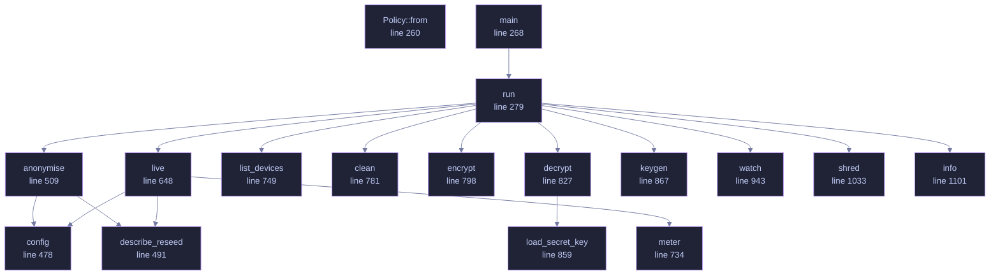

<!-- GENERATED by tools/docs/generate.py from the doc comments in the source. Do not edit: edit the .rs file and run the generator. -->

# `crates/veilvoice-cli/src/main.rs`

[[veilvoice-cli|Crate-veilvoice-cli]] &middot; 1241 lines &middot; [read the source](https://github.com/tilas01/veilvoice/blob/main/crates/veilvoice-cli/src/main.rs)

## Contents

- [What is here](#what-is-here)
- [Two behaviours that surprise people, on purpose](#two-behaviours-that-surprise-people-on-purpose)
- [Passphrase prompts cannot be piped](#passphrase-prompts-cannot-be-piped)
- [A clap ordering rule worth knowing](#a-clap-ordering-rule-worth-knowing)
  - [What calls what](#what-calls-what)
  - [Items](#items)

`veilvoice` — the command-line interface.

Everything VeilVoice does, available without a desktop: it runs over SSH, in
a container, and on machines that have no GUI toolkit at all. The same
engine backs both this and the graphical app.

# What is here

Fourteen subcommands, and they divide into four groups:

* **Audio** -- `anonymise` a file, `live` scramble a microphone, list
`devices`.
* **Privacy of the files themselves** -- `clean` metadata, `encrypt`,
`decrypt`, `keygen`, `shred`.
* **Watching the machine** -- `watch` the microphone and camera, `guard`
VeilVoice's own files against tampering.
* **The app lock** -- `lock set|status|change|remove`.

# Two behaviours that surprise people, on purpose

**`anonymise` writes `<out>.veil`, not a bare WAV.** Recordings are
encrypted at rest by default. `--encrypt=false` opts out and requires
`--yes`, because an unsealed recording is the thing somebody later wishes
they had not produced. The wiki explains where the WAV went.

**The front-ends refuse rather than downgrade.** Asked to encrypt with
nothing to encrypt with, this exits with an error instead of writing plain
audio and mentioning it. Quiet degradation to a weaker posture is the defect
class this project has found in itself most often.

# Passphrase prompts cannot be piped

`rpassword` needs a real console; piping a passphrase in blocks on
`CONIN$` rather than reading it. That is a property of terminal input, not a
bug here, and it means anything that prompts cannot be smoke-tested from a
non-interactive shell. The layer *beneath* each prompt is therefore tested
instead -- see `crate::atrest` and `crate::lock`, where the logic lives
precisely so it can be reached without a terminal.

# A clap ordering rule worth knowing

An argument declared beside `#[command(subcommand)]` must precede the
subcommand on the command line unless it is marked `global = true`. So
`veilvoice lock --path X status` parses and `veilvoice lock status --path X`
does not, except that `--path` is now global specifically so both do.

## What this file contains

1241 lines defining **17 functions** (0 public), **5 types** and **0 constants**. Everything below is read out of the source, so it cannot disagree with the code.

**The types it owns.**

- `struct Cli` (line 76)
- `enum Command` (line 82)
- `enum CleanPolicy` (line 252)
- `struct Tuning` (line 472) -- The engine settings a user can reach from the command line.
- `struct AtRest` (line 500) -- What to do with the result once it exists.

## What calls what

_Colour key: **helper** -- private to this file._

## Items

| Item | Line | Documentation |
|---|---:|---|
| `Cli` struct | [76](https://github.com/tilas01/veilvoice/blob/main/crates/veilvoice-cli/src/main.rs#L76) |  |
| `Command` enum | [82](https://github.com/tilas01/veilvoice/blob/main/crates/veilvoice-cli/src/main.rs#L82) |  |
| `CleanPolicy` enum | [252](https://github.com/tilas01/veilvoice/blob/main/crates/veilvoice-cli/src/main.rs#L252) |  |
| `Policy::from` fn | [260](https://github.com/tilas01/veilvoice/blob/main/crates/veilvoice-cli/src/main.rs#L260) |  |
| `main` fn | [268](https://github.com/tilas01/veilvoice/blob/main/crates/veilvoice-cli/src/main.rs#L268) |  |
| `run` fn | [279](https://github.com/tilas01/veilvoice/blob/main/crates/veilvoice-cli/src/main.rs#L279) |  |
| `Tuning` struct | [472](https://github.com/tilas01/veilvoice/blob/main/crates/veilvoice-cli/src/main.rs#L472) | The engine settings a user can reach from the command line. |
| `config` fn | [478](https://github.com/tilas01/veilvoice/blob/main/crates/veilvoice-cli/src/main.rs#L478) |  |
| `describe_reseed` fn | [491](https://github.com/tilas01/veilvoice/blob/main/crates/veilvoice-cli/src/main.rs#L491) | How the seed-rolling setting reads in the output. |
| `AtRest` struct | [500](https://github.com/tilas01/veilvoice/blob/main/crates/veilvoice-cli/src/main.rs#L500) | What to do with the result once it exists. |
| `anonymise` fn | [509](https://github.com/tilas01/veilvoice/blob/main/crates/veilvoice-cli/src/main.rs#L509) |  |
| `live` fn | [648](https://github.com/tilas01/veilvoice/blob/main/crates/veilvoice-cli/src/main.rs#L648) |  |
| `meter` fn | [734](https://github.com/tilas01/veilvoice/blob/main/crates/veilvoice-cli/src/main.rs#L734) | A small textual level meter. |
| `list_devices` fn | [749](https://github.com/tilas01/veilvoice/blob/main/crates/veilvoice-cli/src/main.rs#L749) |  |
| `clean` fn | [781](https://github.com/tilas01/veilvoice/blob/main/crates/veilvoice-cli/src/main.rs#L781) |  |
| `encrypt` fn | [798](https://github.com/tilas01/veilvoice/blob/main/crates/veilvoice-cli/src/main.rs#L798) |  |
| `decrypt` fn | [827](https://github.com/tilas01/veilvoice/blob/main/crates/veilvoice-cli/src/main.rs#L827) |  |
| `load_secret_key` fn | [859](https://github.com/tilas01/veilvoice/blob/main/crates/veilvoice-cli/src/main.rs#L859) | Load a private key file, which is itself a password-locked container. |
| `keygen` fn | [867](https://github.com/tilas01/veilvoice/blob/main/crates/veilvoice-cli/src/main.rs#L867) |  |
| `watch` fn | [943](https://github.com/tilas01/veilvoice/blob/main/crates/veilvoice-cli/src/main.rs#L943) | Report, and keep reporting, what is using the microphone and camera. |
| `shred` fn | [1033](https://github.com/tilas01/veilvoice/blob/main/crates/veilvoice-cli/src/main.rs#L1033) | Destroy a file's contents, then delete it. |
| `info` fn | [1101](https://github.com/tilas01/veilvoice/blob/main/crates/veilvoice-cli/src/main.rs#L1101) |  |
