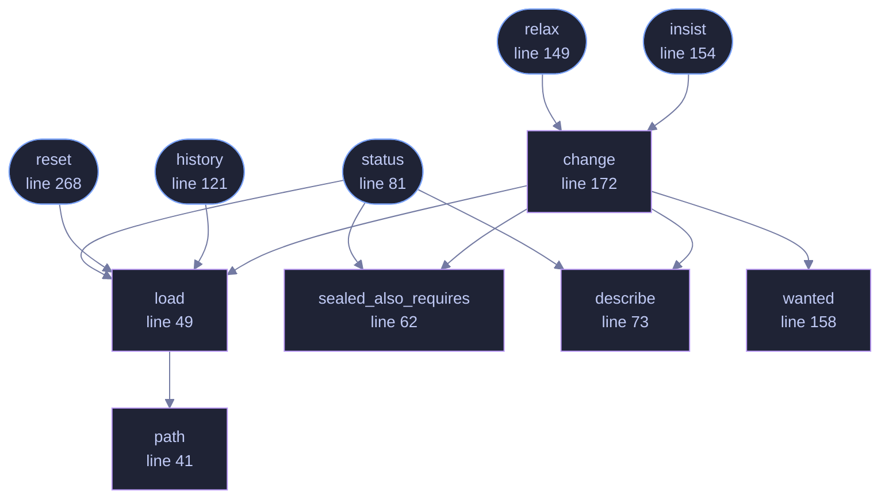

<!-- GENERATED by tools/docs/generate.py from the doc comments in the source. Do not edit: edit the .rs file and run the generator. -->

# `crates/veilvoice-cli/src/mandate.rs`

[[veilvoice-cli|Crate-veilvoice-cli]] &middot; 330 lines &middot; [read the source](https://github.com/tilas01/veilvoice/blob/main/crates/veilvoice-cli/src/mandate.rs)

## Contents

- [This is the opposite tool to veilvoice policy](#this-is-the-opposite-tool-to-veilvoice-policy)
- [Why relaxing asks twice](#why-relaxing-asks-twice)
- [In plain words](#in-plain-words)
  - [What calls what](#what-calls-what)
  - [Items](#items)

`veilvoice mandate` -- the two things VeilVoice insists on, and how to stop.

The command-line front end to `veilvoice_policy::Mandate`. That module
holds the data and the history; this file decides what is printed, and makes
relaxing a requirement a deliberate act rather than a flag somebody typed
once.

# This is the opposite tool to `veilvoice policy`

A sealed policy can only ever make VeilVoice **stricter**, and is meant for
somebody setting rules for somebody else. The mandate is your own baseline
for your own machine, and it is the only thing here that can be **relaxed**.

The two compose in one direction only: the effective requirement is the
mandate **or** whatever the sealed policy adds. So relaxing the mandate
cannot switch off something an administrator has fixed, and `status` says so
when that is what is happening, rather than reporting "not required" at
somebody who will then find it is still required.

# Why relaxing asks twice

Turning off encryption at rest means every recording VeilVoice writes from
then on is a plain file of everything that was said. De-identification took
the voiceprint out; it did not take the words out. That is a real choice
somebody may have real reasons to make, so it is offered, but it is not
offered casually, and it is written down with the date.

# In plain words

VeilVoice asks for a password for itself and encrypts your recordings unless
you tell it not to. This is where you tell it not to, and where you can see
when you did.

## What this file contains

330 lines defining **11 functions** (5 public), **0 types** and **0 constants**. Everything below is read out of the source, so it cannot disagree with the code.

**What happens when it runs.** These are the ways in: public, and nothing else in this file calls them, so they are what an outside caller reaches first.

- `status` (line 81) -- What is required now, and how it got that way.
  - reaches: `describe`, `load`, `sealed_also_requires`, `path`
- `history` (line 121) -- The log of every change, oldest first.
  - reaches: `load`, `path`
- `relax` (line 149) -- Stop insisting on one or both requirements.
  - reaches: `change`, `describe`, `load`, `sealed_also_requires`, `wanted`, `path`
- `insist` (line 154) -- Insist on one or both requirements again.
  - reaches: `change`, `describe`, `load`, `sealed_also_requires`, `wanted`, `path`
- `reset` (line 268) -- Back to insisting on both.
  - reaches: `load`, `path`

## What calls what

_Colour key: **entry** -- a way in: public, and nothing in this file calls it; **helper** -- private to this file._

  

The same graph as Mermaid source

## Items

| Item | Line | Documentation |
|---|---:|---|
| `path` fn | [41](https://github.com/tilas01/veilvoice/blob/main/crates/veilvoice-cli/src/mandate.rs#L41) | Where the mandate file lives. |
| `load` fn | [49](https://github.com/tilas01/veilvoice/blob/main/crates/veilvoice-cli/src/mandate.rs#L49) |  |
| `sealed_also_requires` fn | [62](https://github.com/tilas01/veilvoice/blob/main/crates/veilvoice-cli/src/mandate.rs#L62) | Whether the sealed policy independently fixes this requirement on. |
| `describe` fn | [73](https://github.com/tilas01/veilvoice/blob/main/crates/veilvoice-cli/src/mandate.rs#L73) |  |
| `status` pub fn | [81](https://github.com/tilas01/veilvoice/blob/main/crates/veilvoice-cli/src/mandate.rs#L81) | What is required now, and how it got that way. |
| `history` pub fn | [121](https://github.com/tilas01/veilvoice/blob/main/crates/veilvoice-cli/src/mandate.rs#L121) | The log of every change, oldest first. |
| `relax` pub fn | [149](https://github.com/tilas01/veilvoice/blob/main/crates/veilvoice-cli/src/mandate.rs#L149) | Stop insisting on one or both requirements. |
| `insist` pub fn | [154](https://github.com/tilas01/veilvoice/blob/main/crates/veilvoice-cli/src/mandate.rs#L154) | Insist on one or both requirements again. |
| `wanted` fn | [158](https://github.com/tilas01/veilvoice/blob/main/crates/veilvoice-cli/src/mandate.rs#L158) |  |
| `change` fn | [172](https://github.com/tilas01/veilvoice/blob/main/crates/veilvoice-cli/src/mandate.rs#L172) |  |
| `reset` pub fn | [268](https://github.com/tilas01/veilvoice/blob/main/crates/veilvoice-cli/src/mandate.rs#L268) | Back to insisting on both. |
