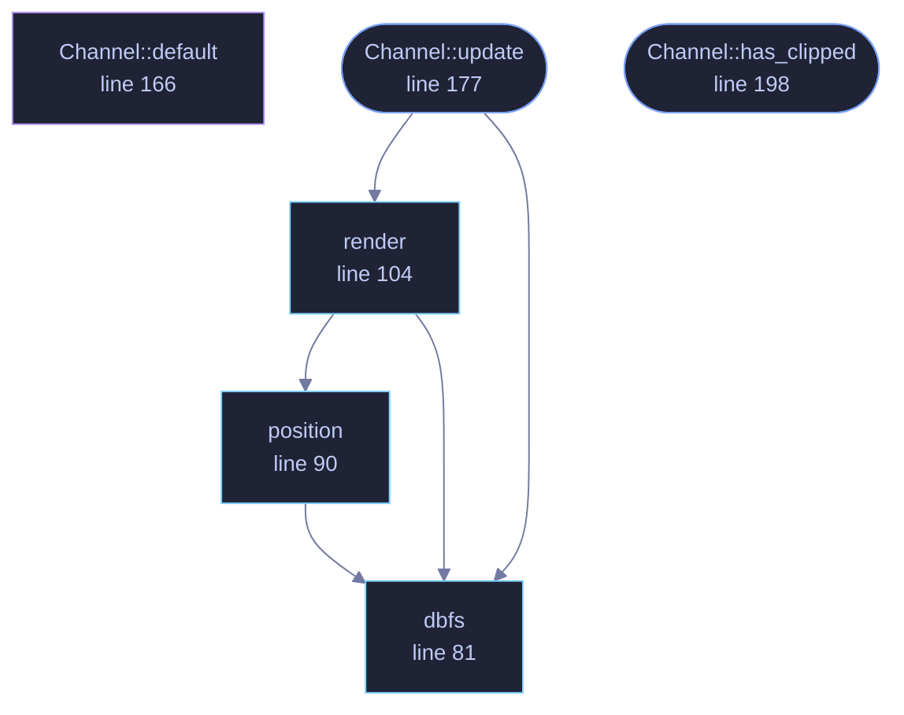

<!-- GENERATED by tools/docs/generate.py from the doc comments in the source. Do not edit: edit the .rs file and run the generator. -->

# `crates/veilvoice-cli/src/meter.rs`

[[veilvoice-cli|Crate-veilvoice-cli]] &middot; 343 lines &middot; [read the source](https://github.com/tilas01/veilvoice/blob/main/crates/veilvoice-cli/src/meter.rs)

## Contents

- [Why the old one was wrong](#why-the-old-one-was-wrong)
- [What it measures, and what it does not](#what-it-measures-and-what-it-does-not)
- [Peak hold](#peak-hold)
  - [What calls what](#what-calls-what)
  - [Items](#items)

Level meters for `veilvoice live`, on a scale that means something.

# Why the old one was wrong

The first meter was linear: a peak of 0.5 filled half the bar. That is
arithmetically fine and useless as a meter, because loudness is not linear.
Ordinary speech recorded at a sensible level peaks around **-12 dBFS**,
which is 0.25 linear — three of twelve blocks. Somebody speaking normally
saw a meter that looked like near-silence, and the only way to fill the bar
was to be clipping.

Every real meter is logarithmic for that reason, and this one is too:
-60 dBFS at the left, 0 dBFS at the right. Speech now sits in the middle of
the bar where a person can see it move.

# What it measures, and what it does not

**Sample peak, since the last read.** `veilvoice-audio` keeps the largest
absolute sample seen since the meter was last looked at and resets it on
read, so nothing between two reads is missed.

It is **not** a loudness meter. RMS, LUFS and everything else that
correlates with how loud a thing *sounds* need a window and a weighting
curve, and they answer a different question: this one is for "am I being
recorded, and am I clipping", which is a peak question.

It also cannot see an **inter-sample peak** — a waveform that passes above
full scale between two samples and clips in a converter or an encoder
without any single sample exceeding 1.0. Catching those needs oversampling.
The meter says `CLIP` when a sample actually reaches full scale, and says
nothing about the ones it cannot see, which is the honest half of a true
peak meter rather than a claim to be one.

# Peak hold

A bar that only shows the current moment cannot show a transient: the loud
syllable is gone before a human eye finishes moving. The highest level of
the last `HOLD` is kept and drawn as a single marker, and it decays rather
than sticking, so the bar stays honest about what is happening *now* while
still showing what just happened.

## What this file contains

343 lines defining **6 functions** (5 public), **1 type** and **4 constants**. Everything below is read out of the source, so it cannot disagree with the code.

**The types it owns.**

- `struct Channel` (line 159) -- One channel's meter, keeping the peak between reads.

**What happens when it runs.** These are the ways in: public, and nothing else in this file calls them, so they are what an outside caller reaches first.

- `Channel::update` (line 177) -- Take a new reading and give back the meter to print.
  - reaches: `dbfs`, `render`, `position`
- `Channel::has_clipped` (line 198) -- Whether this channel has clipped at any point in the session.

## What calls what

_Colour key: **entry** -- a way in: public, and nothing in this file calls it; **api** -- public, and also used inside this file; **helper** -- private to this file._

  

The same graph as Mermaid source

## Items

| Item | Line | Documentation |
|---|---:|---|
| `HOLD` pub const | [47](https://github.com/tilas01/veilvoice/blob/main/crates/veilvoice-cli/src/meter.rs#L47) | How long a peak marker is held before it falls back. |
| `FLOOR_DB` pub const | [54](https://github.com/tilas01/veilvoice/blob/main/crates/veilvoice-cli/src/meter.rs#L54) | The quietest level the bar shows. |
| `CLIP_DB` pub const | [62](https://github.com/tilas01/veilvoice/blob/main/crates/veilvoice-cli/src/meter.rs#L62) | At or above this, the level is called clipping. |
| `dbfs` pub fn | [81](https://github.com/tilas01/veilvoice/blob/main/crates/veilvoice-cli/src/meter.rs#L81) | Level in decibels relative to full scale. |
| `position` pub fn | [90](https://github.com/tilas01/veilvoice/blob/main/crates/veilvoice-cli/src/meter.rs#L90) | Where a level sits along the bar, from 0.0 at the floor to 1.0 at full scale. |
| `EIGHTHS` const | [99](https://github.com/tilas01/veilvoice/blob/main/crates/veilvoice-cli/src/meter.rs#L99) | The eighth-block characters, so a bar of n characters has 8n steps. |
| `render` pub fn | [104](https://github.com/tilas01/veilvoice/blob/main/crates/veilvoice-cli/src/meter.rs#L104) | One meter: the bar, the peak marker, and the number. |
| `Channel` pub struct | [159](https://github.com/tilas01/veilvoice/blob/main/crates/veilvoice-cli/src/meter.rs#L159) | One channel's meter, keeping the peak between reads. |
| `Channel::default` fn | [166](https://github.com/tilas01/veilvoice/blob/main/crates/veilvoice-cli/src/meter.rs#L166) |  |
| `Channel::update` pub fn | [177](https://github.com/tilas01/veilvoice/blob/main/crates/veilvoice-cli/src/meter.rs#L177) | Take a new reading and give back the meter to print. |
| `Channel::has_clipped` pub fn | [198](https://github.com/tilas01/veilvoice/blob/main/crates/veilvoice-cli/src/meter.rs#L198) | Whether this channel has clipped at any point in the session. |
